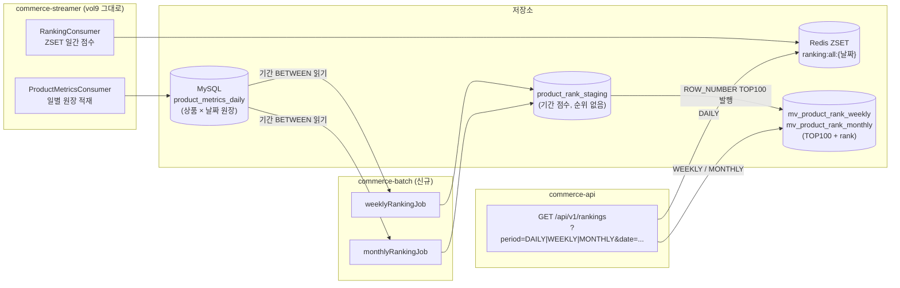
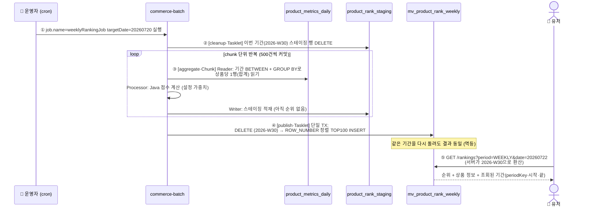
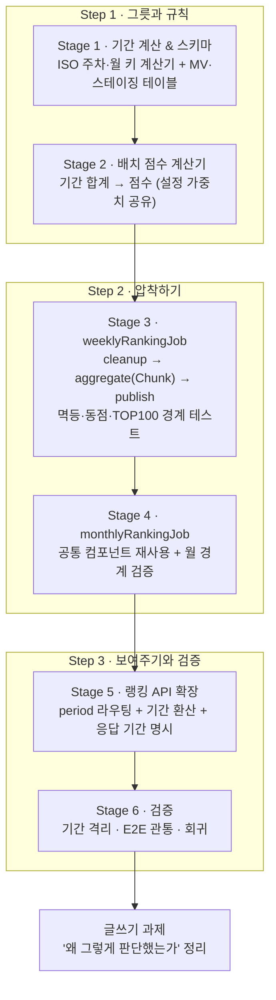

# Volume 10 — Spring Batch로 주간·월간 랭킹 만들기 (계획서)

> 이 문서는 **계획서이자 가설**입니다. 만들다 보면 예상과 다른 결과가 나올 수 있어요(예: "ISO 주차 계산이 이렇게 되는 줄 알았는데 연말 경계에서 다르게 나옴"). 그럴 땐 이 문서를 사실에 맞게 고칩니다.
> 이번 주에 계속 스스로에게 묻는 질문은 하나예요 — **"이 주간 랭킹, 정말 '그 주'의 데이터만으로 만들어졌는가?"**

---

## 1. 우리가 풀려는 문제

vol9에서 실시간 일간 랭킹을 만들었습니다. 이벤트가 올 때마다 Redis ZSET 점수를 올리는 방식이라 "오늘 인기 상품"은 몇 초 안에 반영돼요. 그런데 유저가 "이번 달 인기 상품"을 보고 싶다면 어떨까요?

- **실시간 방식을 주간·월간으로 늘리는 건 비효율입니다.** 일간은 이벤트당 ZSET 1개만 갱신하면 되지만, 주간·월간까지 실시간으로 하려면 이벤트마다 3개 판을 갱신해야 해요. 그리고 월간 랭킹이 "몇 초 안에" 반영될 필요가 있을까요? 없습니다 — 월간 랭킹은 **정확성**이 중요하지 실시간성이 중요하지 않아요.
- **조회 시점에 집계하는 것도 답이 아닙니다.** "지난 한 달간 상품별 점수 TOP 100"을 매 요청마다 `GROUP BY + ORDER BY`로 계산하면, 데이터가 쌓일수록 느려지고 랭킹 지면의 트래픽이 DB를 짓누릅니다.

그래서 이번 주에는 **Spring Batch**로 "미리 계산해두는" 방식을 씁니다. 하루 한 번(운영 기준 주 1회·월 1회) 배치가 일별 원장을 기간 단위로 합산해 **조회 전용 테이블(Materialized View)** 에 TOP 100을 순위까지 매겨 넣어두고, API는 그 테이블을 그냥 읽기만 하는 거예요. vol9 발제의 표로 말하면 — 일간은 "신속성"의 실시간 처리, 주간·월간은 "정확성 & 효율성"의 배치 처리로 **같은 랭킹 도메인 안에서 두 방식을 역할 분담**시키는 겁니다.

여기서 vol9의 결정 하나가 진가를 발휘합니다. 그때 "Redis가 유실되면 다시 계산할 재료"로 만들어 둔 **일별 원장 `product_metrics_daily`** — 이게 바로 이번 배치의 입력이에요. 이번 주차 최대 함정은 입력 데이터의 단위(grain)입니다: 발제가 언급한 `product_metrics`는 서비스 전 기간 **누적** 스냅샷이라, 기간 필터 없이 그대로 읽으면 **주간 = 월간 = 전체 누적**이 되는 구조적 결함이 생겨요. 우리는 상품 × 날짜 단위 원장이 이미 있어서 `metric_date BETWEEN`으로 기간을 정확히 오려낼 수 있습니다.

```
[commerce-api]        조회/좋아요/주문 이벤트 발행            ← vol7~9 그대로
      ↓ Kafka
[commerce-streamer]   이벤트 소비 → product_metrics_daily     ← vol9 그대로 (이번 주 입력)
                      이벤트 소비 → ZSET 일간 랭킹            ← vol9 그대로 (일간 담당)
      ↓ (매주 월요일 / 매월 1일)
[commerce-batch]      일별 원장 → 기간 합산 → 점수 → TOP100   ← 이번 주에 만들 것
      ↓ MySQL MV
[commerce-api]        랭킹 API: period로 일/주/월 라우팅      ← 이번 주에 만들 것
```

---

## 2. 전체 그림 한눈에

등장인물은 셋 — **재료를 쌓는 commerce-streamer(vol9 완성), 압착하는 commerce-batch(신규), 보여주는 commerce-api(확장)**.

### 구조 (누가 무엇과 연결되나)



### 흐름 (배치 한 판이 도는 순서)



- **①** 배치는 수동 실행 모델(`job.name` 파라미터) 그대로. 운영에선 인프라 cron이 실행 주기를 담당한다는 설계를 문서로 남깁니다(결정 ⑥).
- **② ~ ④** Job 하나 = `cleanup → aggregate(Chunk) → publish` 3단. 순위 매기기는 전역 연산이므로 **청크 밖(publish)** 에서만 합니다(결정 ④).
- **⑤** API는 period로 저장소를 라우팅 — 일간은 기존 Redis 경로 그대로, 주간·월간은 MV를 읽습니다(결정 ⑦).

---

## 3. 이 문서에 나오는 용어 (미리 풀어두기)

| 용어 | 쉽게 말하면 |
|---|---|
| Job | **배치 실행 한 판.** "주간 랭킹 만들기" 전체가 Job 하나 |
| Step | Job을 구성하는 **순서 있는 단계.** 우리는 cleanup → aggregate → publish 3단 |
| Tasklet | Step의 한 형태 — **"한 방에 실행하는 작업 하나"** (DELETE 한 번 등) |
| Chunk | Step의 한 형태 — **"N건씩 끊어 흘리는 컨베이어 벨트"** (읽기→가공→저장을 반복, 반복마다 커밋) |
| Reader / Processor / Writer | 컨베이어의 세 역할: **1건씩 읽기 / 1건씩 가공 / N건 모아 저장** |
| Materialized View (MV) | **복잡한 집계를 미리 계산해둔 조회 전용 테이블.** MySQL엔 MV 기능이 없어 "일반 테이블 + 배치 적재"로 구현 |
| 스테이징 테이블 | 순위를 매기기 전, **전 상품의 기간 점수를 내려놓는 중간 테이블.** 순위는 전역 연산이라 "다 모인 뒤"에만 가능 |
| ROW_NUMBER | MySQL이 **"정렬해서 1번부터 번호 붙여줘"** 를 한 번에 해주는 SQL 기능. rank 산정의 정석 |
| ISO 주차 | **월요일 시작, 연 기준 주 번호**(예: 2026-W30 = 7/20~7/26). "7월 1주차" 같은 월 기준 주차는 정의가 흔들려 안 씀 |
| 멱등 (idempotent) | 같은 배치를 **두 번 돌려도 결과가 한 번 돈 것과 같게** 만드는 것 |
| delete-then-insert | 멱등의 기본기 — **그 기간 것만 지우고 새로 쓰기.** 한 트랜잭션으로 묶으면 "반쯤 지워진" 상태가 없음 |
| JobParameters | Job 실행에 넘기는 **입력값**(예: targetDate). 같은 Job을 다른 기간으로 재사용·백필 가능하게 함 |

---

## 4. 목표와 완료 기준

과제 체크리스트 4개 항목을 하나도 빠짐없이 채우는 게 목표입니다.

| 체크리스트 항목 | 완성 단계 |
|---|---|
| Spring Batch Job을 작성하고, 파라미터 기반으로 동작 | Stage 3·4 |
| Chunk Oriented Processing 기반의 배치 처리 | Stage 3 |
| 집계 결과를 저장할 MV 구조 설계·올바른 적재 | Stage 1·3·4 |
| API가 일간·주간·월간 랭킹을 형태에 맞는 데이터 기반으로 제공 | Stage 5 |

여기에 배치 랭킹의 신뢰를 가르는 검증 4종 — **기간 격리 · 멱등 재실행 · 동점 결정성 · TOP100 경계** — 을 자동 테스트로 고정하는 것까지 범위에 넣습니다(Stage 3·6).

---

## 5. 미리 정한 핵심 결정 7가지

만들기 전에 갈림길 7개를 먼저 정했습니다. 이번 주차의 핵심 긴장은 **"실시간(일간)과 배치(주간·월간)가 한 랭킹 도메인 안에서 어긋나지 않게 공존하는 법"** 이에요.

### ① 기간을 어떻게 정의할까 → **캘린더 주(ISO, 월~일)·캘린더 월. 완결된 기간만 집계**

- **주간 = ISO 주차**(`2026-W30` = 7/20~7/26), **월간 = 캘린더 월**(`2026-07`). 배치는 이미 끝난 주/월을 집계합니다.
- "7월 1주차" 같은 월 기준 주차는 안 씁니다 — 주는 월 경계에 반드시 걸치기 때문에(7/1이 수요일이면 그 주는 6월 주차인가 7월 주차인가) 어느 해석을 골라도 경계 케이스가 생겨요. ISO 주차는 이 문제가 없는 표준입니다.
- 대안이었던 **롤링 윈도우**(최근 7일/30일)는 "지금 인기"라는 UX 의미는 좋지만 매일 재계산해야 하고 기간 키가 기준일에 의존해 설계가 복잡해져 기각.
- **연말·연초 함정**: ISO 주차의 연도는 달력 연도가 아니라 **주 기준 연도**입니다. 방향이 양쪽으로 어긋납니다 — 12월 말 날짜가 다음 해 주차에 속하기도 하고(2025-12-29(월)~12-31은 이미 **2026-W01**), 1월 초 날짜가 이전 해 주차에 속하기도 합니다(2027-01-01~01-03은 아직 **2026-W53**). (그 주의 목요일이 어느 해에 있는지가 기준.) vol9에서 일별 키에 `YYYY`(주 기준 연도)를 쓰면 안 됐던 것과 정확히 반대로, **주간 키에는 주 기준 연도가 정답**이에요. 회귀 테스트로 고정합니다.
- 모든 날짜 계산은 **KST(Asia/Seoul)** 명시.

### ② 주간·월간 점수를 어떻게 계산할까 → **기간 합계에 가중치, 주문은 총액에 log 한 번**

```
periodScore = 0.1 × Σview + 0.2 × Σlike + 0.7 × log1p(Σsales_amount)
              (가중치 값은 실시간과 같은 설정 원천을 씀)
```

- vol9 실시간 일간은 **주문 1건마다** `0.7 × log1p(단가×수량)`을 더했어요(증분 방식에선 총합을 알 수 없어서 택한 근사). 그리고 그때 이렇게 기록했죠 — *"수학적으로 log는 총 판매 금액에 한 번 적용해야 맞다. 총합 기준 점수가 필요해지면 일별 원장으로 재계산하는 경로가 열려 있다."* **이번 배치가 바로 그 경로입니다.** 배치는 기간 총액을 알 수 있으니 정법(총액에 log 한 번)을 씁니다.
- **정직하게 남길 트레이드오프**: 그 결과 일간(건별 log 합산)과 주간·월간(총액 log 한 번)은 **점수의 의미가 다릅니다**(`Σlog ≠ logΣ`). 위험한 건 다른 것 자체가 아니라 다른 걸 구분 없이 섞는 것 — 우리는 일간은 실시간 근사, 주간·월간은 배치 정법이라고 **명시적으로 구분**합니다. 기간 타입이 다르면 점수끼리 직접 비교하지 않으므로 순위 왜곡은 없어요.
- 일별 원장에는 건별 금액이 없고 일 합계(`sales_amount`)만 있어 실시간 공식의 정확 재현은 애초에 불가능 — "평균 주문액 근사" 같은 절충안은 근사를 위한 근사라 기각.
- **가중치 값(0.1/0.2/0.7)은 실시간과 같은 설정 프리픽스(`ranking.score.weight`)를 배치 yml에도 둡니다.** 공식(코드)은 실시간·배치가 다르지만(의미가 다르니까), 가중치 숫자만큼은 한 곳 원천 — SQL에 하드코딩하지 않고 Java 계산기 + 설정으로. 같은 숫자가 설정과 SQL 두 곳에 살면 한쪽만 바뀌었을 때 실시간과 배치 랭킹이 조용히 어긋납니다(공식 drift).

### ③ Job을 어떻게 나눌까 → **weeklyRankingJob / monthlyRankingJob 물리 분리**

- 스케줄(주 1회 vs 월 1회)·재실행·실패 격리가 서로 독립이라 Job 2개로 분리합니다. 기존 commerce-batch의 Job별 Config 패턴(`@ConditionalOnProperty` + `JOB_NAME`)과도 일관.
- 단, Step 구성 로직(Reader/Processor/Writer/발행)은 기간 타입·기간 범위만 다르므로 **공통 컴포넌트로 재사용**해 중복을 최소화.
- **주간을 합산해 월간을 만들지 않습니다.** 주는 월 경계에 걸치므로 주간 합산 ≠ 월간. 주간·월간 각각 일별 원장에서 **독립 재집계**.
- **JobParameters**: `targetDate=uuuuMMdd` — 그 날짜가 **속한** 주/월을 집계. 지난 기간 날짜를 넘기면 백필(과거 재집계)도 같은 방식으로 가능. 체크리스트의 "파라미터 기반으로 동작"이 이것.

### ④ Step을 어떻게 구성할까 → **cleanup(Tasklet) → aggregate(Chunk) → publish(Tasklet)**

해야 할 연산은 셋 — (a) 기간 합산, (b) 점수 계산, (c) 순위 매기기. 배치의 핵심 제약은 **(c)가 전역 연산**이라는 것: 내 순위는 다른 모든 상품의 점수를 알아야 정해지는데, Chunk는 데이터를 끊어서 흘립니다. 청크 안에서 순위를 매기면 각 청크가 자기 구간만 보고 순위를 확정해 — 상품이 청크 크기를 넘는 순간 랭킹이 무너져요. 그래서:

- **cleanup(Tasklet)**: 스테이징에서 이번 기간 행 DELETE — 지난 실패 실행의 잔재가 섞이지 않게. (이 잔재가 왜 생기는지는 바로 아래 "트랜잭션 경계" 참고 — cleanup의 존재 이유가 거기서 나옵니다.)
- **aggregate(Chunk)**: Reader가 `metric_date BETWEEN + GROUP BY product_id`로 **상품당 1행(기간 합계)** 씩 읽고, Processor가 **Java로 점수 계산**(결정 ②의 계산기), Writer가 **스테이징 테이블에 적재**(아직 순위 없음). 전 상품을 메모리에 들지 않고 DB에 내려놓는 이유 — 순위를 위해 인메모리로 전량 수집하면 상품 수가 커질 때 OOM으로 가는 길이라서요.
- **publish(Tasklet)**: 스테이징 전체를 `ROW_NUMBER() OVER (ORDER BY score DESC, product_id ASC)`로 **전역 정렬·순위 부여** 후 TOP 100만 MV에 INSERT. 애플리케이션에서 카운터를 돌려 순위를 붙이는 방식은 순서 보장이 약해 처음부터 SQL로.
- SQL 올인원(점수까지 SQL)·Tasklet 단일 대안은 기각 — 가중치가 SQL에 하드코딩되고(설정 외부화와 충돌), 체크리스트의 Chunk 요구가 명목상으로만 남으니까요.

**Reader는 `JdbcCursorItemReader`로 확정.** 두 가지 이유 — ① Reader가 읽는 대상은 이미 `GROUP BY`로 상품당 1행까지 접혀 있고 스테이징엔 raw 값만 넣으면 되니 **엔티티 매핑(JPA)이 불필요**, ② 커서는 커넥션 하나로 결과를 순차 스트리밍해 페이징 리더가 매 페이지 새 쿼리를 던지는 오버헤드가 없습니다. (JPA 페이징 리더가 가진 "오프셋 밀림" 위험 — 처리하며 대상이 조건에서 빠져 다음 페이지가 밀리는 문제 — 은 우리 배치엔 애초에 없어요: Reader가 읽는 원장과 Writer가 쓰는 스테이징이 **다른 테이블**이라 자기가 읽는 대상을 자기가 바꾸지 않으니까요. 그래도 커서를 택한 건 위 ①②의 실리 때문.)

**트랜잭션 경계 — 배치에서 가장 헷갈리는 지점이라 명시해 둡니다.** Chunk는 "N건 읽기 → N건 처리 → N건 쓰기 → **커밋**"을 반복하고, **반복 1회마다 트랜잭션이 끊깁니다**(청크 하나 = 트랜잭션 하나). 그래서 aggregate가 중간(예: 3번째 청크)에서 실패하면, **이미 커밋된 앞 청크들은 스테이징에 남아요** — 전체가 롤백되지 않습니다. 이게 cleanup Step이 필요한 이유예요: 재실행 시 그 남은 잔재를 먼저 지우고 시작해야 이번 집계와 섞이지 않습니다. 반면 publish(Tasklet)는 DELETE+INSERT를 **한 트랜잭션**으로 묶어 "전부 아니면 전무"라, MV는 청크 경계 같은 중간 상태가 없습니다. **구현 시 반드시 확인할 것**: 청크마다 트랜잭션이 내 의도대로 끊기고 커밋되는지(로그로 커밋 단위 관찰) — 리더/프로세서/라이터로 코드가 갈라지면 트랜잭션 크기를 놓치기 쉽습니다.

### ⑤ 같은 배치가 두 번 돌면 → **기간 스코프 delete-then-insert, 단일 트랜잭션**

배치는 실패·재실행이 일상입니다. 재실행이 안전하려면 "그 기간의 이전 흔적을 지우고 새로 쓰기"가 기본기:

- **publish**: `DELETE FROM mv WHERE period_key = ? → INSERT TOP100`을 **한 트랜잭션으로**. 중간에 죽어도 둘 다 롤백되므로 "반쯤 지워진 MV"가 없고, 몇 번을 다시 돌려도 결과가 같습니다(멱등). DELETE~INSERT가 한 TX라 조회 공백도 사실상 없어요.
- **cleanup**: 스테이징도 같은 원리로 기간 스코프 DELETE.
- **동점 처리(tie-break)**: 점수가 같으면 `product_id` 오름차순 — 재실행해도 순위가 흔들리지 않는 **결정성** 확보(정렬 기준이 score뿐이면 동점 상품의 순서가 실행마다 달라질 수 있음).
- 대안이었던 upsert(공백 완전 제로)는 순위권 이탈 상품을 별도로 지워야 해 오히려 복잡, version 스왑(버전 번호로 쌓고 포인터만 원자 교체)은 TOP100 · 주 1회 발행 규모엔 과설계라 기각. 둘 다 "일부러 안 하는 것"에 기록.

**멱등이 여는 또 하나의 문 — 지연 이벤트 보정.** 배치는 "완결된 기간"을 집계하지만, 기간이 끝난 순간(일요일 자정)과 배치 실행(월요일 새벽) 사이에는 시간차가 있어요. 그 사이 Kafka가 지연 배달한 이벤트가 원장(`product_metrics_daily`)에 반영되면 배치가 잡고, 배치 실행 **이후**에 도착하면 그 회차엔 놓칩니다. 우리는 이 문제를 3단으로 다룹니다 — ① **완결 기간만 집계**(진행 중 기간 미집계) + ② **버퍼를 둔 실행**(기간 끝나고 곧장이 아니라 새벽에 실행해 지연이 정착할 시간을 줌) + ③ **필요하면 멱등 재집계로 수렴**(같은 `targetDate`로 나중에 다시 돌리면 그 사이 도착한 지연분까지 반영돼 MV가 갱신됨 — 결정 ③의 백필과 같은 경로). 즉 "엄격하게"는 별도 메커니즘이 아니라 **재집계로 보정**하는 것이고, 이건 delete-then-insert 멱등 덕에 공짜로 얻어집니다. **랭킹은 근사값 / 정확값이 필요하면 재집계 경로가 열려 있다**는 게 이번 주의 태도. 더 엄격한 스냅샷 격리(`created_at ≤ 배치시각` 고정)나 워터마크(streamer가 반영한 지점을 추적해 그게 기간 끝을 넘어야만 실행)는 금융 정산급 정확성이 필요할 때의 방식이라 이번 범위 밖 — "일부러 안 하는 것"에 기록.

### ⑥ 누가 언제 실행할까 → **수동 실행 + 운영 cron 설계 문서화**

- 배치 앱은 "실행하면 Job 하나 돌고 종료"하는 단발 실행 모델을 유지합니다. 실행 주기는 애플리케이션이 아니라 **인프라(cron·K8s CronJob)의 책임**이라는 역할 분리 — 실무 표준이기도 해요.
- 실행 명령과 권장 스케줄을 문서·`.http`급으로 재현 가능하게 남깁니다:

```bash
# 주간: 매주 월요일 01:00 KST (지난주 집계) — targetDate는 지난주의 아무 날짜
./gradlew :apps:commerce-batch:bootRun --args='--job.name=weeklyRankingJob targetDate=20260720'
# 월간: 매월 1일 02:00 KST (지난달 집계)
./gradlew :apps:commerce-batch:bootRun --args='--job.name=monthlyRankingJob targetDate=20260701'
```

- `@Scheduled` 내장은 기각 — 상시 기동 모델로 바꿔야 하고 다중 인스턴스 중복 실행 가드(ShedLock)까지 떠안게 됨. 중복 실행 방지는 Spring Batch의 JobInstance(같은 파라미터 재실행 제어)에 위임하고, 분산 락은 "일부러 안 하는 것"에.
- **이 "중복 실행 방지"가 어디에 기대는지 짚어둡니다 — Spring Batch 메타데이터 테이블.** Spring Batch는 실행 이력(어떤 JobParameters로 언제 실행됐고 어디까지 갔는지)을 `BATCH_JOB_INSTANCE`·`BATCH_JOB_EXECUTION`·`BATCH_STEP_EXECUTION` 같은 메타데이터 테이블에 남깁니다. "같은 파라미터로 이미 완료된 Job은 다시 안 돈다"는 우리의 중복 방지가 바로 이 테이블을 근거로 동작해요. 현재 `commerce-batch`는 이 테이블을 **MySQL에 저장**합니다(`spring.batch.jdbc.initialize-schema`가 local/test에서 `always`). 그래서 우리는 이 기본값을 그대로 유지 — 재실행 이력이 DB에 남아야 백필·재집계(결정 ⑤) 때 "이미 돈 기간인지"를 판별할 수 있으니까요. (메타데이터를 인메모리로 빼 배치 자체 성능·부수 INSERT를 줄이는 운영 선택지도 있지만 — 그러면 실행 이력이 재기동 시 날아가 중복 방지·백필 판별을 잃습니다. 이력을 외부 도구로 대체하는 환경에서나 고려할 트레이드오프라 이번엔 안 함. 글쓰기 소재로.)

### ⑦ API를 어떻게 확장할까 → **period 파라미터 + date는 그대로, 서버가 기간으로 환산**

```
GET /api/v1/rankings?period=WEEKLY&date=20260722&size=20&page=1
  → 서버: "7/22가 속한 주 = 2026-W30" 환산 → mv_product_rank_weekly 조회
GET /api/v1/rankings?date=20260722          → period 생략 = DAILY (기존 호환, Redis)
GET /api/v1/rankings?period=MONTHLY&date=20260722 → "2026-07" → mv_product_rank_monthly
```

- **period 라우팅**: DAILY → 기존 Redis ZSET 경로 그대로(회귀 없음), WEEKLY/MONTHLY → MV 조회. period 파싱은 기존 방침대로 컨트롤러에서 enum 파싱(형식 오류 → BAD_REQUEST).
- **date 하나로 통일한 이유**: "주간인데 왜 날짜?"라는 어색함보다, 클라이언트가 ISO 주차 번호를 직접 계산하는 부담(`week=2026W30`)을 없애는 쪽을 택했어요. 같은 주의 어느 날짜를 넘겨도 같은 결과가 나오는 대신 —
- **응답에 조회된 기간을 명시**합니다: `periodKey`("2026-W30"), 기간 시작·끝 날짜. "무슨 기간의 랭킹을 받았는지"가 응답에 박혀 있어 환산의 모호함을 해소.
- **미발행 기간 = 빈 목록 정상 응답**(에러 아님): 진행 중인 이번 주를 조회하면 빈 목록. 일간의 "빈 랭킹판 = 빈 목록" 기존 계약과 일관.
- 상품 정보 aggregation은 기존 일간과 같은 패턴 — MV에서 (rank, productId, score)를 꺼내고 상품·브랜드는 IN절 한 번에(N+1 금지). 단 주간·월간의 rank는 offset 계산이 아니라 **MV에 저장된 rank 그대로**.

### MV 스키마 (결정 ①~⑤의 귀결)

```sql
-- mv_product_rank_weekly / mv_product_rank_monthly (동일 구조, period_key 형식만 다름)
--   period_key    주간 "2026-W30" / 월간 "2026-07"
--   period_start, period_end  (조회 응답의 기간 명시용)
--   rank          1~100 (발행 시 확정)
--   product_id, score
--   like_count, sales_count, view_count, sales_amount  (기간 합계 — 점수 근거 추적용)
--   유니크: (period_key, product_id), (period_key, rank)

-- product_rank_staging (주간·월간 Job 공용 중간 테이블)
--   period_type(WEEKLY|MONTHLY) + period_key + product_id (유니크)
--   like_count, sales_count, view_count, sales_amount, score  (순위 없음)
```

- MV 엔티티는 **쓰는 쪽(commerce-batch)과 읽는 쪽(commerce-api)에 각각 정의**합니다(현 프로젝트의 앱 간 엔티티 비공유 구조 유지). 두 정의가 어긋나면 안 되므로 컬럼·제약을 맞추는 회귀 관찰 지점으로 기록. 배치 Job은 commerce-batch 모듈에만 — API 앱에 배치 Job을 두면 모듈 경계(웹 진입점 vs 배치 실행기)가 무너집니다.

---

## 6. 어떤 순서로 만들까 (단계 사다리)

큰 흐름: **그릇 만들기(스키마·기간 계산) → 규칙 만들기(점수) → 압착하기(주간 Job → 월간 Job) → 보여주기(API) → 검증.**



---

## 7. 만들면서 계속 지킬 약속

- **주간·월간은 각각 일별 원장에서 독립 재집계.** 주간을 합산해 월간을 만들지 않는다(주는 월 경계에 걸친다).
- **순위는 전역 연산 — 청크 안에서 rank를 매기지 않는다.** 순위 부여는 publish(Tasklet)의 ROW_NUMBER에서만.
- **가중치 숫자는 설정 한 곳, 점수 계산은 Java 한 곳.** SQL에 가중치를 하드코딩하지 않는다.
- **발행은 기간 스코프 delete-then-insert 단일 트랜잭션.** 전체 TRUNCATE 금지(실패 시 MV 전체 공백 반면교사).
- **청크마다 트랜잭션이 끊긴다는 걸 잊지 않는다.** aggregate 중간 실패 시 앞 청크는 스테이징에 남으므로 cleanup이 먼저 지운다. 트랜잭션이 의도대로 커밋되는지 로그로 확인한다.
- **랭킹은 근사값, 재집계로 수렴한다.** 배치 후 도착한 지연 이벤트는 완결 기간 + 버퍼 실행으로 대부분 흡수하고, 정확값이 필요하면 멱등 재집계로 보정한다.
- **동점은 product_id 오름차순으로 결정성 확보.** 재실행해도 순위가 같아야 한다.
- **모든 날짜·주차 계산은 KST 명시.** ISO 주차의 연도는 주 기준 연도임을 잊지 않는다(연말·연초 테스트로 고정).
- **일간 경로는 손대지 않는다.** period=DAILY(생략 포함)는 기존 Redis 경로 그대로 — 기존 E2E가 계속 통과해야 한다.
- **숫자엔 근거를 남긴다** — chunk 크기·TOP 100·스케줄 시각은 이유와 함께 문서에 적는다.
- **안 하기로 한 것도 적어둔다** — 왜 안 했는지가 좋은 기록이 된다.

---

## 8. 어떻게 검증할까

> 이번 주 핵심은 "기간이 정확히 오려졌는가"와 "재실행해도 무너지지 않는가"입니다. 배치 랭킹의 신뢰를 가르는 검증 4종을 자동 테스트로 고정합니다.

- **기간 계산 단위 테스트**: ISO 주차 키(연말·연초 경계 — 12/28~1/3이 어느 해 몇 주차인지), 월 키, 기간 시작·끝 날짜.
- **점수 계산 단위 테스트**: 기간 합계 → 점수. 가중치 순서(주문 금액이 실린 상품 > 좋아요만 쌓인 상품), 금액 0원 경계.
- **Job 통합 테스트** (JobLauncherTestUtils + Testcontainers MySQL):
  - **기간 격리** — 대상 주 바깥(직전·직후 날짜)의 원장 행이 집계에 섞이지 않는지, 주간 결과 ≠ 월간 결과.
  - **멱등 재실행** — 같은 파라미터로 2회 실행 → MV 내용 동일(행 수·순위·점수).
  - **동점 결정성** — 같은 점수 상품들의 순위가 product_id 순으로 고정되는지.
  - **TOP100 경계** — 101개 상품 시드 → MV에 정확히 100행, 101위는 없음.
  - **MV 실적재 내용 단언** — `ExitStatus.COMPLETED`만 보면 "배치가 돌았다"는 것만 알고 "옳게 돌았다"는 모른다: 순위·점수·기간 합계 값 자체를 단언.
- **API E2E**: MV 시드 후 — period별 라우팅(DAILY는 기존 회귀), date → 주/월 환산, 응답의 periodKey·기간 명시, 미발행 기간 빈 목록, 상품정보 aggregation, 페이징.
- **앱 관통 확인 (수동)**: api(이벤트 발행) → streamer(원장 적재) → batch(집계·발행) → api(조회)가 별도 앱이라 하나의 자동 테스트로 못 묶어요. 로컬 인프라 + `.http`/명령 순서로 처음부터 끝까지 재현 가능하게 문서화(vol9 Stage 7과 같은 방식).

---

## Stage 1 — 기간 계산 & 스키마 (그릇 만들기)

> 쉽게 말하면: "2026년 7월 22일이 속한 주는 2026-W30, 그 주는 7/20~7/26"을 계산하는 규칙과, 결과를 담을 테이블들을 확정하는 단계.

- [x] **기간 계산기** — `RankingPeriodCalculator.weekly/monthly(LocalDate)` → `RankingPeriod(periodKey, startDate, endDate)`. ISO 주차(`WeekFields.ISO`), 주 기준 연도, KST 전제. **위치는 modules/redis의 `support/ranking`(vol9 `RankingKeyGenerator` 옆)** — 배치(쓰기)와 api(조회 환산)가 같은 규칙을 봐야 하므로 vol9의 "키 규칙은 한 곳" 교훈을 따름
- [x] **연말·연초 회귀 테스트** — `RankingPeriodCalculatorTest`. 양방향 검증: 2025-12-29→2026-W01, 2027-01-01→2026-W53. (계획서의 "2026-12-28→2027-W01" 예시는 실제로는 2026-W53이라 §5-①에서 교정함.) 월 경계는 평년/윤년 2월 말일(2026-02→28일, 2028-02→29일)로 고정
- [x] **MV 테이블 2개** — `MvProductRankWeeklyModel` / `MvProductRankMonthlyModel` (commerce-batch, 평면 엔티티 2개): period_key·period_start·period_end·rank·product_id·score·기간 합계 4종, 유니크 (period_key, product_id)·(period_key, rank). batch는 raw SQL(publish)로만 쓰므로 **빌더 없는 fields-only** 스키마 선언용. **`rank`는 MySQL 8.0 예약어라 `@Column(name = "`rank`")` 백틱 인용 — Stage 3의 publish SQL/유니크 참조에서도 백틱 필수**
- [x] **스테이징 테이블** — `ProductRankStagingModel` + enum `RankingPeriodType(WEEKLY|MONTHLY)`: period_type + period_key + product_id 유니크, 합계 4종 + score (rank 없음)
- [x] 엔티티 생성·제약 검증 테스트 — `ProductRankSchemaConstraintTest`. ddl-auto가 만든 실제 스키마에 JdbcTemplate으로 중복 행 삽입→`DataIntegrityViolationException` 확인(weekly·monthly 각 제약 + staging). 스키마 전용 테스트라 `spring.batch.job.enabled=false`로 Job 러너 비활성

**이 단계 완료 기준:** "어떤 날짜가 어느 주·어느 월인지"가 테스트로 고정되고, 결과를 담을 그릇이 준비된다. ✅ (redis 7 + batch 7 케이스 통과)

---

## Stage 2 — 배치 점수 계산기 (규칙 만들기)

> 쉽게 말하면: "기간 합계(조회 n건·좋아요 n건·판매금액 n원)를 점수 하나로 바꾸는" 이번 주의 규칙서. 실시간과 가중치 원천은 같고, 주문 항목의 공식만 정법(총액에 log 한 번)으로.

- [x] **가중치 설정** — commerce-batch yml에 실시간과 같은 프리픽스(`ranking.score.weight`: view 0.1 / like 0.2 / order 0.7) + `@ConfigurationProperties` (기존 streamer의 RankingScoreWeightProperties 패턴을 본뜸). 배치 앱은 `@ConfigurationPropertiesScan`이 있어 record만 두면 자동 등록
- [x] **기간 점수 계산기** — `PeriodRankingScoreCalculator.score(ProductRankAggregate)` = `0.1×Σview + 0.2×Σlike + 0.7×log1p(Σsales_amount)`. 합계는 `ProductRankAggregate` record(viewCount·likeCount·salesAmount)로 받아 인자 순서 혼동 차단(Stage 3 Reader SUM 결과 매핑 대상으로 확장 예정). log는 총액에 한 번(정법)
- [x] **단위 테스트** — 가중치 반영 순서(금액 실린 상품이 좋아요만 쌓인 상품을 이기는 반례), 금액 0원 경계(log1p(0)=0 → 판매 항목 기여 0), 전 지표 0이면 0점. ✅ batch 3 케이스 통과
- [x] **일간 공식과 다름을 계산기 주석이 아닌 이 문서(결정 ②)에 기록** — 이미 결정 ②(§ line 149~158)에 상세 기록됨(일간=실시간 근사 건별 log / 주간·월간=배치 정법 총액 log, `Σlog ≠ logΣ`)

**이 단계 완료 기준:** 기간 합계가 주어지면 점수가 결정되고, 그 규칙이 테스트로 고정된다.

---

## Stage 3 — weeklyRankingJob (첫 압착)

> 쉽게 말하면: 일별 원장 7일치를 상품별로 합산해 점수를 매기고, TOP 100을 순위와 함께 주간 MV에 넣는 배치 한 판. 이번 주차의 본체예요.

- [ ] **Job 골격** — `WeeklyRankingJobConfig` (기존 `@ConditionalOnProperty` + JOB_NAME 패턴). JobParameters로 `targetDate=uuuuMMdd` 수신 → 기간 계산기로 주간 키·범위 확정
- [ ] **cleanup Step (Tasklet)** — 스테이징에서 이번 (period_type, period_key) 행 DELETE
- [ ] **aggregate Step (Chunk)** — Reader: `JdbcCursorItemReader`(엔티티 매핑 불필요·순차 스트리밍, 결정 ④), `SELECT product_id, SUM(...) FROM product_metrics_daily WHERE metric_date BETWEEN ? AND ? GROUP BY product_id` (점수 계산 없음 — SQL엔 합산만) / Processor: 기간 점수 계산기 호출 / Writer: 스테이징 INSERT. **chunk 크기 500** — 이 작업은 "원장 읽어 합산해 스테이징에 넣는" 단순 적재라 복잡한 비즈니스 로직·외부 호출이 없어 청크당 트랜잭션이 가벼움. 그래서 크게 잡아도 안전한 특성(필요 시 더 키울 여지)이며, 근거와 함께 상수화
- [ ] **publish Step (Tasklet)** — 단일 TX: `DELETE FROM mv_product_rank_weekly WHERE period_key = ?` → `INSERT ... SELECT ROW_NUMBER() OVER (ORDER BY score DESC, product_id ASC) ... LIMIT 100`
- [ ] **트랜잭션 경계 확인** — aggregate가 청크마다(≈500건) 커밋되는지 로그로 관찰(결정 ④). aggregate 중간 실패 시 앞 청크가 스테이징에 남고, 재실행 때 cleanup이 그걸 지우고 시작하는지 확인
- [ ] **Job 통합 테스트** (JobLauncherTestUtils) — §8의 4종: 기간 격리(주 바깥 날짜 미포함) / 멱등 재실행(2회 → 동일) / 동점 product_id 순 / 101개 상품 → 정확히 100행. MV 내용(순위·점수·합계) 실단언
- [ ] **파라미터 동작 확인** — targetDate를 바꿔 다른 주를 집계(백필)하면 각 주의 MV가 독립으로 쌓이는지

**이 단계 완료 기준:** `job.name=weeklyRankingJob targetDate=...`로 실행하면 그 주의 TOP 100이 MV에 순위와 함께 적재되고, 몇 번을 다시 돌려도 결과가 같다.

---

## Stage 4 — monthlyRankingJob (두 번째 압착)

> 쉽게 말하면: 같은 파이프라인을 월 단위로 한 번 더. Stage 3의 컴포넌트를 재사용해서 "기간 타입과 범위만 다른" Job을 만드는 단계.

- [ ] **Job 골격** — `MonthlyRankingJobConfig`. targetDate가 속한 캘린더 월(1일~말일)을 집계
- [ ] **공통 컴포넌트 재사용** — Reader SQL·Processor·Writer·publish 로직을 기간 타입·범위 파라미터만 바꿔 재사용 (중복 구현 금지. Stage 3에서 재사용 가능한 형태로 안 나왔다면 여기서 정리)
- [ ] **주간 합산 금지 확인** — 월간은 반드시 일별 원장에서 직접 재집계 (주간 MV를 입력으로 쓰지 않음)
- [ ] **Job 통합 테스트** — 월 경계(전월 말일·익월 1일 미포함) / 멱등 재실행 / 주간·월간이 같은 원장에서 서로 다른 결과를 내는지 (기간 격리의 월간 버전)

**이 단계 완료 기준:** 주간·월간 두 Job이 같은 원장에서 각자의 기간을 독립으로 압착하고, 서로의 결과에 영향을 주지 않는다.

---

## Stage 5 — 랭킹 API 확장 (보여주기)

> 쉽게 말하면: 기존 랭킹 API에 "period"를 얹어, 일간은 Redis에서(기존 그대로), 주간·월간은 MV에서 꺼내 보여주는 단계.

- [ ] **`period=DAILY|WEEKLY|MONTHLY` 파라미터** — 생략 시 DAILY(기존 호환). 컨트롤러에서 enum 파싱, 형식 오류 → BAD_REQUEST (기존 date 파싱 방침과 동일)
- [ ] **기간 환산** — WEEKLY/MONTHLY일 때 date → 주간·월간 키. **Stage 1의 공유 기간 계산기(modules/redis)를 그대로 사용** — 배치와 API가 다른 규칙을 보면 랭킹이 조용히 어긋난다 (vol9의 "키 생성기 한 곳" 교훈의 주차 버전)
- [ ] **MV 조회 경로** — commerce-api에 MV 읽기 엔티티·Repository 신설. (rank, productId, score)를 rank 순으로 페이징 조회, 상품·브랜드 정보는 기존 일간과 같은 IN절 aggregation 재사용. rank는 MV 저장값 그대로(offset 계산 아님)
- [ ] **응답에 기간 명시** — `period`(DAILY/WEEKLY/MONTHLY)·`periodKey`·`periodStart`·`periodEnd`를 응답 공통 필드로 포함. 일간은 periodKey = 그 날짜(uuuuMMdd), start = end = 그 날짜 — 세 기간 타입이 같은 응답 구조를 공유
- [ ] **미발행 기간 = 빈 목록** — 진행 중인 주/월 조회 시 빈 목록 정상 응답 (기존 일간 계약과 일관)
- [ ] **E2E 테스트** — MV 시드 후: period 라우팅 3종 / date→기간 환산(같은 주 다른 날짜 → 같은 결과) / 응답 기간 명시 / 빈 기간 / 페이징 / **period 생략 시 기존 일간 동작 회귀**

**이 단계 완료 기준:** 랭킹 API 하나로 일간(Redis)·주간·월간(MV) 랭킹이 각각 올바른 저장소에서 나오고, 응답만 봐도 어느 기간의 랭킹인지 알 수 있다.

---

## Stage 6 — 검증 (전체 흐름과 경계)

> 쉽게 말하면: 과제 체크리스트 4개를 자동 테스트와 수동 관통으로 최종 확인하는 단계.

- [ ] **체크리스트 매핑 확인** — 4개 항목 각각을 어떤 테스트·산출물이 덮는지 답할 수 있는 상태로
- [ ] **E2E 관통 (수동)** — 로컬 인프라 기동 → 상품 조회/좋아요/주문 API 호출(원장 적재) → 주간·월간 Job 실행 → 랭킹 API에서 period별 확인. `.http` + 실행 명령 순서로 재현 가능하게 문서화 (vol9 E2E 관통 문서에 이어 붙이거나 vol10용 신규)
- [ ] **운영 cron 설계 문서화** — 권장 스케줄(주간: 매주 월 01:00 KST / 월간: 매월 1일 02:00 KST)과 실행 명령, "왜 앱 내 스케줄러가 아닌가"(결정 ⑥)를 남김
- [ ] **회귀** — 전 모듈 테스트 통과 (일간 랭킹·기존 배치 Job·streamer가 깨지지 않았는지)

**이 단계 완료 기준:** 과제 체크리스트 4개가 전부 채워지고, 이벤트 발생부터 월간 랭킹 조회까지 전 구간을 명령 순서대로 재현할 수 있다.

---

## 일부러 안 하는 것 (그리고 그 한계)

> "안 한 것"과 "그래서 생기는 한계"를 정직하게 남깁니다 — 글쓰기·PR의 좋은 소재예요.

- **version 스왑 / staging→MV 2단 발행** — 발행 원자성의 최고급 형태지만, TOP 100 · 주 1회 발행 규모엔 단일 TX delete-then-insert로 충분. 발행 중 조회가 대량으로 몰리는 서비스라면 그때 도입.
- **앱 내 @Scheduled + 분산 락(ShedLock)** — 실행 주기는 인프라 책임으로 위임(결정 ⑥). 다중 인스턴스에서 같은 Job이 동시에 돌면 JobInstance가 1차 방어하지만 완전한 가드는 아님 — 한계로 기록.
- **일간 랭킹의 MV 이관** — 일간은 vol9의 실시간 ZSET을 유지. 실시간성이 가치인 지면이라 배치로 바꿀 이유가 없음. 대신 일간(근사)과 주월(정법)의 점수 의미 차이가 남는다(결정 ②).
- **실시간 공식의 배치 재현(건별 log)** — 일별 원장에 건별 금액이 없어 불가능. 재현하려면 주문 이벤트를 건별로 보존하는 원본 팩트 테이블이 필요한데, 이번 범위 밖.
- **주간·월간 랭킹 캐싱** — MV 자체가 이미 "미리 계산된 캐시". 그 위에 또 캐시를 얹는 건 이번 규모에선 중복.
- **파티셔닝·병렬 Step** — 상품 수가 커지면 aggregate를 파티션 병렬로 나눌 수 있지만, 현 규모에선 복잡도만 늘어남.
- **백필 자동화** — targetDate 파라미터로 수동 백필은 가능하게 해두지만, "지난 12주를 한 번에" 같은 루프 실행기는 안 만든다.
- **진행 중 기간 미리보기** — "이번 주 현재까지" 랭킹은 매일 배치를 돌리면 가능하지만, 완결 기간만 집계한다는 계약을 단순하게 유지. 미발행 기간은 빈 목록.
- **삭제·품절 상품의 MV 제외** — vol9 일간과 같은 방침: 조회 시 상품 정보 aggregation에서 걸러지는 수준으로 두고, 집계 단계 필터링은 확장으로.
- **지연 이벤트 스냅샷 격리·워터마크** — 배치 실행 후 도착한 지연 이벤트를 "단 한 건도 놓치지 않게" 하는 엄격 장치(`created_at ≤ 배치시각` 스냅샷 고정, streamer 반영 워터마크가 기간 끝을 넘어야만 실행). 랭킹은 근사값이라 과설계 — 완결 기간 + 버퍼 실행 + 멱등 재집계로 수렴시킨다(결정 ⑤).
- **Spring Batch 메타데이터 인메모리화** — 실행 이력 테이블을 DB 대신 인메모리로 빼 부수 INSERT를 줄이는 선택지. 그러면 재기동 시 이력이 날아가 중복 방지·백필 판별을 잃으므로 MySQL 저장 유지(결정 ⑥). 이력을 외부 도구로 대체하는 운영 환경에서나 고려.

---

## 글쓰기 과제 씨앗

> 단계별로 "왜 이렇게 판단했는가"를 근거로 씁니다. 블로그 또는 GitHub Issue 4포맷(Design Doc / Retrospective / Challenge Story / Benchmark Report) 중 택1.

- 결정 ① → **"7월 1주차는 대체 몇 주차인가"** — 사람의 달력과 시스템의 달력(ISO 주차) 사이
- 결정 ② → **"Σlog ≠ logΣ, 2주 후"** — vol9에서 근사로 남겨둔 공식을 배치가 정법으로 회수한 이야기
- 결정 ② → **"같은 랭킹인데 점수 의미가 다르다"** — 실시간 근사와 배치 정법의 공존을 설계로 승인하기
- 결정 ④ → **"청크 안에서 순위를 매기면 안 되는 이유"** — 전역 연산과 스트리밍 처리의 긴장, 스테이징 테이블이라는 답
- 결정 ④ → **"배치에서 제일 어려운 건 트랜잭션이었다"** — 청크마다 끊기는 트랜잭션 경계와 cleanup의 존재 이유
- 결정 ⑤ → **"배치는 두 번 돌아야 정상이다"** — 멱등을 전제로 설계하기 (delete-then-insert 단일 TX와 동점 결정성)
- 결정 ⑤ → **"자정과 배치 사이의 10분"** — 완결 기간·버퍼·재집계로 지연 이벤트를 다루는 스펙트럼(무시 vs 엄격)
- 결정 ⑥ → **"배치 앱에 @Scheduled를 넣지 않은 이유"** — 실행 로직과 실행 주기의 책임 분리
- 결정 ⑥ → **"실행 이력을 어디에 남길 것인가"** — Spring Batch 메타데이터 테이블(DB vs 인메모리)과 중복 방지·백필의 관계
- vol9 연결 → **"그날의 장부가 진가를 발휘하는 날"** — 일별 원장 하나로 주간·월간·백필까지: 원천 데이터 grain의 힘

---

## 만들 파일 정리

```
docs/volume-10/
  TODO.md                       ← (이 문서, 계획·진행 체크)

modules/redis/
  기간 계산기 (신규)              ← ISO 주차·월 키 + 기간 범위, KST. batch·api 공유 (vol9 키 생성기 옆)

apps/commerce-batch/
  기간 점수 계산기 + 가중치 설정 (신규)
  MV 엔티티 2종 + 스테이징 엔티티/Repository (신규)
  WeeklyRankingJobConfig (신규)  ← cleanup → aggregate(Chunk) → publish
  MonthlyRankingJobConfig (신규) ← 공통 컴포넌트 재사용
  Reader/Processor/Writer·publish 공통 컴포넌트 (신규)

apps/commerce-api/
  RankingV1Controller/Dto — period 파라미터·응답 기간 명시 (수정)
  RankingFacade — period 라우팅 (수정)
  기간 환산 로직 (신규, Stage 1 계산기와 같은 규칙)
  MV 읽기 엔티티·Repository (신규)

apps/commerce-streamer/
  (변경 없음 — 일별 원장·일간 랭킹은 vol9 그대로)
```

> **전제**: 배치 Job은 commerce-batch에만 둔다(모듈 경계). MV 엔티티는 batch(쓰기)·api(읽기) 양쪽에 정의되므로 스키마가 어긋나지 않는지 관찰 지점. local/test 프로파일은 `ddl-auto: create`라 두 앱이 각자 테이블을 만들어도 정의가 같으면 무해하다.
