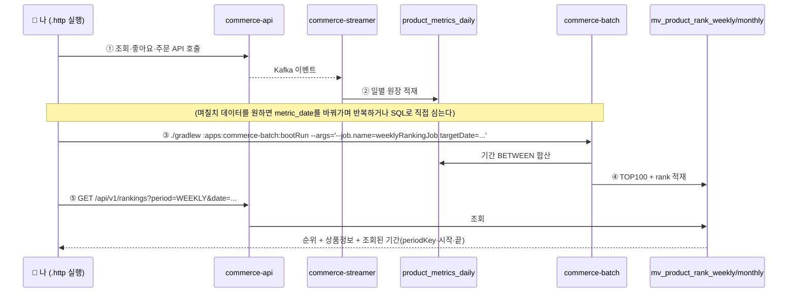

# Volume 10 — 검증 리포트 (Stage 6)

> **이 문서는 "다 만든 주간·월간 랭킹이 정말 제대로 도는가"를 확인한 결과 보고서입니다.**
> 새 기능을 만드는 단계가 아니라, Stage 1~5에서 만든 것을 **자동 테스트로 못 박고 + 실제로 앱을 관통시켜** 확인한 뒤, 무엇을·어떻게·결과가 어땠는지를 남깁니다.
>
> 한 문장으로 이번 주 내내 던진 질문: **"이 주간 랭킹, 정말 '그 주'의 데이터만으로 만들어졌는가?"** — 이 문서는 그 답이 "그렇다"임을 근거와 함께 보여줍니다.

---

## 0. 한눈에 보는 결과

| 확인한 것 | 결과 |
|---|---|
| 과제 체크리스트 4개 항목 | ✅ 4/4 모두 덮음 (§2) |
| 배치 랭킹 신뢰 검증 4종 (기간격리·멱등·동점·TOP100) | ✅ 자동 테스트로 고정 (§3) |
| Volume 10 랭킹 관련 자동 테스트 | ✅ **46개 전부 통과** (§4) |
| 전 모듈 회귀 (`./gradlew test`) | ✅ **BUILD SUCCESSFUL** — 일간 랭킹·기존 배치·streamer 안 깨짐 (§6) |
| 앱 4개 관통 (수동) | ✅ 재현 절차 문서화 (§5) |
| 운영 실행 방식 (cron) | ✅ 설계 근거와 명령 문서화 (§7) |

> **"통과했다"가 아니라 "옳게 통과했다"에 집중했습니다.** 배치가 그냥 `COMPLETED`로 끝났다는 것만 보면 "돌긴 돌았다"만 알 뿐, "결과가 맞다"는 모릅니다. 그래서 모든 Job 테스트는 **MV에 실제로 들어간 순위·점수·기간 합계 값 자체**를 확인합니다.

---

## 1. 무엇을, 왜 검증하나 (배경 30초)

이번 주에 만든 흐름은 앱 3개를 가로지릅니다.

```
[commerce-api]     조회·좋아요·주문 이벤트 발행
      ↓ Kafka
[commerce-streamer] 이벤트를 받아 '일별 원장'(product_metrics_daily)에 쌓음   ← 배치의 입력
      ↓ (주 1회 / 월 1회)
[commerce-batch]   일별 원장을 기간별로 합산 → 점수 → TOP100을 MV에 순위까지 적재  ← 이번 주 본체
      ↓ MySQL MV
[commerce-api]     랭킹 API가 period로 일/주/월을 골라서 보여줌
```

여기서 **가장 무서운 실수**는 두 가지입니다.

1. **기간이 새는 것** — "이번 주 랭킹"을 뽑는데 지난주·다음주 데이터가 섞여 들어가면, 그건 이미 주간 랭킹이 아닙니다.
2. **다시 돌리면 결과가 달라지는 것** — 배치는 실패·재실행이 일상입니다. 같은 주를 두 번 집계했는데 순위가 흔들리면 신뢰할 수 없습니다.

그래서 검증의 초점은 **"기간이 정확히 오려졌는가"** 와 **"두 번 돌려도 무너지지 않는가"** 입니다.

---

## 2. 과제 체크리스트 4개 — 무엇이 덮는가

과제가 요구한 4개 항목 각각을, 어떤 코드와 어떤 테스트가 책임지는지 정리했습니다.

| # | 과제 체크리스트 | 이걸 만든 곳 | 이걸 증명하는 테스트 |
|---|---|---|---|
| 1 | **Spring Batch Job을 파라미터 기반으로 동작** | `WeeklyRankingJobConfig` · `MonthlyRankingJobConfig` — `targetDate`(uuuuMMdd)를 받아 그 날짜가 **속한** 주/월을 집계 | 주간·월간 Job E2E 전체 + `backfillDifferentWeeksAccumulateIndependently`(다른 날짜 → 다른 기간 MV가 독립으로 쌓임) |
| 2 | **Chunk 기반 배치 처리** | aggregate Step: `JdbcCursorItemReader`(원장 읽기) → `RankingScoreProcessor`(점수 계산) → `JdbcBatchItemWriter`(스테이징 적재), **500건마다 커밋** | Job E2E가 다건 상품을 chunk로 흘려 적재 확인 (예: 101개 상품 → TOP100). `ChunkListener`가 커밋 단위를 로그로 관찰 |
| 3 | **집계 결과를 담을 MV 구조 설계·올바른 적재** | MV 테이블 2개 + 스테이징 테이블. 유니크 제약 `(period_key, product_id)`·`(period_key, rank)` | `ProductRankSchemaConstraintTest` 7개(중복 삽입 → 제약 위반 확인) + Job E2E가 적재된 순위·점수·합계 값을 직접 단언 |
| 4 | **API가 일/주/월을 형태에 맞는 데이터로 제공** | `RankingV1Controller` + `RankingFacade`의 `period` 라우팅 (DAILY→Redis, WEEKLY/MONTHLY→MV) | `RankingV1ApiE2ETest` 14개(period별 라우팅·기간 환산·응답 기간 명시·빈 기간·페이징) |

**결론:** 4개 항목 모두 "만든 코드"와 "그것을 증명하는 자동 테스트"가 1:1로 존재합니다.

---

## 3. 배치 랭킹 신뢰 검증 4종 — 무엇을·어떻게·결과

배치 랭킹의 신뢰를 가르는 4가지를 자동 테스트로 못 박았습니다. 각각 **"무엇이 걱정인가 → 어떻게 확인했나 → 결과"** 순서입니다.

### ① 기간 격리 — "그 주 데이터만 들어갔는가"

- **걱정:** 7/20~7/26 주간 랭킹인데, 그 직전(7/19)·직후(7/27) 원장이 섞이면 안 됩니다.
- **어떻게:** 같은 상품(100번)에게 **주 안쪽**(7/20, 7/26)과 **주 바깥**(7/19, 7/27)에 각각 원장을 심고, 주 바깥에만 기록된 상품(200번)도 심습니다. 그리고 집계 후 MV를 확인합니다.
- **결과:** ✅
  - 주 바깥 값(7/19·7/27의 999점짜리 큰 값)은 **합계에 안 잡힘** → 100번의 view 합계가 정확히 `10+5=15`.
  - 주 바깥에만 있던 200번 상품은 **MV에 아예 없음**.
  - 월간도 동일하게 전월 말일(6/30)·익월 1일(8/1)이 제외됨을 확인.
  - 📍 `WeeklyRankingJobE2ETest.aggregatesOnlyWithinTargetWeek`, `MonthlyRankingJobE2ETest.aggregatesOnlyWithinTargetMonth`

> **주간 ≠ 월간도 함께 확인:** 서로 다른 주(7/6=W28, 7/27=W31)에 걸친 날짜를 넣으면 **주간 집계로는 각각 다른 주**지만 **월간 집계로는 한 달(7월)로 합쳐집니다**. 이게 "주간을 합쳐 월간을 만들지 않는다 — 각자 원장에서 독립 재집계"를 증명합니다. 📍 `aggregatesWholeMonthAcrossWeeks`

### ② 멱등 재실행 — "두 번 돌려도 같은가"

- **걱정:** 배치가 중간에 죽어 다시 돌리거나, 지연 이벤트 반영을 위해 재집계할 때, 순위·점수가 흔들리면 안 됩니다.
- **어떻게:** 같은 `targetDate`로 Job을 **연속 2번** 실행하고, 1회차와 2회차의 MV 행 수·순위·점수를 비교합니다.
- **결과:** ✅ 2회차도 `COMPLETED`, 행 수 동일, 1위 상품의 순위·점수가 **1회차와 완전히 동일**. (발행이 `기간 스코프 DELETE → INSERT`를 단일 트랜잭션으로 하기 때문)
  - 📍 `reRunProducesIdenticalResult` (주간·월간 양쪽)

### ③ 동점 결정성 — "점수가 같으면 순위가 매번 같은가"

- **걱정:** 점수가 같은 두 상품의 순서가 실행할 때마다 뒤바뀌면, 재실행 멱등이 깨집니다.
- **어떻게:** 지표가 **완전히 똑같은** 두 상품(5번·10번)을 넣습니다.
- **결과:** ✅ 항상 `product_id` 오름차순 — 5번이 1위, 10번이 2위. (정렬 기준이 `score DESC, product_id ASC`라 동점이 결정적으로 풀림)
  - 📍 `breaksTieByProductIdAscending`

### ④ TOP100 경계 — "딱 100개만, 101등은 없는가"

- **걱정:** 랭킹은 상위 100개만 노출인데, 경계에서 101개가 들어가거나 100개가 안 채워지면 안 됩니다.
- **어떻게:** 점수가 서로 다른 상품 **101개**를 심고 집계합니다.
- **결과:** ✅ MV에 **정확히 100행**, 최고점 상품(101번)이 1위, **최하위(1번)는 MV에 없음**, 2번은 있음(경계 바로 안쪽).
  - 📍 `keepsOnlyTopHundred`

---

## 4. 계층별 자동 테스트 전체 (46개, 전부 통과)

Volume 10 랭킹과 직접 관련된 자동 테스트를 계층별로 정리했습니다. 아래는 `./gradlew test` 실제 결과입니다.

| 계층 | 테스트 클래스 | 케이스 | 무엇을 지키나 |
|---|---|:---:|---|
| **기간 계산**<br/>(modules/redis) | `RankingPeriodCalculatorTest` | **14** | ISO 주차 키·월 키·기간 시작/끝. **연말·연초 함정**(2025-12-29→2026-W01, 2027-01-01→2026-W53)과 2월 말일(평년 28·윤년 29)까지 고정 |
| **점수 계산**<br/>(commerce-batch) | `PeriodRankingScoreCalculatorTest` | **3** | `0.1×Σview + 0.2×Σlike + 0.7×log1p(Σ금액)`. 금액 실린 상품 > 좋아요만 쌓인 상품, 금액 0원 경계, 전 지표 0 |
| **MV 스키마**<br/>(commerce-batch) | `ProductRankSchemaConstraintTest` | **7** | 주간·월간 MV와 스테이징의 유니크 제약이 실제 DB에 걸리는지(중복 삽입 → 제약 위반) |
| **주간 Job**<br/>(commerce-batch) | `WeeklyRankingJobE2ETest` | **5** | 기간 격리·멱등·동점·TOP100·백필(§3) |
| **월간 Job**<br/>(commerce-batch) | `MonthlyRankingJobE2ETest` | **3** | 월 경계 격리·멱등·주 걸침 합산(§3) |
| **랭킹 API**<br/>(commerce-api) | `RankingV1ApiE2ETest` | **14** | period 라우팅(일=Redis·주월=MV), date→기간 환산, 응답의 periodKey·기간 명시, 미발행 기간=빈 목록, 페이징. 일간 회귀 7종 포함 |
| | **합계** | **46** | **failures 0 / errors 0** |

> 계층이 사다리처럼 쌓입니다 — **"어느 날짜가 어느 기간인가"(계산기)** → **"기간 합계를 점수로"(계산기)** → **"담을 그릇이 맞는가"(스키마)** → **"배치가 옳게 적재하는가"(Job E2E)** → **"API가 옳게 꺼내는가"(API E2E)**. 아래 계층이 튼튼해야 위 계층 테스트를 믿을 수 있습니다.

---

## 5. 앱 4개 관통 (수동 E2E) — "이벤트부터 월간 랭킹까지"

자동 테스트는 각 앱을 **따로** 검증합니다. 하지만 실제 서비스는 **api → streamer → batch → api**가 이어져 돌아가죠. 이 넷은 별도 프로세스라 하나의 자동 테스트로 묶을 수 없어서, **로컬에서 순서대로 재현**하는 절차를 남깁니다.

### 전체 그림



### 준비

```bash
# 1) 로컬 인프라 (MySQL·Redis·Kafka)
docker-compose -f ./docker/infra-compose.yml up

# 2) API + streamer 기동 (포트 충돌 피해 streamer는 다른 포트로)
./gradlew :apps:commerce-api:bootRun
SERVER_PORT=8082 MANAGEMENT_SERVER_PORT=8083 ./gradlew :apps:commerce-streamer:bootRun
```

### ①~② 이벤트 발생 → 원장 적재 (일간까지는 vol9 그대로)

`http/commerce-api/ranking-v1.http`의 **[시드] → [이벤트 발생] → [주문]** 을 위에서부터 실행하면 조회·좋아요·주문 이벤트가 발행되고, streamer가 `product_metrics_daily`에 그날치를 쌓습니다. (그 파일 맨 아래 **[Vol10] 주간·월간 배치 관통** 구간이 이어집니다.)

> **팁 — 주간/월간은 "여러 날"이 필요합니다.** 실시간 클릭만으로는 하루치밖에 안 쌓입니다. 며칠에 걸친 랭킹을 보려면 원장에 여러 `metric_date`를 직접 심는 게 빠릅니다:
> ```sql
> INSERT INTO product_metrics_daily (product_id, metric_date, view_count, like_count, sales_count, sales_amount, created_at, updated_at)
> VALUES (1, '2026-07-20', 10, 2, 1, 39000, NOW(6), NOW(6)),
>        (2, '2026-07-22', 3, 0, 1, 50000, NOW(6), NOW(6));
> ```

### ③ 배치 실행 — 그 주/그 달을 집계

```bash
# 주간: targetDate가 속한 ISO 주차(예: 2026-W30 = 7/20~7/26)를 집계
./gradlew :apps:commerce-batch:bootRun --args='--job.name=weeklyRankingJob targetDate=20260722'

# 월간: targetDate가 속한 캘린더 월(예: 2026-07)을 집계
./gradlew :apps:commerce-batch:bootRun --args='--job.name=monthlyRankingJob targetDate=20260722'
```

> 배치 앱은 **"실행하면 Job 하나 돌고 종료"** 하는 단발 모델입니다. `--job.name`으로 어떤 Job을 돌릴지 고르고, `targetDate`로 어느 기간인지 지정합니다. 실행이 끝나면 `mv_product_rank_weekly` / `mv_product_rank_monthly`에 순위가 채워집니다.

MV를 직접 눈으로 확인:
```bash
docker exec -it docker-mysql-1 mysql -uapplication -papplication loopers \
  -e "SELECT period_key, \`rank\`, product_id, score FROM mv_product_rank_weekly ORDER BY \`rank\`;"
```

### ④~⑤ API로 조회 — period별 확인

`ranking-v1.http`의 **[Vol10]** 구간을 실행합니다.

```http
### 주간 랭킹 — 7/22가 속한 주(2026-W30)로 환산되어 조회
GET http://localhost:8080/api/v1/rankings?period=WEEKLY&date=20260722&size=20&page=1

### 월간 랭킹 — 2026-07로 환산
GET http://localhost:8080/api/v1/rankings?period=MONTHLY&date=20260722&size=20&page=1

### 같은 주의 다른 날짜 — 위와 결과가 같아야 함 (7/20도 2026-W30)
GET http://localhost:8080/api/v1/rankings?period=WEEKLY&date=20260720

### 아직 배치를 안 돌린 미래 주 — 에러가 아니라 '빈 목록 + periodKey'
GET http://localhost:8080/api/v1/rankings?period=WEEKLY&date=20260805

### period 생략 = 일간(기존 그대로, Redis) — vol9 회귀
GET http://localhost:8080/api/v1/rankings?date=20260722

### 잘못된 period — 400 Bad Request
GET http://localhost:8080/api/v1/rankings?period=YEARLY&date=20260722
```

**무엇을 확인하나:**
- 응답에 `period`·`periodKey`("2026-W30")·`periodStart`·`periodEnd`가 박혀 있어 **"어느 기간의 랭킹인지"가 응답만 봐도 분명**.
- 주간·월간은 **MV에 저장된 rank 그대로**(페이지가 넘어가도 offset 계산이 아님).
- 미발행 기간은 **빈 목록이 정상**(에러 아님) — periodKey는 그대로 응답에 존재.

---

## 6. 회귀 — "새로 만든 게 기존 걸 깨지 않았는가"

일간 랭킹(vol9의 실시간 ZSET)·기존 배치 Job·streamer는 이번 주에 **손대지 않는 것**이 약속이었습니다. 정말 그런지 전 모듈 테스트로 확인했습니다.

```bash
./gradlew test
```

**결과: ✅ `BUILD SUCCESSFUL`** — 전 모듈 통과.

- 일간 랭킹 소비/집계(`RankingConsumerIntegrationTest`, `RankingRepositoryIntegrationTest`)·일간 점수 계산기(`RankingScoreCalculatorTest`)·키 생성기(`RankingKeyGeneratorTest`) 모두 그대로 통과.
- API의 일간 경로(period 생략) 회귀 7종도 `RankingV1ApiE2ETest`에서 함께 통과.

> **참고 — 앞서 잡은 시한폭탄 1건:** Stage 5 중 전체 테스트를 돌렸을 때 streamer 통합 테스트 10개가 실패했습니다. 원인은 랭킹 만료 검증 테스트가 날짜(`2026-07-17`)를 **하드코딩**해, 시간이 흘러 만료 시각이 과거가 되면서 Redis가 키를 즉시 지운 것이었습니다. `LocalDate.now(SEOUL_ZONE)`로 고쳐(시간이 흘러도 항상 미래 만료) 해소했고, 지금은 전 모듈이 안정적으로 통과합니다. — 배치 작업과 무관한 기존 테스트였지만, "전체를 돌려봐야 드러나는 문제"의 좋은 예라 남깁니다.

---

## 7. 운영에서 누가·언제 실행하나 (cron 설계)

배치 앱은 **실행 주기를 스스로 갖지 않습니다.** "언제 도느냐"는 앱이 아니라 **인프라(cron·K8s CronJob)의 책임**입니다.

### 권장 스케줄

| Job | 시각 (KST) | 무엇을 집계 | 실행 명령 |
|---|---|---|---|
| `weeklyRankingJob` | **매주 월요일 01:00** | 직전에 끝난 한 주(지난주) | `--args='--job.name=weeklyRankingJob targetDate=<지난주 아무 날짜>'` |
| `monthlyRankingJob` | **매월 1일 02:00** | 직전에 끝난 한 달(지난달) | `--args='--job.name=monthlyRankingJob targetDate=<지난달 아무 날짜>'` |

- **왜 기간이 끝나고 곧장이 아니라 새벽인가?** 기간이 끝난 순간(일요일 자정)과 배치 실행 사이에 버퍼를 둬, Kafka가 늦게 배달한 **지연 이벤트가 원장에 정착할 시간**을 줍니다. 그래도 놓친 지연분이 있으면, 같은 `targetDate`로 **다시 돌리면(멱등 재집계)** MV가 갱신됩니다.

### 왜 앱 안에 `@Scheduled`를 넣지 않았나

- 앱 내 스케줄러를 쓰려면 배치 앱을 **상시 기동 모델**로 바꿔야 하고, 인스턴스가 여러 개일 때 **같은 Job이 동시에 도는 걸 막는 분산 락(ShedLock)** 까지 떠안게 됩니다.
- 대신 **실행 로직(배치 앱)과 실행 주기(인프라 cron)의 책임을 분리** — 실무 표준이자, 이 앱을 단발 실행 모델로 단순하게 유지하는 길입니다.
- 같은 파라미터의 중복 실행은 **Spring Batch의 JobInstance**(실행 이력을 MySQL 메타데이터 테이블에 기록)가 1차로 막습니다. 완전한 분산 락은 이번 범위 밖(→ TODO §"일부러 안 하는 것").

---

## 8. 정리

- 과제 체크리스트 **4/4**, 신뢰 검증 **4종**, 랭킹 자동 테스트 **46개 통과**, 전 모듈 회귀 **BUILD SUCCESSFUL**.
- 핵심 질문 **"정말 그 주의 데이터만으로 만들어졌는가"** 에 대한 답은 — **기간 격리 테스트**가 주 안팎을 갈라 증명하고, **멱등·동점 테스트**가 "몇 번을 돌려도 같은 결과"임을 보장합니다.
- 앱 4개를 가로지르는 전 구간은 **§5의 명령 순서**로 처음부터 끝까지 재현할 수 있습니다.
