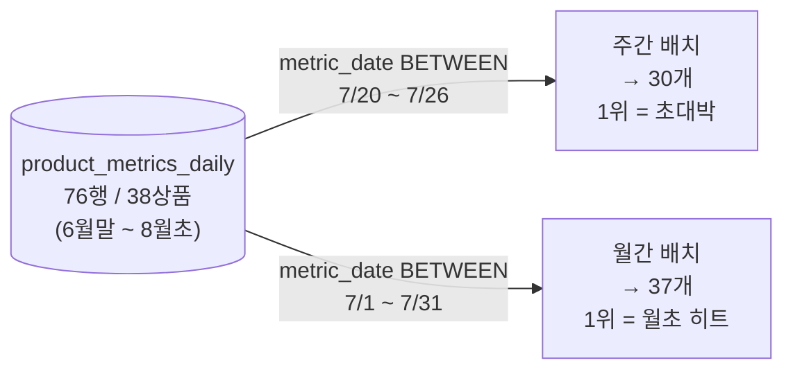

# Volume 10 — 실전 랭킹 시연 결과 (실제 데이터로 배치 돌려보기)

> **이 문서는 "테스트가 통과한다"가 아니라, 실제로 데이터를 잔뜩 넣고 배치를 돌렸을 때 랭킹판이 눈으로 봐도 맞는지**를 확인한 결과입니다.
>
> 상품마다 "성격"(초대박·구경만러·명품 한 방·박리다매 …)을 부여해 원장에 심고, 실제 `weeklyRankingJob` / `monthlyRankingJob` 배치를 로컬에서 돌린 뒤, 나온 랭킹판을 그대로 붙였습니다. 그리고 **"내가 의도한 대로 순위가 나왔는가"** 를 하나하나 짚습니다.

---

## 0. 어떻게 검증했나 — 세 개의 답을 맞춰봤다

같은 질문에 **서로 독립적인 세 경로**로 답을 구해서, 셋이 전부 같은지 봤습니다. 셋이 일치하면 "우연히 맞은 것"이 아닙니다.

```
① 내가 의도한 랭킹   (파이썬으로 점수 공식 직접 계산)
② 독립 SQL 정답지    (배치와 무관하게 원장을 GROUP BY + 공식으로 계산)
③ 실제 배치 결과     (weeklyRankingJob/monthlyRankingJob을 실제 실행 → MV 조회)
```

**결과: ①=②=③ 완전 일치** (주간 30개·월간 37개, 순위·점수 전부 동일). 아래에서 실제 랭킹판으로 보여드립니다.

- **점수 공식** (배치와 동일): `0.1 × Σ조회 + 0.2 × Σ좋아요 + 0.7 × log1p(Σ판매금액)`
- **동점 처리**: 점수가 같으면 `product_id` 오름차순
- **집계 대상**: 주간 = ISO 주차 `2026-W30`(7/20~7/26) · 월간 = `2026-07`(7/1~7/31)

---

## 1. 넣은 데이터 — 상품마다 '성격'을 줬다

총 **원장 76행 / 상품 38종**을 여러 날에 걸쳐 심었습니다. 핵심은 상품마다 뚜렷한 캐릭터를 준 것 — 그래야 "이 상품이 왜 여기 있지?"를 눈으로 검증할 수 있습니다.

| product_id | 캐릭터 | 노림수 (이 상품으로 확인하려는 것) |
|:---:|---|---|
| **1** | 종합 1위 초대박 | 조회·좋아요·판매 모두 최상 → **압도적 1위여야** |
| 2 | 스테디 대박 | 전 지표 2등급 |
| 3~4 | 인기·베스트 | 상위권 |
| 5~24 | 허리라인·롱테일 | 완만하게 줄어드는 일반 상품 (id 클수록 낮게) |
| **25** | 구경만러 | 조회 1500, **좋아요 5·판매 0** → 조회 가중치만으로 얼마나 오르나 |
| **26** | 찜폭발 | **좋아요 600·판매 0** → 좋아요만으로 얼마나 오르나 |
| **27** | 명품 한 방 | **판매액 600만원**(전체 최대급)인데 조회·좋아요 적음 → log가 고가를 얼마나 누르나 |
| **28** | 박리다매 | **판매건수 800**(최다)인데 금액은 40만 → 점수가 '건수'를 보나 '금액'을 보나 |
| 29 | 타임세일 반짝 | 하루(7/22)에 몰림 → 하루 집중도 합산되나 |
| 30 | 매일 조금씩 | 7일 내내 조금씩 → 여러 날 합산이 되나 |
| **31** | 침입자(7/19, W29) | 주간 W30 **직전 주** → 주간엔 빠지고 월간엔 들어와야 |
| **32** | 침입자(7/27, W31) | 주간 W30 **직후 주** → 주간엔 빠지고 월간엔 들어와야 |
| **33** | 월초 히트(7/3~5) | W30엔 데이터 없음, 판매액 최대 → **주간엔 없고 월간 1위여야** |
| 34 | 월중 스테디(7/10~13) | 월간 상위, 주간 없음 |
| 35 | 7월말 신상(7/28~29) | 월간 포함, 주간 없음 |
| 36~37 | 월간 소소 | 월간에만 소소하게 |
| **38** | 월밖 침입자(6/30·8/1) | 7월 **바깥** → 주간·월간 **둘 다 빠져야** |

---

## 2. 주간 랭킹 결과 (2026-W30, 7/20~7/26)

`./gradlew :apps:commerce-batch:bootRun --args='--job.name=weeklyRankingJob targetDate=20260722'` 실행 → `mv_product_rank_weekly` **실제 적재값**입니다.

| rank | pid | 캐릭터 | Σ조회 | Σ좋아요 | Σ판매건수 | Σ판매금액 | score |
|:---:|:---:|---|---:|---:|---:|---:|---:|
| 1 | 1 | 🥇 종합 1위 초대박 | 1400 | 300 | 120 | 3,000,000 | **210.44** |
| 2 | 2 | 스테디 대박 | 1000 | 250 | 90 | 1,500,000 | 159.96 |
| **3** | **25** | 👀 **구경만러 (판매 0)** | 1500 | 5 | 0 | **0** | **151.00** |
| **4** | **26** | ❤️ **찜폭발 (판매 0)** | 250 | 600 | 0 | **0** | **145.00** |
| 5 | 3 | 인기 신상 | 820 | 190 | 70 | 800,000 | 129.52 |
| 6 | 4 | 꾸준한 베스트 | 700 | 160 | 60 | 600,000 | 111.31 |
| 7 | 29 | 타임세일 반짝(하루) | 700 | 120 | 50 | 500,000 | 103.19 |
| 8 | 30 | 매일 조금씩(7일) | 630 | 140 | 35 | 210,000 | 99.58 |
| 9 | 5 | 허리라인 A | 620 | 140 | 50 | 450,000 | 99.11 |
| 10 | 6 | 허리라인 B | 560 | 120 | 44 | 380,000 | 88.99 |
| 11 | 7 | 허리라인 C | 500 | 110 | 40 | 300,000 | 80.83 |
| **12** | **28** | 📦 **박리다매 (판매건수 800)** | 520 | 90 | **800** | 400,000 | 79.03 |
| 13 | 8 | 허리라인 D | 460 | 95 | 36 | 250,000 | 73.70 |
| 14 | 9 | 허리라인 E | 420 | 85 | 30 | 200,000 | 67.54 |
| 15 | 10 | 허리라인 F | 380 | 75 | 26 | 160,000 | 61.39 |
| 16 | 11 | 허리라인 G | 340 | 66 | 22 | 130,000 | 55.44 |
| 17 | 12 | 허리라인 H | 300 | 58 | 18 | 100,000 | 49.66 |
| 18 | 13 | 허리라인 I | 270 | 50 | 15 | 80,000 | 44.90 |
| 19 | 14 | 허리라인 J | 240 | 44 | 12 | 60,000 | 40.50 |
| **20** | **27** | 💎 **명품 한 방 (판매액 600만)** | 180 | 50 | 3 | **6,000,000** | 38.93 |
| 21 | 15 | 허리라인 K | 210 | 38 | 10 | 45,000 | 36.10 |
| 22 | 16 | 허리라인 L | 185 | 32 | 8 | 33,000 | 32.18 |
| 23 | 17 | 허리라인 M | 160 | 27 | 6 | 24,000 | 28.46 |
| 24 | 18 | 허리라인 N | 140 | 22 | 5 | 17,000 | 25.22 |
| 25 | 19 | 허리라인 O | 120 | 18 | 4 | 12,000 | 22.18 |
| 26 | 20 | 롱테일 P | 100 | 14 | 3 | 8,000 | 19.09 |
| 27 | 21 | 롱테일 Q | 80 | 10 | 2 | 5,000 | 15.96 |
| 28 | 22 | 롱테일 R | 60 | 7 | 1 | 3,000 | 13.01 |
| 29 | 23 | 롱테일 S | 45 | 5 | 1 | 1,500 | 10.62 |
| 30 | 24 | 롱테일 T | 30 | 3 | 0 | 0 | 3.60 |

### 🔍 주간 랭킹 관전 포인트 — 의도대로 나왔나?

- ✅ **1위는 예상대로 "초대박"(pid 1).** 조회·좋아요·판매가 전부 최상이라 압도적. 의도 적중.
- 👀 **"구경만러"(pid 25)가 판매 한 건도 없이 3위!** 조회 1500 × 0.1 = **150점**을, 판매 0(log1p(0)=0)·좋아요 5로 만들었습니다. **조회 가중치(0.1)의 힘**을 눈으로 확인 — 실제 서비스에서 "조회는 폭발하는데 구매 전환이 안 되는 상품"이 랭킹 상위에 뜨는 현상 그대로입니다.
- ❤️ **"찜폭발"(pid 26)이 좋아요만으로 4위.** 좋아요 600 × 0.2 = 120점. 역시 판매 0.
- 💎 **"명품 한 방"(pid 27)의 반전 — 판매액 600만원(이 표에서 최대!)인데 겨우 20위.** 이유는 **log**입니다. `0.7 × log1p(6,000,000) ≈ 0.7 × 15.6 ≈ 10.9점`뿐. 판매금액이 100배 커져도 점수는 log라 조금밖에 안 오릅니다. "고가 상품 한 방"은 조회·좋아요가 받쳐주지 않으면 랭킹에서 힘을 못 씁니다. → 이게 vol9에서 결정한 **"주문은 총액에 log 한 번"** 공식의 실제 효과입니다.
- 📦 **"박리다매"(pid 28)의 판매건수 800(최다)은 순위에 거의 영향 없음(12위).** 점수 공식은 판매 **금액**만 보고 **건수**는 안 봅니다. 40만원어치 팔아 순위가 결정됐지, 800건이라서가 아닙니다.
- ✅ **하루 집중(pid 29)·7일 분산(pid 30) 모두 정상 합산.** 여러 날에 나눠 심은 값이 주간 합계로 정확히 뭉쳐졌습니다.
- 🚫 **침입자(pid 31·32)와 다른 주 상품(33~38)은 랭킹에 없음.** 7/19·7/27은 W30 밖이라 제외 — **기간이 정확히 오려졌습니다.**

---

## 3. 월간 랭킹 결과 (2026-07, 7/1~7/31)

`--args='--job.name=monthlyRankingJob targetDate=20260722'` 실행 → `mv_product_rank_monthly` **실제 적재값**입니다. 같은 원장을 **7월 전체**로 집계합니다.

| rank | pid | 캐릭터 | Σ조회 | Σ좋아요 | Σ판매건수 | Σ판매금액 | score |
|:---:|:---:|---|---:|---:|---:|---:|---:|
| **1** | **33** | 🚀 **월초 히트 (주간엔 없던 상품!)** | 2500 | 400 | 300 | 5,000,000 | **340.80** |
| **2** | **31** | 🆕 **침입자 W29 (주간 격리됐던)** | 1800 | 350 | 100 | 2,000,000 | 260.16 |
| **3** | **32** | 🆕 **침입자 W31 (주간 격리됐던)** | 1600 | 320 | 90 | 1,700,000 | 234.04 |
| 4 | 34 | 월중 스테디 | 1600 | 300 | 180 | 1,200,000 | 229.80 |
| **5** | **1** | 🥇→5 **초대박 (주간 1위였는데 5위로!)** | 1400 | 300 | 120 | 3,000,000 | 210.44 |
| 6 | 2 | 스테디 대박 | 1000 | 250 | 90 | 1,500,000 | 159.96 |
| 7 | 25 | 구경만러 | 1500 | 5 | 0 | 0 | 151.00 |
| 8 | 26 | 찜폭발 | 250 | 600 | 0 | 0 | 145.00 |
| 9 | 3 | 인기 신상 | 820 | 190 | 70 | 800,000 | 129.52 |
| 10 | 35 | 7월말 신상 | 900 | 150 | 90 | 600,000 | 129.31 |
| 11 | 4 | 꾸준한 베스트 | 700 | 160 | 60 | 600,000 | 111.31 |
| 12 | 29 | 타임세일 반짝 | 700 | 120 | 50 | 500,000 | 103.19 |
| 13 | 30 | 매일 조금씩 | 630 | 140 | 35 | 210,000 | 99.58 |
| 14 | 5 | 허리라인 A | 620 | 140 | 50 | 450,000 | 99.11 |
| 15 | 6 | 허리라인 B | 560 | 120 | 44 | 380,000 | 88.99 |
| 16 | 7 | 허리라인 C | 500 | 110 | 40 | 300,000 | 80.83 |
| 17 | 28 | 박리다매 | 520 | 90 | 800 | 400,000 | 79.03 |
| 18 | 8 | 허리라인 D | 460 | 95 | 36 | 250,000 | 73.70 |
| 19 | 9 | 허리라인 E | 420 | 85 | 30 | 200,000 | 67.54 |
| 20 | 10 | 허리라인 F | 380 | 75 | 26 | 160,000 | 61.39 |
| 21 | 11 | 허리라인 G | 340 | 66 | 22 | 130,000 | 55.44 |
| 22 | 12 | 허리라인 H | 300 | 58 | 18 | 100,000 | 49.66 |
| 23 | 36 | 월간 소소A | 300 | 40 | 20 | 50,000 | 45.57 |
| 24 | 13 | 허리라인 I | 270 | 50 | 15 | 80,000 | 44.90 |
| 25 | 14 | 허리라인 J | 240 | 44 | 12 | 60,000 | 40.50 |
| 26 | 27 | 명품 한 방 | 180 | 50 | 3 | 6,000,000 | 38.93 |
| 27 | 15 | 허리라인 K | 210 | 38 | 10 | 45,000 | 36.10 |
| 28 | 16 | 허리라인 L | 185 | 32 | 8 | 33,000 | 32.18 |
| 29 | 37 | 월간 소소B | 200 | 20 | 10 | 20,000 | 30.93 |
| 30 | 17 | 허리라인 M | 160 | 27 | 6 | 24,000 | 28.46 |
| 31 | 18 | 허리라인 N | 140 | 22 | 5 | 17,000 | 25.22 |
| 32 | 19 | 허리라인 O | 120 | 18 | 4 | 12,000 | 22.18 |
| 33 | 20 | 롱테일 P | 100 | 14 | 3 | 8,000 | 19.09 |
| 34 | 21 | 롱테일 Q | 80 | 10 | 2 | 5,000 | 15.96 |
| 35 | 22 | 롱테일 R | 60 | 7 | 1 | 3,000 | 13.01 |
| 36 | 23 | 롱테일 S | 45 | 5 | 1 | 1,500 | 10.62 |
| 37 | 24 | 롱테일 T | 30 | 3 | 0 | 0 | 3.60 |

### 🔍 월간 랭킹 관전 포인트 — 주간과 무엇이 다른가?

- 🚀 **월간 1위는 "월초 히트"(pid 33) — 주간 랭킹엔 아예 없던 상품입니다.** 7/3~7/5(월초)에 활동해 W30(7/20~26)엔 데이터가 0이었죠. **집계 기간이 바뀌니 1위가 통째로 바뀌었습니다.**
- 🆕 **2·3위가 "침입자"(pid 31·32).** 주간에선 W30 경계 밖이라 **격리됐던** 바로 그 상품들이, 월간(7월)엔 당당히 상위권. → "기간을 어떻게 자르느냐"가 랭킹을 어떻게 바꾸는지 극명하게 보입니다.
- 🥇→5위 **주간 1위였던 "초대박"(pid 1)이 월간에선 5위로 밀림.** 한 주에선 최강이었지만, 7월 전체로 보면 월초 히트·침입자·월중 스테디 같은 "다른 주의 강자들"에게 밀립니다.
- 🚫 **"월밖 침입자"(pid 38)는 월간에도 없음.** 6/30·8/1은 7월이 아니라 정확히 제외 — 월 경계도 칼같이 오려졌습니다.
- ✅ **월간에만 있는 소소한 상품(pid 35·36·37)이 자연스럽게 편입.** 주간엔 없던 이들이 월간 랭킹 중위권에 들어왔습니다.

---

## 4. 주간 vs 월간 — 같은 원장, 다른 랭킹판

**주간을 합쳐 월간을 만든 게 아닙니다.** 같은 일별 원장(`product_metrics_daily`)을 각각의 기간으로 **독립 재집계**한 결과입니다. 그래서 두 판이 이렇게 다릅니다.

| | 주간 (2026-W30) | 월간 (2026-07) |
|---|---|---|
| **1위** | pid 1 (초대박) | **pid 33 (월초 히트)** — 주간엔 없음 |
| **2·3위** | pid 2, pid 25 | **pid 31·32 (침입자)** — 주간엔 격리됨 |
| **주간 1위 초대박(pid 1)** | 1위 | **5위로 하락** |
| **상품 수** | 30개 | 37개 |
| **격리로 빠진 상품** | 31·32·33~38 (기간 밖) | 38 (월 밖) |



---

## 5. 검증 결론

| 확인 항목 | 결과 |
|---|---|
| 배치 실행 | 주간·월간 모두 `COMPLETED` (cleanup → aggregate → publish 3스텝) |
| **의도 = 독립 SQL = 배치 MV** | ✅ **3자 완전 일치** (주간 30개·월간 37개, 순위·점수 전부 동일) |
| 주간 기간 격리 | ✅ 침입자·타 주 상품(31·32·33~38) 유출 **0건** |
| 월간 기간 격리 | ✅ 월밖 상품(38) 유출 **0건** |
| 여러 날 합산 | ✅ 하루 집중·7일 분산 모두 정확히 합산 |
| 가중치·log 효과 | ✅ 조회만으로 3위(구경만러), 좋아요만으로 4위(찜폭발), 고가 한 방은 log에 눌려 20위(명품) — 공식이 눈에 보이는 대로 동작 |

**한 줄 결론:** 실제 데이터를 잔뜩 넣고 배치를 돌려봤을 때, 랭킹판은 **설계 의도 그대로** 나왔고, "왜 이 상품이 이 순위인가"가 점수 공식으로 **전부 설명**됩니다. 그리고 이번 주 내내 던진 질문 — **"이 주간 랭킹, 정말 '그 주'의 데이터만으로 만들어졌는가?"** — 에 대한 답은, 침입자가 주간엔 빠지고 월간엔 들어오는 이 결과가 **"그렇다"** 고 눈으로 보여줍니다.

---

> **재현 방법:** 이 시연에 쓴 시드 데이터 생성 규칙과 캐릭터 정의는 §1의 표에 그대로 있습니다. 원장에 심고 위 두 배치 명령을 실행하면 같은 랭킹판이 재현됩니다. (배치는 멱등이라 몇 번을 돌려도 결과가 같습니다.)
