# Volume 7 — 이벤트 기반 Decoupling & Kafka 파이프라인 TODO

> 이 문서는 **살아있는 계획서(가설)** 다. 단계 진행 중 구현·측정 결과가 가정과 어긋나면(예: 좋아요를 이벤트로 뺐더니 오히려 락 경합이 그대로) plan을 사실에 맞게 고친다.
> vol6(PG Resilience)의 "완결 → 박제 → 보강(측정 중심)"과 달리, 이번 주는 **경계 설계 중심**이다. 매 단계의 핵심 질문은 언제나 하나다 — **"이걸 이벤트로 분리해야 하는가, 무엇을 의도적으로 동기로 남기는가."**

---

## 0. 목표 & 성공 기준

> 하나의 무거운 트랜잭션에 몰린 흐름을 **꼭 지금 해야 할 것(동기)** 과 **나중에 해도 될 것(비동기)** 으로 가른다. 애플리케이션 내부는 `ApplicationEvent`로, 시스템 경계를 넘는 것은 `Kafka`로 분리하고, 선착순 쿠폰 발급에 실전 적용한다.

핵심 철학:

- **무조건 분리가 아니다.** 정합성이 필요한 상태 변경(쿠폰 사용·재고 차감)은 동기로 남기고, 후속·집계·전송·로깅만 비동기로 뺀다. "왜 이건 동기인가"의 판단 근거 자체가 학습 포인트다.
- **외부(Kafka)로 나가는 순간 유실을 가정한다.** DB 쓰기와 메시지 발행의 원자성 구멍(Dual Write)은 Transactional Outbox로 메우고, 그래도 새는 것은 원천 기준 reconcile로 되맞춘다.
- **파티션 순차는 정합성의 근거가 아니다.** 선착순의 정확성은 DB 조건부 UPDATE와 UNIQUE 제약이 담보한다. 순차 처리는 해석·디버깅을 위한 보조 장치일 뿐이다.

### 성공 기준 (요구사항 체크리스트 매핑)

| 체크리스트 | 충족 단계 |
|---|---|
| 주문–결제 플로우의 부가 로직을 이벤트로 분리 | Stage 3 |
| 좋아요 처리와 집계 분리 (집계 실패와 무관하게 좋아요 성공) | Stage 2 |
| 유저 행동(조회·좋아요·주문) 서버 로깅을 이벤트로 | Stage 3 |
| 동작 주체 분리 + 트랜잭션 간 연관관계 판단 | Stage 0·3·4 |
| 시스템 간 전파가 필요한 이벤트를 Kafka로 발행 | Stage 5 |
| `acks=all`, `idempotence=true` | Stage 5 |
| Transactional Outbox Pattern | Stage 6 |
| PartitionKey 기반 순서 보장 | Stage 5 |
| Consumer가 Metrics 집계 (`product_metrics` upsert) | Stage 7 |
| `event_handled` 멱등 처리 | Stage 7 |
| manual Ack + `updated_at`/version 최신 이벤트만 반영 | Stage 7 |
| 쿠폰 발급 요청 API → Kafka 비동기 발행 | Stage 9 |
| Consumer 선착순 수량 제한 + 중복 발급 방지 | Stage 10 |
| 발급 완료/실패를 유저가 확인 (polling) | Stage 11 |
| 동시성 테스트 — 수량 초과 발급 없음 | Stage 10·12 |

---

## 1. 핵심 결정 (확정)

| 주제 | 결정 | 근거 |
|---|---|---|
| 분리 기준 | **정합성 필요 = 동기 / 후속·집계·전송·로깅 = 비동기.** 쿠폰 사용·재고 차감은 동기 유지 | "무조건 이벤트" 가 아니라 자원 특성별 차등. 상태 변경을 비동기로 빼면 정합성 창(window)이 생긴다 |
| 이벤트 구조 | **사실 단위로 나눈 도메인 record 이벤트(과거형 타입명) + `ApplicationEventPublisher` 직접 발행(Facade) + application 단일 핸들러(전달 어노테이션 + 반응 로직)** | 발행은 이미 Spring에 종속된 Facade가 하고 도메인은 JPA 엔티티라 별도 Publisher 인터페이스(DIP)는 순수 보일러플레이트. ~~리스너(interfaces)/핸들러(application) 분리~~ → **결정 변경(Stage 1 구현 후):** in-app 이벤트는 같은 JVM에서 도메인 record가 그대로 전달되어 어댑터가 번역할 게 없고, 리스너에 포워딩 한 줄만 남아 분리 이득이 없음. 핸들러 하나에 `@TransactionalEventListener` + `@Async` + 로직을 함께 둠(실무 다수파 형태). ~~단일 `LikeChangedEvent` + `LikeChangeType` enum~~ → **결정 변경(Stage 2 구현 후):** `LikeCreatedEvent`/`LikeDeletedEvent`로 재분리. 이벤트 타입명은 과거형 사실(`OrderCreatedEvent`류 관례)이어야 하고, Spring 리스너 디스패치가 페이로드 타입 기반이라 나누면 핸들러가 타입별로 갈려 switch·enum이 통째로 사라짐(타입 안전 + 완전성 검사 확보) |
| 트랜잭션 phase | 정합성 필요 = 동기 / 후속 = `@TransactionalEventListener(AFTER_COMMIT)` + `@Async`, DB 쓰기 핸들러만 `REQUIRES_NEW` | 커밋 이후 실행 보장 + 후속 실패가 본류를 롤백하지 않게 격리 |
| AsyncConfig | **전용 스레드풀**(core/max/queue) + `CallerRunsPolicy` + graceful shutdown | 기본 executor는 스레드 무한 생성·유실 위험. 큐 포화 시 호출 스레드가 직접 실행해 유실 대신 지연 |
| 보상 트랜잭션 | 결제 확정 실패 → `PaymentFailedEvent` → **재고 복원·쿠폰 복원 핸들러**(비동기). 재고 차감 시점은 **주문 시점 유지**(후차감 안 함) | 결제 실패 시 재고·쿠폰이 영구 미복구되는 vol6 한계를 이벤트로 메움. 후차감은 oversell 창을 열어 회피 |
| 주문 "폐기" | 물리·소프트 삭제 X → `markPaymentFailed` **상태 전이**(기존). 주문 전이는 `PaymentTransactionWriter.confirm` 안에 **동기 유지** | 이력·감사·정산 때문에 주문은 종료 상태로 박제. 승자 판별(조건부 UPDATE)과 주문 전이가 같은 트랜잭션이어야 "정확히 한 번" |
| PG 취소 | `PaymentGateway`에 `cancel` 추가, **구현은 로그만** | 결과 불명(PENDING)으로 폐기한 뒤 폴링이 뒤늦게 SUCCESS를 발견하는 엣지용. pg-simulator에 취소 API 없음 |
| 좋아요 집계 | **이중 카운터**: `products.like_count`(in-app 이벤트, 표시·정렬, At Most Once) + `product_metrics`(Kafka, 분석, At Least Once) | 표시/정렬은 즉시성이 필요해 api 자족, 분석 집계는 지연 허용. 용도·소유가 달라 중복은 의도된 비정규화 |
| like_count 갱신 | **in-app 이벤트로 요청에서 분리.** 이유는 지연이 아니라 **주문 행 락 경합 분리 + 실패 격리** | 단일 `+1`은 지연 문제가 아니다. 좋아요가 주문의 `FOR UPDATE` 락에 볼모 잡히지 않게 하고, 집계 실패가 좋아요를 롤백하지 않게 함 |
| product_metrics 정합 | **DB 원자 upsert(`ON DUPLICATE KEY UPDATE +delta`) + `occurredAt`/version stale 가드** | 좋아요·주문·조회 여러 소스가 같은 행을 갱신하므로 파티셔닝만으론 부족. 순서 뒤바뀐 이벤트는 무시 |
| 두 카운터 정합 | 서로 동기화하지 않고 **각자 원천(`likes` COUNT)에 수렴** | 파생 캐시끼리 맞추면 오류가 전파된다. 진실의 원천은 `likes` 테이블 |
| reconcile | **commerce-batch에 주기 잡** — `likes` COUNT로 `products.like_count`·`product_metrics`를 self-heal | in-memory 이벤트는 유실(At Most Once) 가능. 주기 재계산으로 드리프트를 원천 기준 0으로 리셋 |
| Kafka Producer | `acks=all` + `enable.idempotence=true`. 토픽 key = 집계 대상 id | 발행 유실·중복 최소화. 같은 키 = 같은 파티션으로 순서 보장 |
| Outbox 저장 | 비즈니스 트랜잭션 안에서(직접 저장 또는 `BEFORE_COMMIT`) | 메시지 기록과 비즈니스 변경이 같은 트랜잭션이어야 Dual Write 원자성 |
| Outbox relay | **`@Scheduled` 폴링(1초)** → Kafka 발행 성공 확인 후 발행 완료 표시. CDC(Debezium)는 범위 밖 | At Least Once. 발행 성공 콜백/블로킹 확인 후에만 마킹(fire-and-forget 금지) |
| Consumer 멱등 | **`event_handled(event_id PK)` DB 테이블** + manual Ack | 처리 기록과 집계 쓰기를 원자적으로 묶을 수 있음. Redis 대비 원자성 우위 |
| 선착순 동시성 | **조건부 UPDATE(`issued_count < max`, affected rows) + `UNIQUE(user_id, coupon_id)`** — vol6 Stage 7 패턴 재사용 | 정확성 담보. 파티션 직렬화는 보조. 조건부 UPDATE는 concurrency와 무관하게 정확 |
| 선착순 발급 경로 | **Outbox 경유 통일** (요청 상태 저장 + Outbox 한 트랜잭션) | Step 2 Outbox와 경로 하나로 통일, 유실 방지. "send 성공 but DB 실패" 구멍 회피 |
| 선착순 Consumer | **commerce-streamer, concurrency=1 순차** | subject 아키텍처와 일치. 순차는 정확성이 아니라 해석·디버깅 용이성 |
| 발급 요청 상태 | 별도 **`CouponIssueRequest`(PENDING/SUCCESS/FAILED)** + `requestId` polling | UserCoupon에 발급 전 상태를 섞어 의미를 오염시키지 않음 |
| 수량 개념 | `CouponModel`에 `maxQuantity` + `issuedCount` 추가 | 선착순 "N장 한정"을 표현할 수량·발급 카운트가 현재 없음 |

---

## 2. 단계 사다리

핵심 흐름: **현황 판단 → 애플리케이션 내부에서 끊기 → 시스템 경계 넘는 것만 Kafka로 → 선착순 실전 적용.**

```mermaid
flowchart TD
    S0["Stage 0 · 현황 & 경계 판단\n동기 흐름 목록화 · 자원별 동기/비동기 분해표"] --> S1

    subgraph STEP1["Step 1 · ApplicationEvent로 경계 나누기"]
        S1["Stage 1 · 이벤트 인프라 골격\n도메인 record + ApplicationEventPublisher 직접 + 리스너/핸들러 + AsyncConfig"] --> S2
        S2["Stage 2 · 좋아요 ↔ 집계 분리\nlike_count in-app 이벤트 (eventual consistency)"] --> S3
        S3["Stage 3 · 주문/결제 후속 + 유저 행동 로깅\n데이터플랫폼 전송(Mock) · 로깅 = 비동기 / 쿠폰 사용 = 동기"] --> S4
        S4["Stage 4 · 보상 트랜잭션\n결제 실패 → 재고·쿠폰 복원 이벤트 + PG cancel stub"]
    end

    S4 --> S5
    subgraph STEP2["Step 2 · Kafka 이벤트 파이프라인"]
        S5["Stage 5 · Kafka Producer + 토픽\nacks=all · idempotence · key=aggregateId"] --> S6
        S6["Stage 6 · Transactional Outbox\n비즈니스 TX 안 저장 + relay 폴링(At Least Once)"] --> S7
        S7["Stage 7 · Consumer (streamer)\nmanual Ack · event_handled 멱등 · product_metrics 원자 upsert + stale 가드"] --> S8
        S8["Stage 8 · Reconcile 잡 (commerce-batch)\nlikes COUNT로 self-heal"]
    end

    S8 --> S9
    subgraph STEP3["Step 3 · 선착순 쿠폰 발급"]
        S9["Stage 9 · 수량 개념 + 발급 요청 API\nmaxQuantity/issuedCount · 요청(PENDING)+Outbox → Kafka"] --> S10
        S10["Stage 10 · Consumer 선착순 처리\nconcurrency=1 · 조건부 UPDATE · UNIQUE 중복 방지"] --> S11
        S11["Stage 11 · 결과 조회 API\nGET /coupons/issue/{requestId} polling"] --> S12
        S12["Stage 12 · k6 동시성 측정\n1만명 동시 요청 → 수량 초과 0건 + 버퍼 효과"]
    end

    S12 --> DOC["Writing Quest\n단계별 '왜'를 정직하게"]
```



---

## 3. 횡단 규약 (모든 단계 공통)

- **분리 전 판단이 먼저다.** 새 이벤트를 만들 때마다 "이게 실패해도 본류는 성공해야 하는가?"를 한 문장으로 답하고, 그 답이 phase/@Async 선택을 결정한다.
- **발행은 `@Transactional` 메서드 안에서** 한다 — 그래야 `AFTER_COMMIT` 리스너가 정상 트리거된다.
- **외부 I/O(Kafka·데이터플랫폼)는 DB 트랜잭션 밖**에서(커밋 이후 또는 별도 트랜잭션) 수행해 커넥션 점유·롱 트랜잭션을 피한다.
- **핸들러의 `catch`를 빈 블록으로 두지 않는다.** 후속 실패를 삼키더라도 최소한 로깅하고, 상태 변경(쿠폰·재고 복원) 실패는 정합성 구멍이므로 재처리 경로 또는 한계를 명시한다.
- **발행만 하고 소비처 없는 이벤트(dead event)를 만들지 않는다.** 발행 검증뿐 아니라 소비 효과(핸들러 결과)까지 단언한다.
- **엔티티를 통째로 페이로드에 싣지 않는다.** 전송·후속 처리에 필요한 만큼만 스냅샷(record)으로 담는다.

---

## 4. 측정·테스트 규약

> 이번 주는 튜닝보다 경계 설계가 핵심이므로 측정은 선착순 동시성에 집중한다.

- **위치**: `docs/volume-7/measurement/k6/`(시나리오), `docs/volume-7/reports/`(결과)
- **비동기 검증**: `Awaitility` 수렴 대기(`await().untilAsserted`)로 비동기 반영을 단언한다. 시간 고정 `sleep`은 flaky하므로 쓰지 않는다.
- **데이터플랫폼 전송 검증**: Mock sender가 수집한 메시지 리스트를 단언한다.
- **선착순 동시성 테스트**: 수량 N장에 M명 동시 요청 → 발급 성공이 정확히 N, 초과 0건, 같은 유저 중복 1건. 정확성 담보(조건부 UPDATE + UNIQUE)를 검증한다.
- **k6 부하**: 대량 동시 요청(예: 1만) → 수량 초과 발급 0건 + Kafka 버퍼 효과(API 즉시 응답, Consumer 순차 소진)를 관찰 → `reports/`.
- **동기 → 비동기 전환 시** 기존 동기 테스트(동기 집계·동기 동시성)를 **동반 제거**하고, `grep`으로 잔존 0건을 확인한다.

---

## Stage 0 — 현황 & 경계 판단 (설계 원점)

**목표:** 지금 한 트랜잭션에 묶여 있는 흐름을 목록화하고, 무엇을 끊고 무엇을 동기로 남길지 자원 특성별로 판단한다.

- [x] 현재 동기 흐름 목록화 — `OrderFacade.createOrder`(재고 차감 + 쿠폰 사용 + 주문 저장), `LikeFacade`(좋아요 저장 + `incrementLikeCount`), `PaymentTransactionWriter.confirm`(결제 확정 → 주문 상태 전이)
- [x] 자원별 동기/비동기 분해표 작성 (아래)
- [x] "이걸 이벤트로 분리해야 하는가"의 판단 기준 정리 — ① 실패해도 본류가 성립하는가 ② 즉시 정합성이 필요한 상태 변경인가 ③ 시스템 경계를 넘는가

**현황 — 코드로 확인한 동기 흐름**

| 흐름 | 한 트랜잭션에 묶인 것 | 코드 사실 |
|---|---|---|
| `OrderFacade.createOrder` | 재고 차감 → 할인 계산 → 쿠폰 사용 → 주문 저장 | 재고는 상품 행 `FOR UPDATE` 비관락(`getActiveByIdForUpdate`) 후 차감. 쿠폰은 낙관락(`@Version`) — 동시 사용 충돌 시 한쪽이 CONFLICT로 롤백. 할인액이 `finalAmount` 산정에 즉시 사용됨 |
| `LikeFacade.createLike`/`deleteLike` | 좋아요 저장 → `like_count` 증감 | 같은 트랜잭션 — 집계 실패가 좋아요를 롤백시키고, `+1` UPDATE가 주문이 잡은 상품 행 락을 대기할 수 있음 |
| `PaymentTransactionWriter.confirm` | 승자 판별(조건부 UPDATE) → 주문 상태 전이 | `REQUIRES_NEW` 단일 트랜잭션. 콜백(`PaymentFacade`)·폴링(`PaymentReconciliationService`) 두 경로가 모두 여기로 수렴. **결제 실패 시 재고·쿠폰 복원 코드는 현재 없음** (vol6 한계 그대로 → Stage 4에서 메움) |

**자원별 분해표 (세 질문 답 포함)**

| 자원 | ① 실패해도 본류 성립? | ② 즉시 정합성 상태 변경? | ③ 시스템 경계? | 경계 | 근거 |
|---|---|---|---|---|---|
| 재고 차감 | 아니오 — 차감 실패 = 주문 불성립 | 예 | 아니오 | 동기 | 실패 시 주문이 성립 안 함 |
| 쿠폰 사용(상태 변경) | 아니오 — 사용 실패 시 주문도 생성되면 안 됨 | 예 (낙관락 충돌 → 주문과 함께 롤백) | 아니오 | 동기 | 비동기로 빼면 이중 사용 창이 생김 |
| 할인 계산 | 아니오 | 예 — 주문 금액 산정에 즉시 필요 | 아니오 | 동기 (이벤트 아님) | 주문 금액 산정에 즉시 필요 |
| 결제 결과 → 주문 상태 전이 | 아니오 | 예 — 승자 판별과 원자적이어야 정확히 한 번 | 아니오 | 동기 (confirm 내부) | 승자 판별과 원자적이어야 정확히 한 번 |
| 결제 실패 → 재고·쿠폰 복원 | 예 — 복원이 늦어도 결제 실패 확정은 유효 | 아니오 — 지연 방향이 "덜 팔림"이라 감내 가능 | 아니오 | 비동기 이벤트 | 후속 보상, 본류 무영향 |
| 좋아요 집계(like_count) | 예 — 집계 실패해도 좋아요는 성공해야 | 아니오 — eventual 허용 | 아니오 | 비동기 이벤트 | 집계 실패와 무관하게 좋아요 성공 (eventual) |
| product_metrics 집계 | 예 | 아니오 | 예 — streamer가 소비 | 비동기 (Kafka) | 시스템 경계, 분석 지연 허용 |
| 데이터플랫폼 전송 | 예 | 아니오 (상태 변경 아님) | 예 | 비동기 (Mock, 트랜잭션 없음) | 외부 I/O, 본류 무영향 |
| 유저 행동 로깅 | 예 | 아니오 | 아니오 (현재는 서버 로그) | 비동기 | 본류 무영향 |

**긴장 지점 세 곳의 판단 과정 (라이팅 소재)**

- **쿠폰 사용을 동기로 남기는 이유** — 할인액이 주문 `finalAmount` 산정에 즉시 들어가므로 쿠폰 확정과 주문 생성은 원자적일 수밖에 없다. 비동기로 빼면 "주문은 생성됐는데 쿠폰 사용은 실패"가 생겨 주문을 되돌리는 보상 트랜잭션이 필요해진다 — 분리가 만드는 복잡도가 분리로 얻는 것보다 크다. 이중 사용 방지는 낙관락(`@Version`)이 담보하고, 동기라서 낙관락 충돌이 곧 주문 롤백으로 이어진다. (참고: `UNIQUE(user_id, coupon_id)`는 사용이 아니라 중복 **발급**을 막는 제약 — Stage 10에서 재사용)
- **좋아요 집계를 비동기로 빼는 이유** — 지연 때문이 아니다. ⑴ 주문이 상품 행에 `FOR UPDATE` 락을 잡는 동안 `like_count +1` UPDATE가 같은 행 락을 대기해, 좋아요 응답이 주문 트랜잭션 길이의 볼모가 된다. ⑵ 같은 트랜잭션이라 집계 실패가 좋아요를 롤백시킨다. ⑶ 후속 작업이 늘수록(Step 2의 product_metrics 등) 한 트랜잭션의 실패 사유가 함께 누적된다 — 분리는 확장의 디딤돌.
- **재고 차감은 동기, 복원은 비동기인 이유** — 차감 실패는 주문 불성립 그 자체(본류)라 비동기로 빼면 주문을 되돌리는 보상이 필요해져 배보다 배꼽이 커진다. 복원은 "결제 실패 확정"이라는 본류가 끝난 뒤의 후속이고, 복원이 안 됐다고 결제 실패 확정이 롤백되어서는 안 된다. 복원 지연의 방향은 재고가 실제보다 적게 보이는 쪽(판매 기회 손실)이라 초과판매 같은 정합성 사고가 아니다. 단 복원 *실패*는 영구 구멍이므로 Stage 4에서 최소 로깅 + 한계 명시.

**검증:** 모든 이벤트 후보에 대해 위 세 질문의 답이 문서에 남는다. 이 표가 이후 모든 단계 판단의 기준점이 된다. ✅

---

## Stage 1 — 이벤트 인프라 골격

**목표:** 이벤트 발행/구독의 뼈대를 세우고, 후속 로직을 본류 트랜잭션에서 분리한다. (이벤트 객체는 record라 Spring·Kafka 비종속, 발행은 Facade)

- [x] **도메인 record 이벤트** — 전송·후속에 필요한 만큼만 스냅샷. 생성자 불변식(null 금지). 정적 팩토리(`from`/`of`) → ~~`LikeChangedEvent(productId, changeType)` + `LikeChangeType(LIKED/UNLIKED)`~~ → **`LikeCreatedEvent(productId)` / `LikeDeletedEvent(productId)`로 재분리(결정 변경)**: 과거형 사실 타입명 관례 + 타입 기반 디스패치로 switch·enum 제거
- [x] **`ApplicationEventPublisher` 직접 발행(Facade)** — 별도 Publisher 인터페이스 두지 않음. `ApplicationEventPublisher` 자체가 이미 추상이고 발행 지점(Facade)이 이미 Spring 종속이라 한 겹 더 감싸지 않음
- [x] ~~리스너(interfaces 얇은 어댑터) / 핸들러(application 로직) 분리~~ → **application 단일 핸들러로 통합(결정 변경)** — `application.like.LikeEventHandler` 하나에 `@Async` + `@TransactionalEventListener(AFTER_COMMIT)` + `@Transactional(REQUIRES_NEW)` + 집계 로직. in-app 이벤트는 어댑터가 번역할 게 없어 분리 시 포워딩 보일러플레이트만 남았음
- [x] **AsyncConfig** — `@EnableAsync` + 전용 `ThreadPoolTaskExecutor`(core/max/queue) + `CallerRunsPolicy` + graceful shutdown(`waitForTasksToCompleteOnShutdown`). Boot이 `applicationTaskExecutor`를 따로 띄우므로 `@Async("eventTaskExecutor")` 빈 이름 명시 필수
- [x] 발행 지점은 `@Transactional` 메서드 안 (AFTER_COMMIT 정상 트리거 전제) — `LikeFacade` 클래스 레벨 `@Transactional` 안에서 발행

**검증:** 이벤트 하나를 발행 → `AFTER_COMMIT` + `@Async` 핸들러가 전용 풀 스레드(`event-` prefix)에서 실행됨을 통합 테스트로 확인. ✅ `LikeEventHandlerIntegrationTest`

> **plan 수정(사실 반영):** dead event 금지 규약 때문에 Stage 1 전용 샘플 이벤트를 만들지 않고, Stage 2의 좋아요 이벤트를 첫 실전 이벤트로 삼아 Stage 1·2를 한 몸으로 구현·검증했다. 이벤트는 처음엔 `LikeChangedEvent`+enum 단일 타입으로 시작했다가, "이벤트 타입명은 과거형 사실이어야 하고 Spring 디스패치가 타입 기반"이라는 판단으로 `LikeCreatedEvent`/`LikeDeletedEvent`로 재분리했다(사용자 논의 후 결정).

---

## Stage 2 — 좋아요 ↔ 집계 분리 (eventual consistency)

**목표:** 좋아요 저장과 `like_count` 집계를 끊어, 집계가 실패해도 좋아요는 성공하게 한다.

- [x] `LikeFacade.createLike`/`deleteLike`의 `incrementLikeCount`/`decrementLikeCount` 직접 호출을 **`LikeCreatedEvent`/`LikeDeletedEvent` 발행**으로 대체
- [x] 핸들러(`AFTER_COMMIT` + `@Async` + `REQUIRES_NEW`)가 `products.like_count` 증감 — 집계 실패해도 좋아요는 이미 커밋됨
- [x] 상품 조회 응답의 `like_count`는 그대로 노출 (표시·정렬 권위값 유지) — 조회 경로 변경 없음
- [x] 기존 동기 좋아요 집계·동시성 테스트를 비동기로 이관하고 잔존 제거 — 단위(`LikeFacadeTest`)는 발행 검증으로, 통합(`LikeFacadeIntegrationTest`)은 수렴 대기로 이관. `grep` 잔존 0건(핸들러·테스트 픽스처 시딩만 남음). **동시성 테스트는 애초에 존재하지 않아 이관 대상 없음(사실 반영)**
- [x] `Awaitility`로 비동기 반영 검증 — `await().untilAsserted` 수렴 대기, 미발생 검증은 `during()` 유지 확인

**검증:** 좋아요 저장은 즉시 성공하고, `like_count`는 잠시 후(수 ms) 반영된다. 집계 핸들러가 실패해도 좋아요 레코드는 남는다. ✅ `LikeEventHandlerIntegrationTest.keepsLikeCommitted_whenAggregationFails`

> **판단 근거(라이팅 소재):** 이건 지연 때문이 아니다. 단일 `+1`은 마이크로초다. 분리 이유는 ① 좋아요가 주문의 상품 행 `FOR UPDATE` 락에 볼모 잡히지 않게 ② 집계 실패가 좋아요를 롤백하지 않게. 이 규모에선 동기여도 되지만, Step 2의 스트림 집계로 가는 디딤돌이다.

---

## Stage 3 — 주문/결제 후속 분리 + 유저 행동 로깅

**목표:** 부가 로직(외부 전송·로깅)을 이벤트로 빼되, 정합성이 필요한 쿠폰 사용은 동기로 남긴다.

- [x] **데이터플랫폼 전송 포트(Mock)** — `domain.dataplatform.DataPlatformSender` 포트 + `infrastructure` 로그 Mock 구현(`PaymentGateway` 패턴). `OrderCreatedEvent`(주문 커밋 후)·`PaymentSucceededEvent`(결제 확정 승자 커밋 후)를 `DataPlatformEventHandler`(`AFTER_COMMIT` + `@Async`, DB 안 쓰므로 트랜잭션 없음)가 전송. 실패해도 본류 무영향
- [x] **유저 행동 로깅** — 도메인별 개별 이벤트 구독(`UserActivityEventHandler`): `ProductViewedEvent`(상세 조회, 공개 엔드포인트라 userId 없이 productId만) · `LikeCreatedEvent`/`LikeDeletedEvent`(행동 로깅 겸용으로 userId enrich) · `OrderCreatedEvent`. 통합 이벤트 대신 개별 구독을 택한 근거 — Stage 2와 일관된 타입 기반 디스패치, 기존 이벤트 재사용
- [x] **쿠폰 사용은 동기 유지** — `OrderFacade`의 낙관락 처리 그대로. 할인액이 `finalAmount` 산정에 즉시 필요해 원자적일 수밖에 없고, 분리 시 주문을 되돌리는 보상이 필요해져 배보다 배꼽이 커짐 (Stage 0 분해표 근거)
- [x] 각 핸들러의 phase/async 근거 — 데이터플랫폼·로깅 모두 "실패해도 본류 성립 + 상태 변경 아님 + (전송은) 시스템 경계" → `AFTER_COMMIT`+`@Async`. DB를 쓰지 않으므로 `REQUIRES_NEW` 불필요(집계 핸들러와 대비)

**검증:** 데이터플랫폼 전송이 실패해도 주문은 커밋 유지(`keepsOrderCommitted_whenSendFails`). 전송·로깅 모두 전용 이벤트 스레드에서 비동기 실행. 쿠폰 사용은 여전히 주문 트랜잭션 안에서 동기 확정. ✅ `DataPlatformEventHandlerIntegrationTest` · `UserActivityEventHandlerIntegrationTest`

---

## Stage 4 — 보상 트랜잭션 (결제 실패 → 복원)

**목표:** 결제가 확정 실패하면 재고·쿠폰을 이벤트로 복원한다. (vol6의 "결제 실패 시 재고/쿠폰 미복구" 한계 메움)

- [x] `PaymentTransactionWriter.confirm`에서 **승자(affected==1)만** `PaymentFailedEvent(paymentId, orderId)` 발행 (주문 상태 전이는 동기 유지)
- [x] **재고 복원 핸들러** — `PaymentCompensationEventHandler.restoreStock`: 주문 항목만큼 상품 행 `FOR UPDATE` 후 원복 (`AFTER_COMMIT` + `@Async` + `REQUIRES_NEW`). `Stock.increase`/`ProductModel.increaseStock` 신설
- [x] **쿠폰 복원 핸들러** — `restoreCoupon`: 주문의 `userCouponId`로 `UserCoupon.restore()`(usedAt 초기화)
- [x] `PaymentGateway.cancel` 추가, **구현은 로그만** — `confirm`에서 패배(affected==0)했는데 결과가 SUCCESS이고 기존 확정이 FAILED인 경우(폐기 후 뒤늦게 SUCCESS 발견) 호출. **한계:** 스텁이 확정 트랜잭션 안에서 호출됨 — 실 PG 취소 API라면 커밋 후 별도 경로(재시도 포함)로 빼야 함
- [x] 보상 핸들러 실패 시 처리 — 핸들러 예외는 `REQUIRES_NEW` 전체 롤백(부분 복원 방지) 후 async 예외 로거가 기록. **한계:** 재처리 경로 없음 — 복원 실패는 로그로만 남고 영구 구멍(운영이라면 DLQ/재시도 필요, 범위 밖)

**검증:** 결제 확정 실패 시 주문은 `PAYMENT_FAILED`로 전이되고(삭제 아님), 재고·쿠폰이 복원된다. 두 번 확정해도 복원은 정확히 한 번. 뒤늦은 SUCCESS 발견 시 PG cancel 호출. ✅ `PaymentCompensationEventHandlerIntegrationTest`

---

## Stage 5 — Kafka Producer + 토픽 설계

**목표:** 시스템 경계를 넘는 이벤트를 Kafka로 발행한다.

- [x] **Producer 설정** — `kafka.yml`에 `acks=all` + `enable.idempotence=true` (retries=3 기존 유지). commerce-api에 `modules:kafka` 연결
- [x] **토픽 설계** — `KafkaTopicConfig`의 `NewTopic` 빈: `catalog-events`(partitions=3, key=productId) · `order-events`(partitions=3, key=orderId) · `coupon-issue-requests`(**partitions=1**, key=couponId — 선착순 해석 용이성을 위해 정직하게 단일 파티션)
- [x] **PartitionKey = 집계 대상 id** — `KafkaMessagePublisher.publish(topic, key, payload)`가 String key로 발행, `send().get()` 동기 확인(성공해야 반환) — Stage 6 relay의 "발행 확인 후 마킹" 전제
- [x] Kafka Testcontainers fixture 신설(`modules/kafka` testFixtures, MySQL fixture 패턴) — `spring.kafka.bootstrap-servers` 시스템 프로퍼티 주입. local 프로파일 admin bootstrap을 `localhost:19092`로 교정(호스트 실행 앱이 토픽 생성 가능하게)
- [x] 이벤트 승격 경계 확정 — Kafka로 넘는 것: 좋아요/조회(catalog) · 주문/결제(order) · 쿠폰 발급 요청(coupon). **실제 발행 배선은 Stage 6 Outbox 경유로 일원화**(직접 발행 경로를 만들었다 지우는 이중 작업 회피). in-app 후속(like_count·복원·로깅)은 그대로 유지

**검증:** 같은 key 메시지가 항상 같은 파티션으로 가고, Producer에 acks=all·멱등이 설정됨을 실 브로커(Testcontainers)로 확인. ✅ `KafkaMessagePublisherIntegrationTest`

---

## Stage 6 — Transactional Outbox

**목표:** DB 쓰기와 Kafka 발행의 원자성 구멍(Dual Write)을 메운다.

- [x] **Outbox 테이블** — `outbox_events`: `event_id`(UNIQUE), `topic`, `partition_key`(=집계 대상 id), `event_type`, `payload`(envelope JSON: eventId·eventType·aggregateId·occurredAt·data), `published_at`(null=미발행)
- [x] **Outbox 저장 = `BEFORE_COMMIT` 리스너** — 기존 in-app 도메인 이벤트 발행을 재사용해 `OutboxEventRecorder`가 같은 트랜잭션 안에서 INSERT (Facade 코드 무변경). LIKE_CREATED/LIKE_DELETED → catalog-events, ORDER_CREATED(항목 스냅샷 포함) → order-events
- [x] **relay = `@Scheduled` 폴링(1초)** — 미발행 오래된 순 100건 → `send().get()` 동기 확인 → 성공 후에만 `published_at` 마킹. 실패 시 `break`로 뒤 항목도 함께 다음 주기 재시도(파티션 내 순서 보존, At Least Once — 마킹 실패 시 중복 발행 가능성은 Stage 7 컨슈머 멱등이 흡수)
- [x] fire-and-forget 금지 — `KafkaMessagePublisher`가 블로킹 확인 후 반환
- [x] **plan 수정(사실 반영):** `PRODUCT_VIEWED`는 Outbox를 우회해 Kafka **직접 발행**(`AFTER_COMMIT`+`@Async`). 조회는 readOnly 트랜잭션이라 BEFORE_COMMIT INSERT가 불가하고, 조회 수는 유실 허용(At Most Once)이 자연스러움. `OrderCreatedEvent`에 판매 집계용 items(productId·quantity) 스냅샷 추가

**검증:** 비즈니스 커밋과 Outbox 기록이 함께 성공/롤백된다. 발행 실패 시 미발행으로 남아 다음 주기에 재전달된다. ✅ `OutboxIntegrationTest` (스케줄링은 test 프로파일 비활성이라 relay를 직접 호출해 결정론적으로 검증)

> **알려진 한계:** 역직렬화 불가능한 poison 행이 생기면 relay가 그 지점에서 매 주기 멈춘다(우리가 직렬화한 페이로드라 실질 발생 가능성은 낮음). DLQ/격리는 범위 밖으로 기록.

---

## Stage 7 — Consumer (commerce-streamer)

**목표:** 이벤트를 소비해 `product_metrics`에 집계하고, 중복·순서 뒤바뀜을 방어한다.

- [ ] **`@KafkaListener` + manual Ack** — 처리 완료 후 `acknowledge()`
- [ ] **`event_handled(event_id PK)` 멱등** — 이미 처리된 이벤트는 skip. 처리 기록과 집계 쓰기를 원자적으로
- [ ] **`product_metrics` 원자 upsert** — 좋아요 수 / 판매량 / 조회 수. `INSERT ... ON DUPLICATE KEY UPDATE +delta`
- [ ] **`occurred_at`/version stale 가드** — 순서 뒤바뀐 이벤트는 최신값을 덮어쓰지 않음
- [ ] "왜 핸들링 테이블(`event_handled`)과 로그 테이블을 분리하는가" 근거 기록 — 멱등 판정용 최소 상태 vs 감사·재처리용 이력의 책임 분리

**검증:** 같은 이벤트를 두 번 보내도 집계는 한 번만 반영된다. 순서가 뒤바뀐 stale 이벤트는 무시된다.

---

## Stage 8 — Reconcile 잡 (commerce-batch)

**목표:** in-memory 이벤트 유실로 어긋난 카운터를 원천 기준으로 되맞춘다.

- [ ] **`LikeCountReconciliation` 잡** — `products.like_count`를 `SELECT COUNT(*) FROM likes ...`(진실의 원천)로 재계산해 보정
- [ ] **`product_metrics` 보정** — 원천 대비 drift를 주기 재계산으로 리셋 (안전망)
- [ ] 주기(예: 야간 cron)로 실행. 두 카운터를 서로 동기화하지 않고 각자 원천에 수렴
- [ ] 통합 테스트 — 이벤트를 의도적으로 누락시킨 뒤 잡 실행 → 원천과 일치 복구 확인

**검증:** `like_count`를 인위적으로 어긋나게 한 뒤 잡을 돌리면 `likes` COUNT와 일치하게 self-heal 된다.

> **판단 근거:** in-memory ApplicationEvent는 At Most Once(유실 가능)라 `like_count`가 원천과 서서히 어긋난다. Kafka 경로(`product_metrics`)는 At Least Once + 멱등이라 offset replay로도 복구되지만, 두 파생 카운터 모두 "원천 수렴"을 안전망으로 둔다.

---

## Stage 9 — 수량 개념 + 선착순 발급 요청 API

**목표:** 선착순 수량을 표현하고, 발급 요청을 Kafka로 비동기 접수한다.

- [ ] `CouponModel`에 **`maxQuantity` + `issuedCount`** 추가
- [ ] **`CouponIssueRequest` 도메인**(PENDING/SUCCESS/FAILED) — UserCoupon과 분리
- [ ] **발급 요청 API** `POST /coupons/{couponId}/issue` — 요청(PENDING) 저장 + Outbox 기록을 한 트랜잭션 → `requestId` 반환(즉시 응답)
- [ ] Outbox relay → `coupon-issue-requests`(key=couponId) 발행

**검증:** 발급 요청이 즉시 `requestId`와 함께 접수되고, 요청 상태와 Outbox가 원자적으로 저장된다.

---

## Stage 10 — Consumer 선착순 처리

**목표:** 수량을 초과하지 않고 중복 없이 발급한다.

- [ ] **commerce-streamer Consumer, concurrency=1 순차** (SINGLE_LISTENER, manual Ack)
- [ ] **`event_handled` 멱등** 선체크
- [ ] **조건부 UPDATE** — `UPDATE coupon SET issued_count = issued_count + 1 WHERE id = ? AND issued_count < max_quantity`. affected==0이면 소진 → FAILED (vol6 Stage 7 패턴 재사용)
- [ ] **`UserCoupon` 저장** — `UNIQUE(user_id, coupon_id)` 위반 시 중복 → FAILED (최종 방어)
- [ ] `CouponIssueRequest` SUCCESS/FAILED 전이

**검증:** 정확성은 조건부 UPDATE + UNIQUE가 담보한다(순차는 보조). 동시성 테스트로 초과·중복 0건 확인.

---

## Stage 11 — 결과 조회 API (polling)

**목표:** 유저가 발급 결과를 확인할 수 있게 한다.

- [ ] **`GET /coupons/issue/{requestId}`** — `CouponIssueRequest` 상태(PENDING/SUCCESS/FAILED) 반환
- [ ] E2E — 접수 → 비동기 처리 → polling으로 결과 확인까지

**검증:** requestId로 발급 진행/결과를 조회할 수 있다.

---

## Stage 12 — k6 동시성 측정

**목표:** 대량 동시 요청에도 수량 초과 발급이 없고, Kafka가 버퍼로 시스템을 보호함을 수치로 확인한다.

- [ ] k6 시나리오 — 수량 N장 쿠폰에 대량(예: 1만) 동시 요청 → `measurement/k6/`
- [ ] 관찰 — API 즉시 응답(접수), Consumer 순차 소진, 최종 발급 정확히 N, 초과 0건 → `reports/`
- [ ] Kafka 버퍼 효과(요청 폭주가 API를 무너뜨리지 않음) 서술

**검증:** 1만 동시 요청에도 발급은 정확히 N장, 초과 0건. API는 폭주에도 즉시 응답.

---

## 의도적으로 안 하는 것 + 알려진 한계

> "안 한 것"과 "그래서 생기는 한계"를 정직하게 남긴다 — 라이팅·PR 본문의 좋은 소재.

- **DLQ (Dead Letter Queue)** — 반복 실패 메시지 격리는 범위 밖. Consumer 실패는 재처리(멱등 의존) 또는 로깅으로 두고, 필요성만 한계로 기록.
- **Consumer Group 분리 / 배치 처리** — 관심사별 그룹 분리·배치 소비는 Nice-to-Have. 이번 주는 단일 그룹·건별 처리로.
- **CDC(Debezium) Outbox relay** — 폴링 relay로 충분. "운영 스케일에서는 CDC" 를 한계로 기록.
- **재고 예약(reserve) 모델 / 결제 후 재고 확정** — 재고는 주문 시점 차감 유지. oversell 방지용 예약 모델은 범위 밖(다음 주차 대기열 주제와 연결).
- **선착순 Redis 원자 연산(INCR/Lua/ZSET)** — DB 조건부 UPDATE로 충분. Redis 게이트·랭킹은 대규모 hot-row·랭킹 시나리오의 한계로 기록(다음 주차 예고).
- **Saga 전 과정 이벤트화** — 주문 전 단계를 순차 이벤트 체인으로 만들지 않는다. 결합 분리 주제에 집중.
- **엔티티 통째·중첩 이벤트 페이로드** — 필요한 만큼만 스냅샷.

---

## Writing Quest

> 단계별 의사결정("왜 그렇게 판단했는가")을 근거로 작성. 블로그 또는 GitHub Issue 4포맷(Design Doc / Retrospective / Challenge Story / Benchmark Report) 중 택1.

라이팅 씨앗 (단계 → 주제):

- Stage 0·3 → **"트랜잭션 안에 다 넣을 수 있는데, 굳이 나누는 이유"** (경계 판단 기준)
- Stage 2 → **"좋아요 수를 비동기로 뺀 건 느려서가 아니다"** (락 경합 분리 + eventual consistency)
- Stage 4 → **"결제가 실패하면 주문을 지워야 할까"** (상태 전이 vs 삭제, 보상 트랜잭션)
- Stage 6 → **"Outbox 없이 Kafka만 쓰면 벌어지는 일"** (Dual Write 문제)
- Stage 8 → **"두 개의 좋아요 카운터를 어떻게 맞추나"** (원천 수렴 self-heal)
- Stage 10 → **"100장 한정에 1만 명이 몰리면"** (파티션 순차가 아니라 조건부 UPDATE가 정확성을 담보하는 이유)
- Stage 11 → **"멱등 처리를 DB로 할 때와 Redis로 할 때"** (트레이드오프)

---

## 산출물 트리

```
docs/volume-7/
  TODO.md                 ← (이 문서, 작업 계획·진행 체크)
  measurement/k6/
    seed.sh               ← 측정 공통 시드
    coupon-issue.js       ← 선착순 대량 동시 요청 시나리오
  reports/
    coupon-concurrency.md ← 수량 초과 0건 + Kafka 버퍼 효과
```
