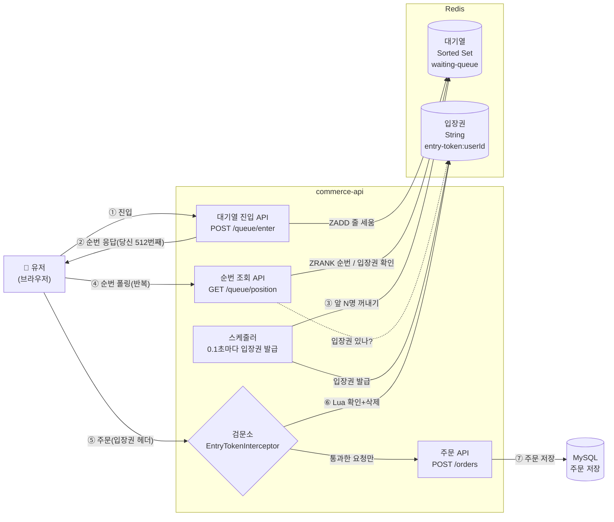
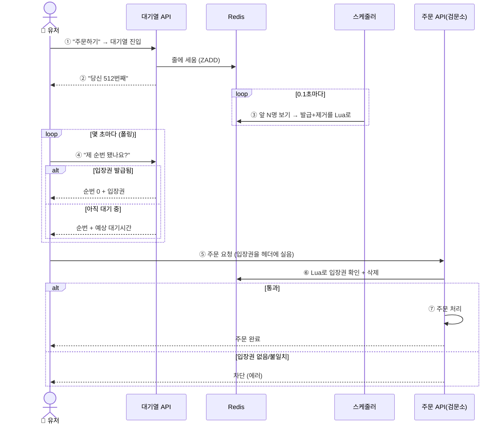
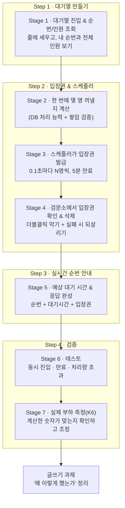

# Volume 8 — 주문 대기열 만들기 (계획서)

> 이 문서는 **계획서이자 가설**입니다. 만들다 보면 예상과 다른 결과가 나올 수 있어요(예: "18명씩 꺼내기로 했는데 실제로 돌려보니 DB가 먼저 힘들어함"). 그럴 땐 이 문서를 사실에 맞게 고칩니다.
> 이번 주에 계속 스스로에게 묻는 질문은 하나예요 — **"우리 DB가 감당할 수 있는 속도로만 주문을 받고 있나?"**

---

## 1. 우리가 풀려는 문제

블랙 프라이데이 같은 큰 행사가 열리면, 평소 초당 100건이던 주문이 **초당 1만 건**으로 폭증합니다. 이 요청이 전부 한꺼번에 주문 API로 몰리면:

- DB가 감당 못 해서 **전체 서비스가 멈추고**,
- 유저는 화면만 돌다가 타임아웃 → 새로고침 → 트래픽이 더 늘어나는 **악순환**에 빠집니다.

> 💡 **"DB 하나 힘든 게 왜 서비스 전체를 멈추나?"** — 이 연쇄가 핵심이에요.
> 주문이 몰리면 → 주문 API가 DB 커넥션을 못 얻어 **몇 초씩 대기** → 그 대기 동안 요청을 붙들고 있던 **톰캣 스레드(최대 200개)가 하나씩 묶임** → 스레드가 다 묶이면 주문 API 서버를 아무리 늘려놔도 **전부 멈추고** → 주문과 무관한 다른 요청까지 못 받는 **전체 장애**로 번집니다. DB 문제 하나가 서비스 전체를 무너뜨리는 거죠. 그래서 **앞단에서 미리 속도를 조절**해야 합니다.

서버를 아무리 늘려도 **DB는 쉽게 못 늘려요.** 그래서 답은 "서버 늘리기"가 아니라 **"DB가 처리할 수 있는 속도만큼만 주문을 흘려보내기"**입니다.

그 방법이 **대기열**이에요. 주문 API 앞에 줄을 세워두고, 시스템이 감당할 만큼만 순서대로 입장시키는 거죠. 놀이공원 인기 놀이기구 앞에 줄을 세우고, 한 번에 정해진 인원만 태우는 것과 똑같아요.

> 💡 이렇게 "뒤(DB)가 감당할 만큼만 앞(유저 요청)을 흘려보내는 것"을 **back-pressure(백프레셔)**라고 부릅니다. 어려운 말 같지만, 그냥 "뒤가 밀리지 않게 앞에서 속도 조절하기"예요.

---

## 2. 전체 그림 한눈에

만들 시스템이 어떻게 도는지 먼저 큰 그림으로 봅시다. 등장인물은 넷이에요 — **유저(클라이언트), 대기열, 스케줄러, 주문 API.** 구조 그림과 흐름 그림 두 개로 보여드릴게요.

### 구조 (누가 무엇과 연결되나)



### 흐름 (시간 순서대로)



- **① ~ ②** 유저가 "주문하기"를 누르면, 곧바로 주문 API가 아니라 **대기열에 먼저 들어갑니다.**
- **③** **스케줄러**(정해진 시간마다 자동으로 도는 프로그램)가 0.1초마다 대기열 앞에서 정해진 인원을 꺼내 **입장권(토큰)**을 발급합니다.
- **④** 유저 화면은 **몇 초마다 "제 순번 됐나요?"를 서버에 계속 물어봅니다**(이걸 폴링이라고 해요).
- **⑤ ~ ⑦** 입장권을 받으면, 그걸 주문 요청에 실어 보냅니다. 주문 API 앞 **검문소**가 입장권을 확인하고, 통과하면 주문을 처리한 뒤 입장권을 반납(삭제)합니다.

주문이 끝난 다음은 **vol7에서 만든 이벤트·Kafka 파이프라인이 그대로** 이어받습니다. 대기열은 "주문 API 앞의 관문"일 뿐이에요.

---

## 3. 이 문서에 나오는 용어 (미리 풀어두기)

| 용어 | 쉽게 말하면 |
|---|---|
| Redis | 아주 빠른 메모리 기반 저장소. 대기열과 입장권을 여기에 저장 |
| Sorted Set (ZSet) | **자동으로 정렬되는 명단.** 이름 옆에 숫자를 붙여 넣으면 숫자 순서대로 줄이 세워짐 |
| score | ZSet에서 **정렬 기준이 되는 숫자.** 우리는 "들어온 시각"을 씀 |
| TTL | **일정 시간 뒤 자동으로 사라지는 만료 시간.** 입장권을 5분 뒤 자동 삭제하는 데 씀 |
| 스케줄러 | 정해진 시간마다 자동으로 실행되는 프로그램. 여기선 0.1초마다 입장권 발급 |
| 입장 토큰 | 주문 API에 들어갈 수 있는 **입장권.** 대기열을 통과한 사람에게만 발급 |
| 폴링(Polling) | 클라이언트가 **몇 초마다 서버에 반복해서 물어보는** 방식 |
| 인터셉터 | 컨트롤러(주문 처리) 들어가기 직전에 요청을 가로채는 **검문소** |

Redis 명령어도 몇 개 나오는데, 그때그때 뜻을 옆에 적어둘게요. (예: `ZADD` = 명단에 추가, `ZRANK` = 내 순번 조회)

---

## 4. 목표와 완료 기준

과제 체크리스트 15개 항목을 하나도 빠짐없이 채우는 게 목표입니다. 각 항목이 어느 단계에서 완성되는지 정리했어요.

| 체크리스트 항목 | 완성 단계 |
|---|---|
| 대기열 진입 API (`POST /queue/enter`) | Stage 1 |
| 순번 조회 API (`GET /queue/position`) | Stage 1·5 |
| 같은 유저 중복 진입 막기 | Stage 1 |
| 전체 대기 인원 조회 | Stage 1 |
| 스케줄러가 주기적으로 N명씩 입장권 발급 | Stage 3 |
| 입장권 만료 시간(5분) 설정 | Stage 3 |
| 주문 시 입장권 확인 | Stage 4 |
| 주문 끝나면 입장권 삭제 | Stage 4 |
| 배치 크기(한 번에 꺼낼 인원)를 근거와 함께 정하기 | Stage 2 |
| 예상 대기 시간 계산 | Stage 5 |
| 순번 + 예상 대기 시간 응답 | Stage 5 |
| 순번 응답에 입장권 포함 | Stage 5 |
| 동시 진입 테스트 (순서 지켜지나) | Stage 6 |
| 입장권 만료 테스트 (시간 지나면 무효되나) | Stage 6 |
| 처리량 초과 테스트 (많이 몰려도 안정적인가) | Stage 6·7 |

---

## 5. 미리 정한 핵심 결정 8가지

만들기 전에 갈림길 8개를 먼저 정했습니다. 대부분은 **"가장 단순한 방법"**을 골랐고, 평가에서 중요한 두 곳(배치 크기·중복 주문 방지)만 조금 더 신경 썼어요.

### ① 대기열 순서를 뭘로 매길까 → **들어온 시각(밀리초)**

명단(ZSet)은 이름 옆에 숫자를 붙이면 그 숫자 순으로 줄을 세워줍니다. 그 숫자로 **"지금 시각"(밀리초 단위)**을 씁니다. 먼저 온 사람이 더 작은 숫자 → 앞줄이 되죠. 아주 드물게 "같은 밀리초에 두 명"이 겹치면 순서가 살짝 뒤바뀔 수 있지만, 유저가 못 느낄 수준이라 그냥 감수합니다.

### ② 같은 사람이 새로고침하면 → **뒤로 밀리게 (순번 안 지켜줌)**

이미 줄 선 사람이 새로고침을 누르면, 시각이 새로 찍혀서 **맨 뒤로 밀립니다.** "새로고침하면 손해"라는 걸 알게 되니 F5 연타(불필요한 재시도 폭주)를 줄이는 효과가 있어요. 실제 대기열 서비스들이 "새로고침하면 순번이 밀립니다"라고 경고하는 것과 같은 이유예요.

> 참고: 어느 쪽이든 **같은 사람이 줄에 두 번 서지는 않아요**(명단에 이름은 하나만 들어감). 새로고침은 순번만 갱신할 뿐입니다.

### ③ 한 번에 몇 명 꺼낼까 → **DB 처리 능력으로 계산 + 쌓임 검증**

**먼저 "어떻게 발급할지"부터 정합니다.** 스케줄러가 토큰을 뿌리는 방식은 크게 둘이에요:

- **놀이공원 방식 (일정 인원 쏟아붓기)** → **우리 선택.** 0.1초마다 정해진 인원을 발급. 앞에 몇 명 남았는지로 **"약 N초 남음"을 정확히 계산해 보여줄 수 있어요.**
- **은행 창구 방식 (고정 수 유지)**: 활성 토큰을 예를 들어 100개로 고정하고, 완료·만료로 빠진 **빈 자리만큼만** 채움. 이상 트래픽은 확실히 막지만, 앞사람이 주문을 빨리/늦게 하는지에 따라 **예상 대기 시간을 정확히 못 줘요.**

유저에게 "몇 분 남았어요"를 정확히 보여주는 게 이탈 방지의 핵심이라 **놀이공원 방식**을 택했어요. 이 방식의 단점("토큰 가진 유저가 일시적으로 몰려 부하")은 바로 아래 쌓임 검증으로 잡습니다.

**그럼 한 번에 몇 명 꺼낼까?** 감으로 정하면 안 되고, 두 단계로 계산합니다:

1. **기본 계산**: "우리 DB가 초당 몇 건 처리 가능한가"에서 역산합니다.
   ```
   DB 동시 처리 능력(커넥션 50개) ÷ 주문 1건 시간(0.2초) = 초당 250건
   안전하게 70%만 쓰면 → 초당 175건
   스케줄러가 0.1초마다 도니까 → 한 번에 약 18명
   ```
2. **쌓임 검증 (Little's Law)**: 여기 함정이 있어요. 입장권은 **5분 동안 살아있어서**, 발급받은 사람이 아직 주문 안 했어도 "언제든 주문할 수 있는 상태"로 쌓입니다.

   > 💡 **쉽게 말하면 (파티 방 비유):** 1분에 2명씩 들어오는데 각자 30분 머무는 방엔, 지금 이 순간 60명이 있어요(2 × 30). 마찬가지로 초당 175명에게 입장권을 주는데 각 입장권이 5분(300초) 살아있으면, **언제든 주문 가능한 사람이 5만 명 넘게 쌓입니다.** 이들이 한꺼번에 몰리면 초당 175건만 버티는 DB가 터지죠. 그래서 "발급 속도"만 보지 말고 "쌓이는 양"까지 확인해야 합니다. 이 계산법이 Little's Law(들어오는 속도 × 머무는 시간 = 쌓인 양)예요.

**이 숫자(배치 크기·만료 시간)는 이론으로 '초기값'만 잡습니다.** 실제로 커넥션을 붙잡는 시간은 예상과 다를 수 있어서(응답 시간 ≠ 커넥션 점유 시간), **Stage 7에서 K6로 부하를 걸어 검증한 뒤 최종 확정**해요. 감이 아니라 **측정으로 논리적으로 정하는 것**이 이번 과제의 핵심입니다.

### ④ 대기열에서 꺼내는 방법 → **앞 N명 보고 → 발급과 삭제를 Lua로 한 번에**

"줄에서 먼저 빼버리고 입장권을 주려다가 중간에 서버가 죽으면", 그 사람은 줄에도 없고 입장권도 없이 **증발해버려요.** 그래서 발급과 삭제를 **Redis 안에서 한 덩어리(Lua — 여러 명령을 끼어들기 없이 한 번에 처리하는 기능)로** 처리합니다:

```
1. 앞 N명을 '보기만' 함 (읽기라 죽어도 무해)      ← ZRANGE   · Lua 밖
2. 각자 UUID를 만들어, 발급(SET) + 줄 삭제(ZREM)를
   Lua 스크립트 하나로 원자적으로 실행           ← SET+ZREM · Lua 안
```

발급과 삭제가 한 덩어리라 **"발급됐는데 삭제 안 된" 어중간한 상태가 생기지 않아요.** 스케줄러가 ①과 ② 사이에 죽어도 ①은 읽기뿐이라 아무것도 안 바뀌고, 다음 주기에 다시 꺼내집니다 — 아무도 증발하지 않고, 같은 사람에게 입장권이 두 번 나가지도 않아요.

> 입장권 UUID는 애플리케이션이 만들어 넘기기 때문에(Lua 안에서 랜덤 생성은 제약이 커요) "앞 N명 읽기"만 Lua 밖에 남습니다. 더 깔끔한 정석은 **대기 셋과 입장 셋 두 개를 두고, 한 셋에서 빼면서 다른 셋에 넣는 이동 자체를 Lua로 원자화**하는 방식이에요(이번엔 단일 셋으로 단순화). 이건 검문소(⑦)의 Lua와 목적이 달라요 — 검문소는 여러 요청의 *동시 경쟁*을 막고, 여기는 스케줄러가 *도중에 죽어도* 발급·삭제가 쪼개지지 않게 합니다.

### ⑤ 입장권을 어떻게 만들고 얼마나 살릴까 → **랜덤 문자열 + 5분 만료**

입장권은 **아무도 못 맞히는 랜덤 문자열(UUID)** 하나예요. Redis에 이렇게 저장합니다:
```
저장:  entry-token:{userId} = "a3f9-8b2c-..."  (5분 뒤 자동 삭제)
```
5분이면 장바구니 확인하고 결제 끝내기에 충분하고, 딴짓하다 안 오면 자동으로 사라져 다음 사람에게 자리가 넘어갑니다.

### ⑥ 입장권을 어디서 확인할까 → **주문 API 문 앞 검문소(인터셉터)**

주문 API 앞에 **검문소(인터셉터)**를 세워, 입장권이 있는 요청만 통과시킵니다. 우리 프로젝트엔 이미 비슷한 검문소(`AdminAuthInterceptor`)가 있어서 그걸 본떠 만들면 돼요. 유저는 입장권을 **요청 헤더(`X-Entry-Token`)**에 실어 보냅니다. 이렇게 하면 주문 처리 코드는 한 줄도 안 건드립니다.

### ⑦ 입장권을 언제 지우고, 더블클릭은 어떻게 막을까 → **검문 때 지우기 + 실패하면 되살리기**

두 가지 문제를 각각 해결합니다:

- **더블클릭 중복 주문 막기**: 유저가 "주문하기"를 두 번 누르면 요청이 거의 동시에 두 개 와서, 둘 다 입장권을 보고 통과 → 주문이 두 번 될 수 있어요. 이걸 막으려면 **"입장권 확인 + 삭제"를 중간에 끼어들 수 없는 한 덩어리로** 처리해야 합니다. Redis에서 이걸 해주는 게 **Lua**예요.

  > 💡 **Lua가 뭔지 쉽게:** 여러 명령을 적은 **쪽지 한 장**을 Redis에 통째로 건네면, Redis가 그 쪽지를 처리하는 동안 **다른 요청을 안 받아요.** 그래서 첫 번째 클릭이 입장권을 지우는 사이 두 번째 클릭이 끼어들 수 없어, **딱 한 번만 통과**합니다.

- **주문 실패 시 재시도 허용**: 검문소에서 입장권을 지웠는데 주문이 실패하면, 유저가 억울하게 다시 줄 서야 해요. 그래서 **주문이 실패하면 입장권을 되살려줍니다.** 결과적으로 "성공하면 소진, 실패하면 복구"가 됩니다.

  > 참고: 입장권 확인·삭제는 반드시 **주(master) 저장소**에서 합니다. Redis는 원본(master)과 복사본(replica)이 있는데, 방금 발급한 입장권이 복사본엔 아직 안 넘어갔을 수 있어서, 복사본에서 확인하면 "없다"고 잘못 막힐 수 있거든요.

### ⑧ 예상 대기 시간 계산 → **순번 ÷ 발급 속도, "약 N분"으로**

```
예상 대기 시간 = 내 순번 ÷ 초당 발급 인원
   예: 512번째 ÷ 초당 175명 ≈ 약 3초
```
정확한 값이 아니라 상황에 따라 달라지는 추정이라 **"약 3분"**처럼 어림수로 보여줍니다.

---

## 6. 어떤 순서로 만들까 (단계 사다리)

큰 흐름: **줄 세우기 → 몇 명 꺼낼지 계산 → 스케줄러로 발급 → 검문소 통과 → 실시간 안내 → 검증.**



---

## 7. 만들면서 계속 지킬 약속

- **뒤(DB)를 지키는 게 먼저.** 새 숫자(배치 크기·만료 시간·주기)를 정할 때마다 "이 숫자가 DB를 힘들게 하진 않나?"를 한 번씩 되묻는다.
- **입장권 확인·삭제는 주(master) 저장소에서** 한다 — 복사본은 시간차가 있어 방금 발급한 입장권을 놓칠 수 있다.
- **줄에서 지우는 건 발급과 같은 Lua 안에서 함께** 한다 — 삭제를 나중으로 미루면 같은 사람을 계속 다시 꺼내 처리량이 뚝 떨어진다.
- **대기열을 통과한 사람만 주문 API를 지난다** — 검문은 인터셉터에 두고, 주문 처리 코드에 섞지 않는다.
- **숫자엔 근거를 남긴다** — 배치 크기·만료 시간은 계산 과정과 함께 문서에 적고, 감으로 정하지 않는다.
- **안 하기로 한 것도 적어둔다** — 왜 안 했는지가 좋은 기록이 된다.

---

## 8. 어떻게 검증할까

> 이번 주 핵심은 "배치 크기가 정말 DB를 지켜주는가"라, 측정도 여기에 집중합니다.

- **위치**: 시나리오는 `docs/volume-8/measurement/k6/`, 결과는 `docs/volume-8/reports/`
- **동시 진입 순서**: 여러 명이 동시에 들어와도 순번이 들어온 순서대로 매겨지는지, 같은 사람은 한 번만 들어가는지 확인
- **입장권 만료**: 입장권 발급 후 5분이 지나면 확인이 "무효"로 바뀌는지 확인 (시간이 지나야 하니 `Awaitility`로 기다렸다가 확인, 고정 sleep은 쓰지 않음)
- **더블클릭**: 같은 입장권으로 동시에 두 번 주문하면 딱 한 번만 통과하는지 확인
- **처리량 초과**: 배치 크기보다 많이 몰려도, 초과분은 대기열에 쌓이고 시스템은 멀쩡한지 확인
- **실제 부하(K6)**: 100명 이상 동시에 몰아넣어 보고, 발급이 배치 속도대로 나눠지는지 관찰. **계산과 실제가 다르면 배치 크기를 다시 조정하고** 그 과정을 기록

---

## Stage 1 — 대기열 만들기 (줄 세우고, 순번/인원 보기)

> 쉽게 말하면: 유저를 줄에 세우고, "당신 몇 번째" "지금 몇 명 대기 중"을 알려주는 단계.

- [x] **`POST /queue/enter`** — 대기열 명단에 추가(`ZADD`)하고 현재 순번을 응답. 순서 기준 숫자는 "지금 시각(밀리초)"
- [x] **중복 진입 막기** — 명단엔 이름이 하나만 들어가므로 두 번 안 세워짐. 새로고침하면 순번만 갱신(뒤로 밀림)
- [x] **`GET /queue/position`** — 내 순번 조회(`ZRANK`). (Stage 5에서 예상 대기시간·입장권 포함으로 확장)
- [x] **전체 대기 인원** — 명단 전체 인원 수 조회(`ZCARD`)
- [x] 코드 배치 — `domain.queue`에 대기열 개념, `infrastructure`에 Redis 접근 코드
- [x] 대기열에 없는 유저가 순번 조회하면 `QUEUE_NOT_FOUND` 에러(범용 `NOT_FOUND` + 커스텀 메시지로 처리)

**이 단계 완료 기준:** 동시에 여러 명이 들어와도 순번이 들어온 순서대로 매겨지고, 같은 사람은 한 번만 줄에 선다.

---

## Stage 2 — 한 번에 몇 명 꺼낼지 계산하기 (문서)

> 쉽게 말하면: 스케줄러가 0.1초마다 몇 명을 꺼낼지, 그 숫자를 감이 아니라 계산으로 정하는 단계.

- [ ] **기본 계산** — 실제 DB 커넥션 수(`jpa.yml`의 `maximum-pool-size` 확인)와 주문 1건 처리 시간으로 초당 처리량을 구하고, 안전하게 70%만 쓴 뒤, 0.1초당 인원으로 나눔
  ```
  초당 처리량 = 커넥션 수 ÷ 주문 1건 시간
  안전 처리량 = 초당 처리량 × 0.7
  배치 크기   = 안전 처리량 ÷ 10   (0.1초마다 발급하니까)
  ```
- [ ] **쌓임 검증 (Little's Law)** — 입장권이 5분 사는 동안 "주문 가능한 사람"이 얼마나 쌓이는지 계산하고, 그게 몰려도 DB가 버티는지 확인. 넘치면 발급 속도를 낮추거나 만료 시간을 줄임
  ```
  쌓인 사람 = 발급 속도 × 만료 시간(5분)
  → 이 사람들이 몰려도 DB가 버티나? 아니면 조정
  ```
- [ ] 계산 결과(배치 크기·만료 시간·주기)와 과정을 `docs/volume-8/reports/`에 기록 (Stage 7에서 실측으로 다시 맞출 예정)

**이 단계 완료 기준:** 배치 크기·만료 시간 옆에 "왜 이 숫자인지" 계산 근거가 문서로 남는다. 단 이건 **이론상 초기값**이고, 확정은 Stage 7 K6 실측 뒤에 한다.

---

## Stage 3 — 스케줄러가 입장권 발급하기

> 쉽게 말하면: 0.1초마다 자동으로 돌면서 대기열 앞에서 N명을 꺼내 입장권을 나눠주는 단계.

- [ ] **0.1초마다 도는 스케줄러** — `@Scheduled(fixedDelay = 100ms)`. Stage 2에서 정한 인원만큼 발급 (`fixedDelay` = 이전 작업이 끝난 뒤 0.1초 쉬고 다음 실행 → 작업이 몰리지 않음)
- [ ] **꺼내는 순서: 보기(Lua 밖) → 발급+삭제(Lua)** — ① 앞 N명 조회(`ZRANGE`)는 Lua 밖에서(읽기라 죽어도 무해) ② 각자 UUID를 만들어 **발급(`SET`)과 줄 삭제(`ZREM`)를 Lua 한 덩어리로 원자 실행**. 발급됐는데 삭제 안 되는 어중간한 상태가 없어 증발도, 중복 발급도 안 생김
- [ ] **입장권 = 랜덤 문자열 + 5분 만료** — `entry-token:{userId}`에 저장, 300초 뒤 자동 삭제
- [ ] 줄에서 지우는 건 발급과 같은 Lua 안에서 함께 (나중으로 미루지 않기)
- [ ] 발급은 주(master) 저장소에서

> **왜 Lua로 묶나 (Stage 4와 목적이 다름):** 검문소(Stage 4) Lua는 여러 요청이 같은 입장권을 *동시에 경쟁*하는 걸 막는 용도이고, 여기 Lua는 스케줄러가 *도중에 죽어도* 발급·삭제가 쪼개지지 않게 하는 용도다. 스케줄러는 서버 한 대에 하나만 돌아(`fixedDelay`) 동시 경쟁 자체는 없다 — 서버가 여러 대면 얘기가 달라진다("안 하는 것"의 분산 스케줄러 참고).

**이 단계 완료 기준:** 0.1초마다 정해진 인원에게 입장권이 발급되고, 받은 사람은 줄에서 빠진다. 발급이 죽어 Lua가 실행되지 않으면 그 사람은 줄에 남아 다음 주기에 다시 받는다.

---

## Stage 4 — 검문소에서 입장권 확인하고 삭제하기

> 쉽게 말하면: 대기열을 통과한 사람만 주문하게 막고, 더블클릭 중복 주문을 방지하는 단계.

- [ ] **검문소(`EntryTokenInterceptor`)** — 주문 API(`POST /orders`)에 적용(기존 `AdminAuthInterceptor` 본뜸). 헤더에 입장권 없으면 `ENTRY_TOKEN_REQUIRED` 에러
- [ ] **Lua로 "확인 + 삭제"를 한 덩어리로** — 저장된 입장권이 헤더로 온 값과 같으면 삭제하고 통과, 아니면 차단(`ENTRY_TOKEN_INVALID`). 이렇게 해야 더블클릭 시 딱 한 번만 통과
  ```lua
  local stored = redis.call('GET', KEYS[1])   -- 저장된 입장권 꺼냄
  if stored == ARGV[1] then                    -- 헤더 값과 같으면
      redis.call('DEL', KEYS[1])               -- 삭제하고
      return 1                                 -- 통과
  end
  return 0                                     -- 없거나 다르면 차단
  ```
- [ ] **주문 실패 시 되살리기** — 주문 처리 중 오류가 나면 검문소가 입장권을 다시 저장(재시도 허용). 성공하면 그대로 삭제된 상태 유지("주문 완료 후 삭제"와 같은 결과)
- [ ] 확인·삭제는 주(master) 저장소에서 (복사본 시간차로 잘못 막히는 것 방지)
- [ ] 주문 처리 코드(`OrderFacade`)는 안 건드림 — 검문은 인터셉터에만

**이 단계 완료 기준:** 입장권 없는 요청은 막히고, 같은 입장권으로 동시에 두 번 주문해도 한 번만 통과하며, 주문이 실패하면 입장권이 되살아나 다시 시도할 수 있다.

---

## Stage 5 — 예상 대기 시간 & 응답 완성하기

> 쉽게 말하면: "512번째, 약 3분 남음"을 보여주고, 내 차례가 오면 입장권을 응답에 담아주는 단계.

- [ ] **예상 대기 시간** — `내 순번 ÷ 초당 발급 인원`, "약 N초/분"으로 표현
- [ ] **순번 조회 응답 분기** — 두 경우로 나뉨:
  ```
  입장권이 발급돼 있으면  → { 순번: 0, 입장권: "a3f9-..." }
  아직 대기 중이면        → { 순번: 512, 예상대기: "약 3초" }
  ```
  입장권 받은 사람은 이미 줄에서 빠졌으니(Stage 3), "입장권 있나?"를 먼저 확인
- [ ] 응답은 필드가 정해진 record 형태로

**이 단계 완료 기준:** 대기 중엔 순번+예상 시간이, 내 차례엔 입장권이 응답된다. 클라는 이 입장권을 헤더에 실어 주문한다.

---

## Stage 6 — 테스트로 검증하기

> 쉽게 말하면: 동시성·만료·처리량이 요구대로 동작하는지 자동 테스트로 확인하는 단계.

- [ ] **동시 진입 순서** — 동시에 N명 진입 → 순번이 들어온 순서와 일치, 같은 유저는 한 번만
- [ ] **입장권 만료** — 발급 후 5분 지나면 확인이 차단으로 바뀌는지 (`Awaitility`로 기다렸다 확인)
- [ ] **더블클릭** — 같은 입장권 동시 2회 → 한 번만 통과
- [ ] **처리량 초과** — 배치보다 많이 몰려도 초과분은 대기열에 쌓이고 시스템은 안정
- [ ] E2E 테스트 — 진입 → 순번 조회 → 주문까지 관통. 에러는 상태코드·결과·에러코드까지 확인

**이 단계 완료 기준:** 세 가지 요구 테스트가 통과한다.

---

## Stage 7 — 실제 부하 측정하고 조정하기 (K6)

> 쉽게 말하면: 이론으로 잡은 배치 크기가 실제로 맞는지 부하를 걸어 확인하고, **측정 결과를 근거로 숫자를 최종 확정**하는 단계. "감으로 정하던 숫자를 실측으로 논리적으로 정하는" 이번 과제의 핵심.

- [ ] K6 시나리오 — 100명 이상 동시에 몰아넣고, 발급이 배치 속도대로 나눠지는지 관찰 → `measurement/k6/`
- [ ] 볼 것 — 발급 속도, 대기 인원 변화, 주문 API 에러율·DB 커넥션 사용률·**CPU 사용률**(배치 크기를 커넥션 수뿐 아니라 CPU 여유로도 검증 — 임계치 이전 안전 구간에서 도는지 보고, 안전 버퍼를 남겨 보수적으로 확정)
- [ ] **계산과 실제가 다르면 배치 크기 재조정** — 이유(예: 커넥션을 붙잡는 시간이 예상과 다름)와 함께 `reports/`에 기록
- [ ] **이론 → 실측 → 재조정 루프를 문서화** — Stage 2의 초기값과 실측치를 나란히 두고, 최종 배치 크기·만료 시간(TTL)을 어떤 근거로 확정했는지 `reports/batch-sizing.md`에 남김
- [ ] 대기열의 평탄화 효과 정리 — "한꺼번에 들어온 요청이 배치 속도로 천천히 나가는" 모습 확인

**이 단계 완료 기준:** 많이 몰려도 DB가 배치 속도로 보호되고, 배치 크기·만료 시간의 최종값이 **이론이 아니라 실제 측정으로** 논리적으로 확정된다.

---

## 일부러 안 하는 것 (그리고 그 한계)

> "안 한 것"과 "그래서 생기는 한계"를 정직하게 남깁니다 — 글쓰기·PR의 좋은 소재예요.

- **대기열을 트래픽에 따라 켜고 끄기 (지금은 늘 켜둠)** — 대기열은 원래 모든 주문에 항상 붙어 있는 게 아니라, **요청이 몰릴 때만** 열린다. 여는 기준은 "이벤트 상품이냐"가 아니라 **지금 들어오는 요청량(초당 주문 수)** 이다 — 이벤트 상품이 아니어도 오픈런처럼 일반 주문이 폭증하면 열어야 하고, 반대로 요청이 적으면 이벤트여도 줄 세울 필요가 없다. 그래서 "이벤트/일반 상품 구분"은 대기열을 여는 본질이 아니다(처음엔 상품 속성으로 나누려 했지만, 몰리는 건 상품 종류가 아니라 트래픽이다). 실무에선 **요청량 감시기(레이트 리미터)** 가 주문 API 앞(인터셉터)에서 현재 요청량을 보고 "이 요청을 대기열로 보낼지"를 판단한다 — 주문과 대기열은 완전히 다른 별개 시스템이라, 주문 코드 안에서 대기열로 갈라지게 하지 않는다(주문은 주문 로직만 안다). 상품별로 이벤트 대상을 더 잘게 나누고 싶으면 그 위에 별도 엔티티(시작·종료 시각 + 대상 상품)를 얹을 수 있지만, 그건 핵심이 아니다. 이번 과제는 **대기열 자체 구현에 집중**하므로 "이벤트 기간 동안 대기열은 켜져 있고, 그 사이 주문은 모두 대기열을 거친다"고 가정하고, 요청량 기반 On/Off와 레이트 리미터는 확장으로 남긴다.
- **Redis가 죽었을 때의 대응** — Redis가 멈추면 어떻게 서비스할지(막을지/우회할지)는 이번 범위 밖. 지금은 "Redis 죽으면 대기열 진입 불가"가 한계. 핵심 완성 후 선택 확장.
- **대기열 최대 수용 인원(상한)** — 지금은 줄 서겠다는 요청을 **무제한으로** 받는다. 극단적으로 몰리면 대기열이 차지하는 Redis **메모리가 계속 커진다**(자원이 "고갈"되는 게 아니라 메모리가 부풀다가, 다 차면 저장 실패 에러가 난다). 이건 Redis 설정(`maxmemory-policy`) 같은 인프라 레벨로는 못 푼다 — 그 설정은 "꽉 차면 오래된 걸 지운다"인데, 대기열은 이미 줄 선 사람을 지우면 안 되기 때문. 그래서 **애플리케이션 레벨에서 "대기열은 최대 N명까지"** 상한을 두고, 넘는 요청은 거절하거나 "잠시 후 다시 시도"로 안내하는 방식으로 푼다. 상한값 N은 정답이 없고 Redis 메모리 여유와 팀 합의로 정한다. 이번 과제는 서버 한 대·통제된 부하 전제라 상한 없이 두고, 한계로만 남긴다.
- **SSE(서버가 먼저 알려주기)** — 순번은 한 명 빠지면 전원이 바뀌어서, 서버가 전원에게 밀어주면 결국 폴링과 같아짐. 폴링으로 충분.
- **순번 구간별 폴링 주기 조절** — "곧 입장이면 1초, 멀면 5초"처럼 주기를 바꾸는 건 나중 과제. 지금은 고정 주기.
- **입장권 발급 시각 흩뿌리기(Jitter)** — 0.1초 배치 분산으로 1차 완화. 추가 분산은 범위 밖.
- **서버 여러 대일 때 스케줄러 중복 방지** — 지금은 서버 한 대 전제. 여러 대면 필요하지만 이번엔 안 함.
- **같은 밀리초 완벽 공정 / 상품별 대기열 / 복잡한 만료 정책** — 핵심(처리량 제어)과 떨어진 확장이라 나중에.

---

## 글쓰기 과제 씨앗

> 단계별로 "왜 이렇게 판단했는가"를 근거로 씁니다. 블로그 또는 GitHub Issue 4포맷(Design Doc / Retrospective / Challenge Story / Benchmark Report) 중 택1.

- Stage 1 → **"새로고침하면 순번이 뒤로 밀리는 게 왜 트래픽 방어가 될까"**
- Stage 2 → **"한 번에 몇 명 꺼낼지, 그 숫자를 어떻게 정했나"** (DB 계산 + 쌓임 검증)
- Stage 4 → **"더블클릭 중복 주문을 어떻게 막았나"** (한 덩어리로 처리하기)
- Stage 4 → **"입장권 확인은 왜 원본 저장소에서 해야 하나"** (복사본 시간차)
- Stage 7 → **"계산으로 정한 숫자가 실제와 달랐을 때"**
- 전체 → **"막을까(429), 줄 세울까(대기열)"** — 두 전략 중 언제 뭘 쓰나

---

## 만들 파일 정리

```
docs/volume-8/
  TODO.md                 ← (이 문서, 계획·진행 체크)
  measurement/k6/
    seed.sh               ← 측정용 기본 데이터
    queue-enter.js        ← 대량 동시 진입 시나리오
  reports/
    batch-sizing.md       ← 배치 크기 근거 + 실측 조정 기록
```
