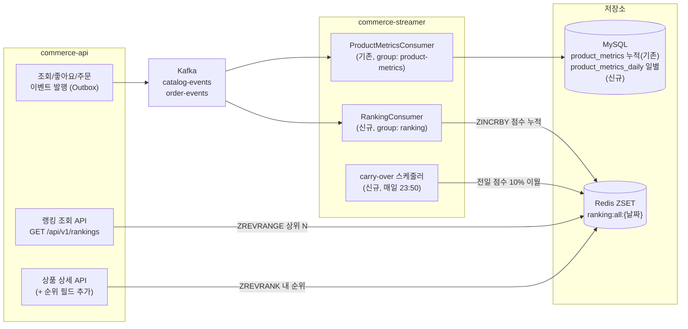
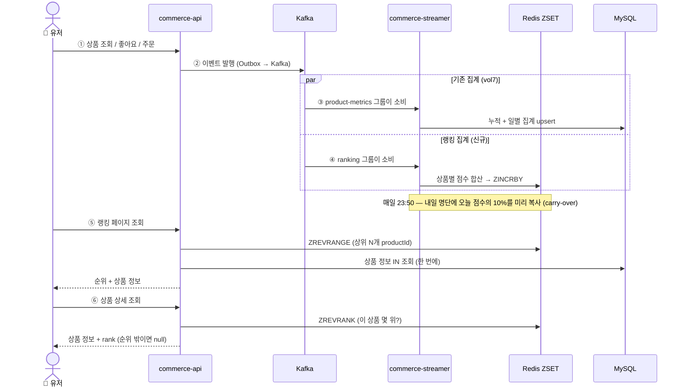
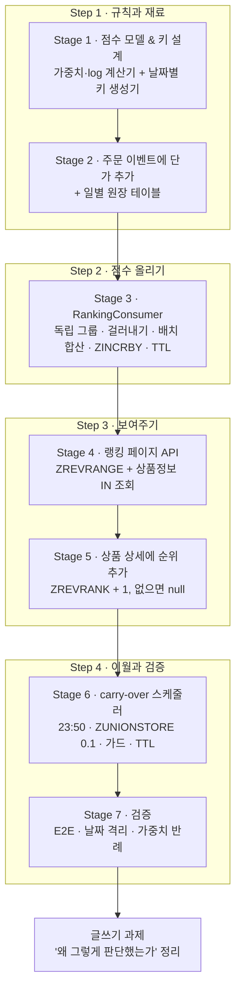

# Volume 9 — 실시간 상품 랭킹 만들기 (계획서)

> 이 문서는 **계획서이자 가설**입니다. 만들다 보면 예상과 다른 결과가 나올 수 있어요(예: "주문 점수를 이렇게 계산하기로 했는데 실제로 돌려보니 순위가 이상함"). 그럴 땐 이 문서를 사실에 맞게 고칩니다.
> 이번 주에 계속 스스로에게 묻는 질문은 하나예요 — **"이 랭킹, 유저가 봤을 때 정말 '오늘 인기 있는 상품'인가?"**

---

## 1. 우리가 풀려는 문제

홈 화면에 "오늘의 인기 상품 Top 20"을 보여주고 싶습니다. 어떤 상품이 인기 있는지는 이미 알고 있어요 — vol7에서 만든 파이프라인이 조회·좋아요·주문 이벤트를 전부 수집해 `product_metrics`에 쌓아두고 있으니까요. 그런데 이걸 그대로 쓰면 두 가지 문제가 있습니다.

- **DB 정렬은 느리고 비쌉니다.** "점수 순으로 정렬해서 상위 20개"를 DB에 물으면(`GROUP BY + ORDER BY`) 데이터가 쌓일수록 느려져요. 게다가 인기 상품 지면은 홈 메인이라 **가장 많이 조회되는 API**입니다. 요청마다 정렬하면 DB가 랭킹 보여주다 지쳐버립니다.
- **누적 집계는 랭킹의 의미를 퇴색시킵니다.** 서비스 오픈 때부터 점수를 누적하면, 옛날에 점수를 쌓아둔 상품이 영원히 상위에 눌러앉아요. 신상품은 노출 기회를 못 얻고, 소수 상품이 상위권을 독식하는 **롱테일 현상**이 생깁니다. "오늘 인기 있는 상품"이려면 **오늘 점수와 어제 점수를 분리**해야 해요.

그래서 이번 주에는 **Redis의 Sorted Set(ZSET)** 을 씁니다. vol8 대기열에서 "숫자 순으로 자동 정렬되는 명단"으로 이미 써봤죠. 이번엔 그 숫자를 "들어온 시각"이 아니라 **인기 점수**로 쓰는 거예요. 이벤트가 올 때마다 점수를 올리면 명단이 항상 점수 순으로 정렬돼 있으니, "상위 20개 주세요"가 정렬 없이 즉시 나옵니다. 그리고 **날짜별로 명단을 분리**해서(오늘 명단, 어제 명단) 매일 새 랭킹이 시작되게 합니다.

```
[commerce-api]        조회/좋아요/주문 이벤트 발행          ← vol7 그대로
      ↓ Kafka
[commerce-streamer]   이벤트 소비 → product_metrics 집계   ← vol7 그대로
                      이벤트 소비 → ZSET 랭킹 점수 갱신     ← 이번 주에 만들 것
      ↓ Redis ZSET
[commerce-api]        랭킹 조회 API / 상품 상세에 순위 표시  ← 이번 주에 만들 것
```

---

## 2. 전체 그림 한눈에

등장인물은 셋이에요 — **이벤트를 만드는 commerce-api, 점수를 매기는 commerce-streamer, 랭킹을 보여주는 commerce-api(조회)**. vol7 파이프라인 위에 랭킹 전용 소비자 하나와 조회 API를 얹는 구조입니다.

### 구조 (누가 무엇과 연결되나)



### 흐름 (시간 순서대로)



- **① ~ ②** 유저 행동이 이벤트로 발행되는 부분은 **vol7 그대로**입니다. 손대지 않아요. (단 하나, 주문 이벤트에 **상품 단가**를 추가합니다 — 결정 ③ 참고)
- **③ ~ ④** 같은 이벤트를 **두 소비자가 각자** 받습니다. 기존 소비자는 DB 집계를, 새 소비자는 ZSET 점수를 맡아요. 서로 독립이라 한쪽이 죽어도 다른 쪽은 계속 돕니다.
- **⑤ ~ ⑥** 조회는 ZSET에서 순위만 꺼내고, 상품 이름·가격 같은 정보는 DB에서 **한 번에(IN절)** 가져와 합칩니다.

---

## 3. 이 문서에 나오는 용어 (미리 풀어두기)

| 용어 | 쉽게 말하면 |
|---|---|
| ZSET (Sorted Set) | **점수 순으로 자동 정렬되는 명단.** vol8 대기열에서 이미 사용. 이번엔 점수 = 인기 점수 |
| ZINCRBY | 명단에서 특정 상품의 **점수를 더하는** 명령. 없던 상품이면 자동으로 추가됨 |
| ZREVRANGE | 명단을 **점수 높은 순으로 N개** 꺼내는 명령 (랭킹 페이지용) |
| ZREVRANK | 특정 상품이 **점수 높은 순으로 몇 번째**인지 묻는 명령 (0부터 시작 → +1 해서 순위로) |
| ZUNIONSTORE | 두 명단을 **합쳐서 새 명단을 만드는** 명령. 이월(carry-over)에 사용 |
| TTL | 일정 시간 뒤 키가 **자동으로 사라지는 만료 시간.** 지난 날짜의 랭킹판을 자동 청소 |
| Consumer Group | Kafka에서 **같은 메시지를 받아보는 팀 단위.** 팀이 다르면 같은 메시지를 각자 받음 |
| 멱등 (dedup) | 같은 메시지가 **두 번 와도 결과가 한 번 처리한 것과 같게** 만드는 것 |
| 콜드 스타트 | 자정에 새 랭킹판이 **텅 빈 채로 시작**되는 문제 |
| carry-over | 콜드 스타트를 메우려고 **전날 점수의 일부(10%)를 새 판에 미리 복사**하는 것 |
| log1p(x) | `log(1+x)`. **큰 수를 완만하게 눌러주는 함수.** 주문 금액의 스케일 폭주를 막는 데 사용 |

---

## 4. 목표와 완료 기준

과제 체크리스트 9개 항목을 하나도 빠짐없이 채우는 게 목표입니다. 각 항목이 어느 단계에서 완성되는지 정리했어요.

| 체크리스트 항목 | 완성 단계 |
|---|---|
| 랭킹 ZSET의 TTL·키 전략을 적절하게 구성 | Stage 1·3 |
| 날짜별로 적재할 키를 계산하는 기능 | Stage 1 |
| 이벤트 발생 후 ZSET에 점수가 적절하게 반영 | Stage 3 |
| 랭킹 Page 조회 시 정상적으로 랭킹 정보 반환 | Stage 4 |
| 랭킹 Page 조회 시 상품 ID가 아닌 상품정보가 Aggregation되어 제공 | Stage 4 |
| 상품 상세 조회 시 해당 상품의 순위 반환 (순위에 없다면 null) | Stage 5 |
| 이벤트 발행 → ZSET 반영 → API 조회 E2E 흐름 확인 | Stage 7 |
| 일자가 변경되어도 이전 날짜의 랭킹 조회가 정상 동작 | Stage 7 |
| 가중치 적용이 의도대로 순서에 반영 (주문 1건 > 좋아요 3건) | Stage 1·7 |

여기에 Nice-to-Have 중 **콜드 스타트 완화(carry-over 스케줄러)** 를 범위에 포함합니다(Stage 6). 시간 단위 랭킹과 실시간 가중치 조절은 이번엔 안 해요("일부러 안 하는 것" 참고).

---

## 5. 미리 정한 핵심 결정 8가지

만들기 전에 갈림길 8개를 먼저 정했습니다. 이번 주차의 핵심 긴장은 **"실시간 반영"과 "복구 가능"을 어떻게 다 잡느냐**예요.

### ① 점수를 언제 올릴까 → **이벤트 소비 즉시 ZINCRBY (실시간)**

두 가지 방식이 있어요:

- **실시간 증분 (우리 선택)**: 이벤트가 오면 즉시 `ZINCRBY`로 점수를 더함. 반영이 빠르고 단순. 단점은 Redis가 사실상 유일한 점수 원본이 된다는 것 — Redis가 유실되면 복구할 길이 없고, 가중치를 바꿔도 과거 점수를 다시 계산할 수 없어요(점수 42.8이 조회 몇 건 + 주문 몇 건인지 역산이 안 되니까).
- **DB 원장 + 주기 재계산**: 이벤트를 DB에만 쌓고, 스케줄러가 몇 분마다 전체 재계산 후 ZSET을 덮어씀. 복구·재계산은 자유롭지만 반영이 스케줄러 주기만큼 늦어요 — "실시간 랭킹"이라는 이번 과제 의도와 멀어집니다.

**실시간을 택하되, 약점(복구 불가)은 결정 ②로 보완합니다.** 멘토님 가이드도 같은 방향이었어요 — "ZSET을 유일한 원본으로 두지 말고, DB에 원본 데이터를 갖고 있어서 언제든 다시 계산할 수 있어야 한다."

### ② 복구의 근거를 어디 둘까 → **일별 집계 테이블(`product_metrics_daily`) 신설**

Redis가 유실되거나 가중치 정책이 바뀌면 **"그날의 조회/좋아요/판매가 각각 몇 건이었나"** 를 알아야 랭킹판을 다시 만들 수 있어요. 그런데 기존 `product_metrics`는 서비스 전체 기간의 **누적**이라 날짜별 분리가 안 됩니다. (그리고 이 누적 테이블은 commerce-batch의 좋아요 수 보정 배치가 이미 쓰고 있어서 구조를 바꾸면 안 돼요.)

그래서 **일별 테이블을 새로 만듭니다**:

```
product_metrics_daily
  (product_id, metric_date)  ← 복합 유니크: 상품 × 날짜당 한 행
  like_count / sales_count / view_count
  sales_amount               ← 판매 금액 합계 (주문 점수 재계산용)
```

기존 소비자(ProductMetricsConsumer)가 누적 테이블을 갱신할 때 **같은 트랜잭션에서 일별 행도 함께** upsert합니다. 이번 주에 재계산 배치 자체를 만들진 않아요 — **"언제든 다시 계산할 수 있는 재료"만 확보**해 두는 겁니다. (재계산이 실제로 필요해지는 시나리오와 방법은 글쓰기 소재로.)

### ③ 점수를 얼마씩 올릴까 → **view 0.1 / like 0.2 / order 0.7×log1p(금액)**

가중치는 "구매 결정에 가까울수록 크게"입니다. 조회는 흔하니 0.1, 좋아요는 관심 표현이니 0.2, 주문은 지갑을 연 것이니 0.7.

| 이벤트 | 점수 변화 |
|---|---|
| PRODUCT_VIEWED | `+0.1` |
| LIKE_CREATED | `+0.2` |
| LIKE_DELETED | `-0.2` (취소하면 점수도 되돌림 — 한쪽만 반영하면 비대칭 버그) |
| ORDER_CREATED | 아이템별 `+0.7 × log1p(단가 × 수량)` |

**주문에 log를 씌우는 이유**: 주문 점수를 금액 그대로 쓰면 5만원짜리 주문 1건이 `35,000점`이 돼서 좋아요(0.2점) 17만 건과 맞먹어요. 금액이라는 지표는 조회·좋아요와 **스케일이 수천 배 차이** 나서, 그대로 합산하면 주문이 랭킹을 독식합니다. `log1p`로 눌러주면 5만원 주문이 `0.7 × log1p(50000) ≈ 7.6점` — "주문 1건 > 좋아요 3건(0.6점)"이라는 요구 순서는 지키면서 폭주는 막습니다.

**정직하게 남길 트레이드오프**: 수학적으로 log는 "상품별 **총** 판매 금액에 한 번" 적용해야 맞아요(`log(a) + log(b) ≠ log(a+b)`). 하지만 실시간 증분 방식에선 총합을 알 수 없으니 **"주문 1건당 그 주문 금액에 log"** 로 의미를 재정의합니다 — 주문 건수는 선형으로 쌓이고, 금액만 건별로 감쇠되는 점수예요. 총합 기준 점수가 필요해지면 결정 ②의 일별 원장으로 재계산하는 경로가 열려 있습니다.

**주문 이벤트에 단가 추가**: 현재 `OrderCreatedEvent`의 아이템엔 `productId`, `quantity`만 있어서 금액 계산이 안 됩니다. 아이템에 `price`(주문 시점 단가)를 추가해요. 주문 전체 금액(`finalAmount`)을 나눠 쓰는 방법도 있지만, 단가가 다른 상품이 섞인 주문에서 왜곡되고 할인까지 섞여 부정확해서 채택하지 않았습니다.

가중치 숫자(0.1/0.2/0.7)는 코드에 박지 않고 **설정(`@ConfigurationProperties`)으로 외부화**합니다 — 서비스 전략에 따라 바뀌는 값이니까요.

### ④ 랭킹 키를 어떻게 나눌까 → **`ranking:all:{uuuuMMdd}` 일별 키 + 생성 로직은 한 곳에**

날짜별로 키를 분리하면(오늘판, 어제판) 매일 랭킹이 새로 시작되고, 지난 판은 TTL로 자동 청소됩니다. 두 가지 디테일:

- **날짜 포맷은 `uuuu`**: 주(week) 기준 연도인 `YYYY`를 실수로 쓰면 12월 말~1월 초 경계에서 연도가 어긋나고(예: 2024-12-30이 `2025`로 포맷됨), `yyyy`(year-of-era)는 STRICT 파싱 시 era 정보가 없어 실패해요. `uuuu`가 포맷·파싱 모두 안전합니다. 회귀 테스트로 고정합니다.
- **키 생성 로직은 `modules/redis`에 한 곳만**: 키는 streamer(쓰기)와 api(읽기)가 **같은 규칙**을 봐야 해요. 각자 하드코딩하면 한쪽만 바뀌었을 때 랭킹이 조용히 어긋납니다. 공유 모듈에 두면 컴파일 타임에 통일돼요.
- **키 날짜는 이벤트 발생 시각(occurredAt) 기준**: 소비가 늦어져 자정을 넘겨 처리돼도, 어제 발생한 이벤트는 어제 판에 반영됩니다.

### ⑤ 지난 랭킹판을 언제 지울까 → **TTL 2일, 단 만료 "시점"을 고정**

"오늘판 + 어제판(전날 랭킹 조회용)"만 있으면 되니 TTL은 2일. 두 가지 함정을 피합니다:

- **매 쓰기마다 EXPIRE 금지**: 점수 올릴 때마다 TTL을 재설정하면 이벤트가 이어지는 한 영원히 만료되지 않아요(의도치 않은 수명 연장). **키가 처음 만들어질 때 한 번만** 겁니다.
- **만료 시점을 "키 날짜 + 2일 자정"으로 고정**: "지금부터 48시간"으로 걸면 carry-over(결정 ⑦)가 밤 11시 50분에 TTL을 다시 걸 때 만료 시점이 앞뒤로 흔들려요. `키 날짜 + 2일의 자정까지 남은 시간`으로 계산하면 언제 몇 번을 걸어도 만료 시점이 같습니다.

### ⑥ 같은 이벤트가 두 번 오면 → **Redis SETNX로 걸러내되, 점수 반영과 한 덩어리로(Lua)**

Kafka는 같은 메시지를 두 번 줄 수 있고(at-least-once), `ZINCRBY`는 두 번 실행하면 점수가 두 번 오릅니다. 기존 소비자는 DB `event_handled` 테이블로 걸러내지만, 랭킹 소비자가 그걸 같이 쓰면 **Redis만 만지는 소비자에 DB 의존이 생겨** 분리한 의미가 없어져요. 그래서 랭킹 쪽은 **Redis 안에서** 걸러냅니다 — `ranking:handled:{eventId}` 키를 SETNX(없을 때만 저장)로 심고, 이미 있으면 건너뜀. TTL 2일(랭킹판 수명과 동일).

단, **"걸러내기(SETNX)"와 "점수 올리기(ZINCRBY)"를 따로 두면 걸러낸 직후 죽었을 때 그 점수가 유실**됩니다. 그래서 한 배치의 **dedup(SETNX) + 상품별 합산 ZINCRBY + 조건부 TTL을 단일 Lua 스크립트로 원자 실행**합니다. Lua는 Redis에서 통째로 실행되므로 "전부 반영" 아니면 "미실행" 둘 중 하나만 남고, 미실행이면 Kafka가 offset을 커밋하기 전이라 재전달해 정상 처리합니다(스크립트 자체도 SETNX 덕에 멱등 — 같은 배치를 두 번 EVAL해도 안전).

> 남는 한계: 스크립트 **실행 직전**에 Redis나 컨슈머가 죽으면 그 배치는 아직 handled가 안 박혔으니 재소비로 복구됩니다(at-least-once가 메움). 즉 이전의 "반쯤 처리된 창"은 닫혔고, 남는 건 정상적인 재처리뿐이에요. 랭킹은 근사값이라는 특성상 그걸로 충분하고, Redis 영구 유실처럼 정확한 값이 필요하면 결정 ②의 원장에서 재계산합니다.

### ⑦ 자정의 텅 빈 랭킹판 → **23:50에 전일 점수 10%를 미리 복사 (carry-over)**

자정에 새 판이 열리면 모든 상품이 0점이에요. 새벽에 좋아요 하나만 눌려도 그 상품이 1위가 되는 **랭킹 아수라장**이 됩니다. 유저는 "어제 인기였던 상품"이 새벽에도 보이길 기대하고요.

그래서 **매일 23:50에 스케줄러**가 내일 판을 미리 만들어둡니다:

```
ZUNIONSTORE 내일키 1 오늘키 WEIGHTS 0.1
→ 오늘 점수의 10%가 내일 판에 미리 깔림
```

- **왜 0.1?** 어제의 관성은 남기되, 오늘의 실제 활동으로 충분히 역전 가능한 수준이라서요. 어제 1등(100점)이 내일 10점으로 시작하니, 오늘 주문 두어 건이면 넘어섭니다.
- **왜 23:50?** 자정 "이전"에 준비돼 있어야 자정 직후의 아수라장을 막아요. 멘토님 표현대로 "50분이 고정 기준은 아니지만, 00시보다 먼저 실행돼 있어야" 합니다. (23:50~00:00 사이 이벤트는 이월분에 안 담기지만, 그 10분치의 10%는 오차로 감수 — 이것도 기록해둘 트레이드오프)
- **함정 둘**: ZUNIONSTORE는 TTL을 **승계하지 않으므로** 새 키에 EXPIRE 재설정 필수. 그리고 재실행되거나 내일 키에 이미 이벤트가 쌓여 있으면 **이중 합산**되므로, 대상 키가 이미 있으면 건너뛰는 가드(EXISTS)를 둡니다. 이 셋을 따로 두면 그 사이에 경합이 나니, **가드(EXISTS) + ZUNIONSTORE + EXPIRE를 단일 Lua로 원자화**합니다 — 스케줄러가 두 번 돌거나 자정 직전 이벤트와 겹쳐도 이중 합산·EXPIRE 누락이 없습니다(멱등).
- **어디서?** 랭킹판의 "쓰기 주인"인 **commerce-streamer**에 `@Scheduled`로. vol8처럼 서버 한 대 전제입니다.

### ⑧ 랭킹을 어떻게 보여줄까 → **ZSET에서 순위만, 상품 정보는 DB에서 한 번에**

- **랭킹 페이지** `GET /api/v1/rankings?date=yyyyMMdd&size=20&page=1`: ZREVRANGE로 해당 페이지 구간의 productId를 꺼내고, 상품·브랜드 정보는 **IN절로 한 번에** 조회해 합칩니다. 상품마다 개별 조회하면 20위 요청에 쿼리 21번(N+1) — 가장 흔한 함정이에요. 순위는 `offset + 1`부터, 전체 개수는 ZCARD.
- **상품 상세**: 기존 응답에 `rank` 필드 추가. `ZREVRANK + 1`(0부터 세니까), **랭킹판에 없으면 null**. null이 응답에서 통째로 사라지지 않는지(전역 직렬화 설정) 확인합니다 — "순위 없음"도 계약의 일부니까요.
- **읽기/쓰기 분리**: 점수 쓰기(ZINCRBY)는 master, 랭킹 조회(ZREVRANGE·ZREVRANK)는 replica. 조회가 압도적으로 많은 워크로드라 읽기 부하를 복제본으로 넘깁니다. 랭킹은 근사값이라 복제 지연(찰나의 옛 점수)은 문제되지 않아요.

---

## 6. 어떤 순서로 만들까 (단계 사다리)

큰 흐름: **점수 규칙 정하기 → 재료 준비(이벤트·원장) → 점수 올리기 → 보여주기 → 이월 → 검증.**



---

## 7. 만들면서 계속 지킬 약속

- **랭킹은 근사값, 원장은 정확값.** Redis 점수가 조금 어긋나는 건 괜찮지만, 다시 계산할 재료(일별 원장)는 정확하게 지킨다.
- **키 규칙은 한 곳에만.** streamer와 api가 각자 키를 만들면 언젠가 어긋난다 — 공유 모듈의 키 생성기만 쓴다.
- **점수 쓰기는 master, 랭킹 읽기는 replica.**
- **TTL은 키가 처음 생길 때 한 번, 만료 시점은 "키 날짜 + 2일 자정"으로 고정.** 매 쓰기 재설정 금지.
- **Redis 반영 실패를 조용히 삼키지 않는다.** 최소한 로그는 남긴다 — 무음 처리는 점수 어긋남(drift)이 쌓여도 아무도 모른다.
- **좋아요 취소는 점수도 취소.** 더하기만 반영하고 빼기를 잊으면 비대칭 버그.
- **dedup과 점수 반영은 한 덩어리다.** 따로 두면 그 사이에서 점수가 샌다 — Lua로 원자 실행한다(carry-over의 가드+union+EXPIRE도 마찬가지).
- **숫자엔 근거를 남긴다** — 가중치·이월 비율(0.1)·TTL(2일)은 이유와 함께 문서에 적는다.
- **안 하기로 한 것도 적어둔다** — 왜 안 했는지가 좋은 기록이 된다.

---

## 8. 어떻게 검증할까

> 이번 주 핵심은 "점수가 의도한 순서를 만드는가"와 "날짜 경계에서 무너지지 않는가"입니다.

- **점수 계산 단위 테스트**: 가중치 반례 포함 — "주문 1건(0.7×log1p) > 좋아요 3건(0.6)"이 실제 숫자로 성립하는지. log1p 경계값(금액 0원)도.
- **키 생성 회귀 테스트**: `uuuuMMdd` 포맷, 연말·연초 경계 날짜.
- **소비 → ZSET 반영 통합 테스트** (Testcontainers Redis): 이벤트 종류별 점수 반영, 같은 이벤트 두 번 소비 시 한 번만 반영, 좋아요 취소 시 점수 감소.
- **랭킹 API E2E**: ZSET을 직접 시드하고 페이지 조회 → 순서·순위 번호·상품정보 aggregation 확인. 상품 상세 rank(있을 때 / 없을 때 null).
- **날짜 격리**: 어제 키와 오늘 키에 다른 점수를 시드하고, `date` 파라미터로 각각 조회했을 때 섞이지 않는지.
- **carry-over**: 오늘 키에 점수 시드 → 이월 실행 → 내일 키에 10% 점수 + TTL 존재 + 재실행해도 이중 합산 없음.
- **앱 관통 확인**: api(발행)와 streamer(소비)가 별도 앱이라 하나의 자동 테스트로 못 묶어요. 이벤트 발행 → ZSET 반영 → API 조회 관통은 **로컬 인프라를 띄우고 .http로 수동 확인**하고, 각 구간은 위 자동 테스트로 덮습니다.

---

## Stage 1 — 점수 모델 & 키 설계

> 쉽게 말하면: "무슨 이벤트에 몇 점을 줄지"와 "오늘 랭킹판의 이름은 뭔지"를 코드로 확정하는 단계. 이번 주의 규칙서예요.

- [ ] **날짜별 키 생성기** — `ranking:all:{uuuuMMdd}` 를 만드는 클래스를 `modules/redis`에 신설 (streamer·api가 같은 클래스를 봄). 날짜를 받아 키를 돌려주는 순수 로직
- [ ] **`uuuuMMdd` 포맷 회귀 테스트** — 연말·연초 경계(12/28~1/3)에서 연도가 안 어긋나는지
- [ ] **가중치 설정 외부화** — view 0.1 / like 0.2 / order 0.7을 `@ConfigurationProperties`로 (streamer의 yml)
- [ ] **점수 계산기** — 이벤트 종류 → 점수 변화량. 주문은 아이템별 `0.7 × log1p(단가 × 수량)`, 좋아요 취소는 음수
- [ ] **가중치 반례 단위 테스트** — "주문 1건 > 좋아요 3건" 성립, 조회 vs 좋아요 vs 주문의 의도한 순서, 금액 0원 경계

**이 단계 완료 기준:** 어떤 이벤트가 몇 점인지, 오늘 판의 키 이름이 뭔지 — 규칙이 테스트로 고정된다.

---

## Stage 2 — 주문 이벤트에 단가 추가 & 일별 원장

> 쉽게 말하면: 주문 점수를 계산할 재료(단가)를 이벤트에 싣고, "언제든 다시 계산할 수 있는" 날짜별 장부를 마련하는 단계.

- [ ] **`OrderCreatedEvent.Item`에 `price`(주문 시점 단가) 추가** — 발행부(OrderFacade 쪽)와 소비부가 같은 스키마를 보도록 함께 수정
- [ ] **`product_metrics_daily` 테이블 신설** — `(product_id, metric_date)` 복합 유니크, `like_count`/`sales_count`/`view_count`/`sales_amount`
- [ ] **기존 ProductMetricsAggregator 확장** — 누적 upsert와 **같은 트랜잭션에서** 일별 행도 upsert (기존 `applyDelta` 패턴을 본뜬 ON DUPLICATE KEY UPDATE). 날짜는 occurredAt 기준
- [ ] 기존 누적 `product_metrics`와 commerce-batch 보정 배치는 **손대지 않음** (누적 테이블 구조 변경 금지)
- [ ] 통합 테스트 — 이벤트 소비 후 누적·일별 두 테이블이 함께 갱신되는지, 날짜가 다른 이벤트는 다른 행에 쌓이는지

**이 단계 완료 기준:** "그날 상품별로 조회/좋아요/판매(건수·금액)가 얼마였나"를 DB가 답할 수 있다 — Redis가 날아가도 랭킹을 다시 만들 재료가 남는다.

---

## Stage 3 — RankingConsumer (점수 올리기)

> 쉽게 말하면: 이벤트를 랭킹 전용으로 한 번 더 받아서, 오늘 랭킹판의 점수를 실시간으로 올리는 단계.

- [ ] **독립 Consumer Group** — 기존 토픽(catalog-events, order-events)을 `ranking` 그룹으로 구독하는 RankingConsumer 신설 (배치 리스너). DB 집계와 서로 장애 격리
- [ ] **원자 적재 Lua** — 한 배치를 occurredAt 날짜별로 그룹핑 → 그룹마다 `dedup(SETNX ranking:handled:{eventId}, TTL 2일) + 상품별 합산 ZINCRBY + 조건부 EXPIREAT(키 날짜 + 2일 자정)`를 **단일 Lua로** 실행. dedup·배치합산·TTL을 따로 두면 그 사이에서 점수가 새므로 한 덩어리로 묶음. 다품목 이벤트는 eventId당 1회 dedup 후 모든 아이템 반영. DB event_handled는 쓰지 않음(Redis만 만지는 소비자에 DB 의존을 만들지 않기)
- [ ] **배치 내 상품별 합산** — 한 번에 받은 메시지를 상품별 점수 변화량으로 먼저 합산(Lua 내부 table), 상품당 ZINCRBY 1회 (Redis 왕복 최소화 — 과제의 "배치 리스너로 정제" 의도)
- [ ] **키·템플릿** — 키는 occurredAt 날짜 기준, master 템플릿으로 EVAL(쓰기). TTL은 매 쓰기 재설정이 아니라 키가 처음 생길 때만(스크립트 안에서 `TTL < 0`일 때만 EXPIREAT)
- [ ] **Redis 실패는 로그** — 조용히 삼키지 않음. 컨슈머는 죽이지 않되 어긋남이 관측되게
- [ ] 통합 테스트 (Testcontainers Redis, 실제 EVAL) — 종류별 점수 반영 / **같은 배치 2회 EVAL → 1회만 반영** / 좋아요 취소 → 감소 / TTL이 "키 날짜 + 2일 자정"으로 고정되는지 / 다품목 주문 dedup

**이 단계 완료 기준:** 이벤트가 흐르면 몇 초 안에 오늘 랭킹판 점수가 오르고, 같은 이벤트(배치)가 다시 와도 점수는 그대로다.

---

## Stage 4 — 랭킹 페이지 API

> 쉽게 말하면: "오늘의 인기 상품 1위부터 20위"를 상품 정보와 함께 보여주는 단계.

- [ ] **`GET /api/v1/rankings?date=yyyyMMdd&size=20&page=1`** — date 생략 시 오늘. date는 컨트롤러에서 `uuuuMMdd` 파싱(형식 오류 → BAD_REQUEST), page/size는 클라 신뢰(기존 방침)
- [ ] **ZREVRANGE 페이징** — 해당 페이지 구간의 (productId, score)를 replica에서 조회. 순위는 `offset + 1`부터
- [ ] **상품정보 Aggregation** — productId 목록으로 상품·브랜드를 **IN절 한 번에** 조회해 합침 (개별 조회 N+1 금지). 응답: 순위 + 상품 정보
- [ ] **전체 개수** — ZCARD로 총 상품 수, 페이지 정보 계산
- [ ] **빈 랭킹판** — 키가 없거나 비어 있으면 빈 목록 정상 응답 (에러 아님)
- [ ] E2E 테스트 — ZSET 시드 후: 점수 순 정렬·순위 번호·상품정보 포함·페이지 경계·빈 판·date 파라미터

**이 단계 완료 기준:** 랭킹 페이지가 상품 ID 나열이 아니라 "1위 — ○○상품(△△브랜드, 만원)"으로 응답한다.

---

## Stage 5 — 상품 상세에 순위 추가

> 쉽게 말하면: 상품 상세 페이지에 "이 상품, 오늘 7위예요"를 붙이는 단계.

- [ ] **기존 상품 상세 응답에 `rank` 필드 추가** — 오늘 키 기준 `ZREVRANK + 1`, 랭킹판에 없으면 **null**
- [ ] **null 직렬화 확인** — 전역 직렬화 설정에 rank=null이 응답에서 통째로 사라지지 않는지 (사라지면 "순위 없음"을 클라가 구분 못 함)
- [ ] 조회는 replica 템플릿
- [ ] E2E 테스트 — 랭킹판에 있는 상품(숫자 rank) / 없는 상품(rank=null) 두 경우

**이 단계 완료 기준:** 상세 조회 한 번으로 상품 정보와 오늘 순위가 함께 온다. 순위 밖이면 null이 명시적으로 온다.

---

## Stage 6 — carry-over 스케줄러 (자정 콜드 스타트 완화)

> 쉽게 말하면: 자정에 랭킹판이 텅 비지 않게, 밤 11시 50분에 오늘 점수의 10%를 내일 판에 미리 깔아두는 단계.

- [ ] **23:50 `@Scheduled`** — commerce-streamer에. 크론 표현식은 설정으로 외부화
- [ ] **carry-over Lua (원자)** — `EXISTS 내일키(있으면 skip) + EXISTS 오늘키(없으면 skip) + ZUNIONSTORE 내일키 1 오늘키 WEIGHTS 0.1 + EXPIREAT(내일 + 2일 자정)`를 **한 스크립트로**. 가드·union·EXPIRE를 따로 두면 그 사이 경합이 나므로 원자화 (재실행·이중 합산·EXPIRE 누락 방지). 이월 비율 0.1은 설정 외부화
- [ ] 통합 테스트 — 이월 점수 10% 정확성 / TTL이 "내일 + 2일 자정"에 존재 / 재실행 시 변화 없음(SKIP_DEST_EXISTS) / 오늘 키 부재 시 무해(SKIP_SRC_EMPTY)

**이 단계 완료 기준:** 자정 직후에도 어제의 인기 상품이 (10% 점수로) 랭킹에 남아 있고, 오늘 활동으로 자연스럽게 역전된다.

---

## Stage 7 — 검증 (전체 흐름과 경계)

> 쉽게 말하면: 과제 체크리스트의 검증 3종을 자동 테스트와 수동 관통으로 확인하는 단계.

- [ ] **가중치 순서 검증** — "주문 1건 > 좋아요 3건"이 ZSET 순위로 실제 성립 (Stage 1 단위 테스트 + ZSET 반영 통합 테스트로 이중 확인)
- [ ] **날짜 격리 검증** — 어제 키·오늘 키에 서로 다른 점수 시드 → date 파라미터별 조회가 섞이지 않음, 자정이 지나도(키가 바뀌어도) 이전 날짜 조회 정상
- [ ] **E2E 관통 (수동)** — 로컬 인프라(Kafka·Redis) 띄우고: 상품 조회/좋아요/주문 API 호출 → streamer 로그·ZSET 점수 확인 → 랭킹 API에서 순위 확인. `.http` 파일로 재현 가능하게
- [ ] **회귀** — 기존 모듈 전체 테스트 통과 (이벤트 스키마 변경·Aggregator 확장이 기존을 깨지 않았는지)

**이 단계 완료 기준:** 과제 체크리스트 9개 항목이 전부 채워지고, 각 항목을 어떤 테스트가 덮는지 답할 수 있다.

---

## 일부러 안 하는 것 (그리고 그 한계)

> "안 한 것"과 "그래서 생기는 한계"를 정직하게 남깁니다 — 글쓰기·PR의 좋은 소재예요.

- **재계산·보정 배치** — 일별 원장(결정 ②)으로 "다시 계산할 재료"는 확보했지만, 실제로 Redis를 원장 기준으로 덮어쓰는 배치는 안 만든다. 지금은 Redis가 유실되면 **수동 재계산이 필요**한 상태가 한계. 가중치 정책이 바뀌는 날, 이 원장이 진가를 발휘할 것.
- **시간 단위(1h) 랭킹** — 키를 `ranking:all:{uuuuMMddHH}`로 하나 더 두면 되는 구조지만, 일간 랭킹의 완성도(이월·TTL·검증)에 집중한다. 키 생성기가 한 곳에 있으니 확장 비용은 낮다.
- **실시간 가중치 변경** — 가중치를 설정으로 빼두긴 했지만(재배포로 변경 가능), DB/캐시 기반 무배포 변경은 안 한다. 그리고 가중치를 바꿔도 **이미 쌓인 점수는 옛 가중치**라는 근본 문제는 재계산 배치가 있어야 풀린다.
- **Redis 장애 시 DB로 대신 응답(fallback)** — Redis가 죽으면 랭킹 API는 빈 응답/에러가 한계. 원장이 있으니 fallback 경로를 만들 수는 있지만 이번 범위 밖.
- **조회수 어뷰징 방어** — 새로고침 연타로 조회 점수를 올리는 걸 막지 않는다. 조회 가중치가 0.1로 낮아 영향이 제한적이라는 것과, 유저별 중복 제거(Set/Bitmap)라는 해법이 있다는 것만 기록.
- **삭제·품절 상품을 랭킹판에서 제거** — 삭제된 상품이 ZSET에 남아 순위를 차지할 수 있다. 지금은 상품 조회 시 걸러지는 수준으로 두고, 즉시 ZREM은 확장으로.
- **랭킹 응답 캐싱** — 홈 지면이라 조회가 많지만, ZREVRANGE 자체가 충분히 빠르고 replica로 분산했으니 이번엔 캐시 층을 얹지 않는다.
- **다중 인스턴스 스케줄러 중복 방지** — vol8과 같은 서버 한 대 전제. 여러 대면 분산 락이 필요하지만 이번엔 안 함 (가드 덕에 이중 합산은 안 나지만).

---

## 글쓰기 과제 씨앗

> 단계별로 "왜 이렇게 판단했는가"를 근거로 씁니다. 블로그 또는 GitHub Issue 4포맷(Design Doc / Retrospective / Challenge Story / Benchmark Report) 중 택1.

- 결정 ① → **"실시간 랭킹인데 왜 DB 장부부터 만들었나"** — Redis는 언제나 망가질 수 있다
- 결정 ③ → **"주문 1건이 좋아요 17만 개를 이기면 안 되잖아요"** — 스케일이 다른 지표를 한 점수로 합치기(log)
- 결정 ③ → **"Σlog ≠ log(Σ)"** — 실시간 증분과 수학적 정확성 사이에서 점수의 '의미'를 재정의한 이야기
- 결정 ④·⑤ → **"시간의 양자화 — 랭킹판에 유통기한을 붙이는 법"** (일별 키 + TTL 시점 고정)
- 결정 ⑦ → **"자정의 랭킹 아수라장"** — 콜드 스타트와 10%의 관성
- 결정 ⑥ → **"같은 이벤트가 두 번 오면 점수도 두 번 오른다"** — 두 소비자의 서로 다른 멱등 전략(DB 테이블 vs SETNX)
- 결정 ⑥ → **"SETNX 한 줄과 ZINCRBY 한 줄 사이의 틈"** — 두 명령을 Lua로 합쳐 유실 창을 닫은 이야기

---

## 만들 파일 정리

```
docs/volume-9/
  TODO.md                    ← (이 문서, 계획·진행 체크)

modules/redis/
  랭킹 키 생성기 (신규)        ← streamer·api 공유

apps/commerce-api/
  주문 이벤트 Item에 price 추가 (수정)
  랭킹 조회 API — Controller/Facade/Dto (신규)
  상품 상세 응답에 rank 추가 (수정)
  랭킹 ZSET 읽기 Repository (신규, replica)

apps/commerce-streamer/
  RankingConsumer (신규, group: ranking)
  점수 계산기 + 가중치 설정 (신규)
  랭킹 ZSET 쓰기 Repository (신규, master, dedup·TTL 포함)
  원자 적재 Lua (신규, dedup + 배치합산 ZINCRBY + 조건부 EXPIREAT)
  carry-over Lua (신규, EXISTS 가드 + ZUNIONSTORE 0.1 + EXPIREAT)
  carry-over 스케줄러 (신규)
  ProductMetricsAggregator 일별 원장 확장 (수정)
  product_metrics_daily 엔티티/Repository (신규)
```

> **Lua 전제**: 스크립트는 Redis에서 원자 실행되지만 실행 동안 Redis를 블로킹하므로 배치 크기를 `max.poll.records`로 묶는다. 그리고 적재 Lua가 KEYS[]에 없는 `ranking:handled:*`를 ARGV로 만들어 건드리므로 **비클러스터(master+replica) 전제** — 훗날 Redis Cluster로 가면 슬롯 제약이 생긴다.
